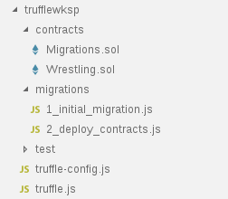

# POC_ETH_Truffle_WrestlerVBox201805
Bitácora ampliada con notas propias sobre el desarrollo del tutorial Ethereum Development Walkthrough (Part 2: Truffle, Ganache, Geth and Mist) (https://hackernoon.com/ethereum-development-walkthrough-part-2-truffle-ganache-geth-and-mist-8d6320e12269)
[Autor: https://hackernoon.com/@dev_zl](https://hackernoon.com/@dev_zl)

Contiene la bitácora de progreso de ejecución del tutorial, y de hecho contiene partes literales del tutorial, ampliado con notas y detalles propias y pensado para servir de posible guía para poder reproducir el tutorial cuando sea preciso pero también por si puede ser de utilidad como guía ampliada a terceros.

## Bitácora y notas

## Paso 1. Instalación y configuración inicial

### Versión de linux utilizada en este ejemplo
```sh
# cat /etc/issue
Debian GNU/Linux 9 \n \l
# uname -a
Linux vbxdeb8 4.9.0-5-amd64 #1 SMP Debian 4.9.65-3+deb9u2 (2018-01-04) x86_64 GNU/Linux
```


### Instalación de NodeJS 6.0 LTS + npm
[How to Install NodeJS on Debian 9 Stretch Linux ](https://linuxconfig.org/how-to-install-nodejs-on-debian-9-stretch-linux)

```sh
root@vbxdeb8:~# mkdir Descargas
root@vbxdeb8:~# cd Descargas/

root@vbxdeb8:~/Descargas# wget --verbose https://deb.nodesource.com/setup_6.x
--2018-05-01 19:49:21--  https://deb.nodesource.com/setup_6.x
Resolviendo deb.nodesource.com (deb.nodesource.com)... 13.33.235.63, 13.33.235.17, 13.33.235.102, ...
Conectando con deb.nodesource.com (deb.nodesource.com)[13.33.235.63]:443... conectado.
Petición HTTP enviada, esperando respuesta... 200 OK
Longitud: 11040 (11K) [text/plain]
Grabando a: “setup_6.x”

setup_6.x                                   100%[==========================================================================================>]  10,78K  --.-KB/s    in 0s      

2018-05-01 19:49:22 (139 MB/s) - “setup_6.x” guardado [11040/11040]

root@vbxdeb8:~/Descargas# chmod u+x setup_6.x 

root@vbxdeb8:~/Descargas# ./setup_6.x 

root@vbxdeb8:~/Descargas# ./setup_6.x 

## Installing the NodeSource Node.js 6.x LTS Boron repo...


## Populating apt-get cache...

+ apt-get update
Obj:1 http://security.debian.org/debian-security stretch/updates InRelease
Obj:2 http://packages.microsoft.com/repos/vscode stable InRelease                                                               
Ign:3 http://ftp.de.debian.org/debian stretch InRelease                   
Obj:4 http://ftp.de.debian.org/debian stretch-updates InRelease
Obj:5 http://ftp.de.debian.org/debian stretch Release
Leyendo lista de paquetes... Hecho

## Installing packages required for setup: apt-transport-https...

+ apt-get install -y apt-transport-https > /dev/null 2>&1

## Confirming "stretch" is supported...

+ curl -sLf -o /dev/null 'https://deb.nodesource.com/node_6.x/dists/stretch/Release'

## Adding the NodeSource signing key to your keyring...

+ curl -s https://deb.nodesource.com/gpgkey/nodesource.gpg.key | apt-key add -
OK

## Creating apt sources list file for the NodeSource Node.js 6.x LTS Boron repo...

+ echo 'deb https://deb.nodesource.com/node_6.x stretch main' > /etc/apt/sources.list.d/nodesource.list
+ echo 'deb-src https://deb.nodesource.com/node_6.x stretch main' >> /etc/apt/sources.list.d/nodesource.list

## Running `apt-get update` for you...

+ apt-get update
Obj:1 http://security.debian.org/debian-security stretch/updates InRelease
Obj:2 http://packages.microsoft.com/repos/vscode stable InRelease                
Ign:3 http://ftp.de.debian.org/debian stretch InRelease                          
Obj:4 http://ftp.de.debian.org/debian stretch-updates InRelease
Obj:5 http://ftp.de.debian.org/debian stretch Release  
Des:7 https://deb.nodesource.com/node_6.x stretch InRelease [4.635 B]
Des:8 https://deb.nodesource.com/node_6.x stretch/main amd64 Packages [1.004 B]
Descargados 5.639 B en 1s (4.811 B/s)
Leyendo lista de paquetes... Hecho

## Run `sudo apt-get install -y nodejs` to install Node.js 6.x LTS Boron and npm
## You may also need development tools to build native addons:
     sudo apt-get install gcc g++ make
## To install the Yarn package manager, run:
     curl -sL https://dl.yarnpkg.com/debian/pubkey.gpg | sudo apt-key add -
     echo "deb https://dl.yarnpkg.com/debian/ stable main" | sudo tee /etc/apt/sources.list.d/yarn.list
     sudo apt-get update && sudo apt-get install yarn


root@vbxdeb8:~/Descargas# apt-get install -y nodejs
Leyendo lista de paquetes... Hecho
Creando árbol de dependencias       
Leyendo la información de estado... Hecho
El paquete indicado a continuación se instaló de forma automática y ya no es necesario.
  libuv1
Utilice «apt autoremove» para eliminarlo.
Se instalarán los siguientes paquetes NUEVOS:
  nodejs
0 actualizados, 1 nuevos se instalarán, 0 para eliminar y 200 no actualizados.
Se necesita descargar 10,1 MB de archivos.
Se utilizarán 45,6 MB de espacio de disco adicional después de esta operación.
Des:1 https://deb.nodesource.com/node_6.x stretch/main amd64 nodejs amd64 6.14.2-1nodesource1 [10,1 MB]
Descargados 10,1 MB en 1s (5.824 kB/s)
Seleccionando el paquete nodejs previamente no seleccionado.
(Leyendo la base de datos ... 263653 ficheros o directorios instalados actualmente.)
Preparando para desempaquetar .../nodejs_6.14.2-1nodesource1_amd64.deb ...
Desempaquetando nodejs (6.14.2-1nodesource1) ...
Configurando nodejs (6.14.2-1nodesource1) ...
Procesando disparadores para man-db (2.7.6.1-2) ...

root@vbxdeb8:~/Descargas# node --version
v6.14.2
root@vbxdeb8:~/Descargas# nodejs --version
v6.14.2
root@vbxdeb8:~/Descargas# npm --version
3.10.10


root@vbxdeb8:~/Descargas# curl -sL https://dl.yarnpkg.com/debian/pubkey.gpg | sudo apt-key add -
OK
root@vbxdeb8:~/Descargas# echo "deb https://dl.yarnpkg.com/debian/ stable main" | sudo tee /etc/apt/sources.list.d/yarn.list
deb https://dl.yarnpkg.com/debian/ stable main


root@vbxdeb8:~/Descargas# apt-get update && sudo apt-get install yarn
Obj:1 http://security.debian.org/debian-security stretch/updates InRelease
Obj:2 http://packages.microsoft.com/repos/vscode stable InRelease                                                  
Ign:3 http://ftp.de.debian.org/debian stretch InRelease                                                            
Obj:4 http://ftp.de.debian.org/debian stretch-updates InRelease
Obj:5 http://ftp.de.debian.org/debian stretch Release  
Obj:6 https://deb.nodesource.com/node_6.x stretch InRelease
Des:7 https://dl.yarnpkg.com/debian stable InRelease [11,5 kB]
Des:9 https://dl.yarnpkg.com/debian stable/main all Packages [7.053 B]
Des:10 https://dl.yarnpkg.com/debian stable/main amd64 Packages [7.053 B]
Descargados 25,6 kB en 1s (15,0 kB/s)
Leyendo lista de paquetes... Hecho
Leyendo lista de paquetes... Hecho
Creando árbol de dependencias       
Leyendo la información de estado... Hecho
El paquete indicado a continuación se instaló de forma automática y ya no es necesario.
  libuv1
Utilice «sudo apt autoremove» para eliminarlo.
Se instalarán los siguientes paquetes NUEVOS:
  yarn
0 actualizados, 1 nuevos se instalarán, 0 para eliminar y 200 no actualizados.
Se necesita descargar 695 kB de archivos.
Se utilizarán 4.428 kB de espacio de disco adicional después de esta operación.
Des:1 https://dl.yarnpkg.com/debian stable/main amd64 yarn all 1.6.0-1 [695 kB]
Descargados 695 kB en 0s (1.428 kB/s)
Seleccionando el paquete yarn previamente no seleccionado.
(Leyendo la base de datos ... 266657 ficheros o directorios instalados actualmente.)
Preparando para desempaquetar .../archives/yarn_1.6.0-1_all.deb ...
Desempaquetando yarn (1.6.0-1) ...
Configurando yarn (1.6.0-1) ...

root@vbxdeb8:~/Descargas# yarn --version
1.6.0
```

### Instalando Truffle (como root)
```sh
npm install -g truffle
```

```sh
root@vbxdeb8:~/Descargas# npm install -g truffle
/usr/bin/truffle -> /usr/lib/node_modules/truffle/build/cli.bundled.js
/usr/lib
└─┬ truffle@4.1.7 
  ├─┬ mocha@3.5.3 
  │ ├── browser-stdout@1.3.0 
  │ ├─┬ commander@2.9.0 
  │ │ └── graceful-readlink@1.0.1 
  │ ├─┬ debug@2.6.8 
  │ │ └── ms@2.0.0 
  │ ├── diff@3.2.0 
  │ ├── escape-string-regexp@1.0.5 
  │ ├─┬ glob@7.1.1 
  │ │ ├── fs.realpath@1.0.0 
  │ │ ├─┬ inflight@1.0.6 
  │ │ │ └── wrappy@1.0.2 
  │ │ ├── inherits@2.0.3 
  │ │ ├─┬ minimatch@3.0.4 
  │ │ │ └─┬ brace-expansion@1.1.11 
  │ │ │   ├── balanced-match@1.0.0 
  │ │ │   └── concat-map@0.0.1 
  │ │ ├── once@1.4.0 
  │ │ └── path-is-absolute@1.0.1 
  │ ├── growl@1.9.2 
  │ ├── he@1.1.1 
  │ ├── json3@3.3.2 
  │ ├─┬ lodash.create@3.1.1 
  │ │ ├─┬ lodash._baseassign@3.2.0 
  │ │ │ ├── lodash._basecopy@3.0.1 
  │ │ │ └─┬ lodash.keys@3.1.2 
  │ │ │   ├── lodash._getnative@3.9.1 
  │ │ │   ├── lodash.isarguments@3.1.0 
  │ │ │   └── lodash.isarray@3.0.4 
  │ │ ├── lodash._basecreate@3.0.3 
  │ │ └── lodash._isiterateecall@3.0.9 
  │ ├─┬ mkdirp@0.5.1 
  │ │ └── minimist@0.0.8 
  │ └─┬ supports-color@3.1.2 
  │   └── has-flag@1.0.0 
  ├── original-require@1.0.1 
  └─┬ solc@0.4.23 
    ├─┬ fs-extra@0.30.0 
    │ ├── graceful-fs@4.1.11 
    │ ├── jsonfile@2.4.0 
    │ ├── klaw@1.3.1 
    │ └── rimraf@2.6.2 
    ├── memorystream@0.3.1 
    ├── require-from-string@1.2.1 
    ├── semver@5.5.0 
    └─┬ yargs@4.8.1 
      ├─┬ cliui@3.2.0 
      │ ├─┬ strip-ansi@3.0.1 
      │ │ └── ansi-regex@2.1.1 
      │ └── wrap-ansi@2.1.0 
      ├── decamelize@1.2.0 
      ├── get-caller-file@1.0.2 
      ├── lodash.assign@4.2.0 
      ├─┬ os-locale@1.4.0 
      │ └─┬ lcid@1.0.0 
      │   └── invert-kv@1.0.0 
      ├─┬ read-pkg-up@1.0.1 
      │ ├─┬ find-up@1.1.2 
      │ │ ├── path-exists@2.1.0 
      │ │ └─┬ pinkie-promise@2.0.1 
      │ │   └── pinkie@2.0.4 
      │ └─┬ read-pkg@1.1.0 
      │   ├─┬ load-json-file@1.1.0 
      │   │ ├─┬ parse-json@2.2.0 
      │   │ │ └─┬ error-ex@1.3.1 
      │   │ │   └── is-arrayish@0.2.1 
      │   │ ├── pify@2.3.0 
      │   │ └─┬ strip-bom@2.0.0 
      │   │   └── is-utf8@0.2.1 
      │   ├─┬ normalize-package-data@2.4.0 
      │   │ ├── hosted-git-info@2.6.0 
      │   │ ├─┬ is-builtin-module@1.0.0 
      │   │ │ └── builtin-modules@1.1.1 
      │   │ └─┬ validate-npm-package-license@3.0.3 
      │   │   ├─┬ spdx-correct@3.0.0 
      │   │   │ └── spdx-license-ids@3.0.0 
      │   │   └─┬ spdx-expression-parse@3.0.0 
      │   │     └── spdx-exceptions@2.1.0 
      │   └── path-type@1.1.0 
      ├── require-directory@2.1.1 
      ├── require-main-filename@1.0.1 
      ├── set-blocking@2.0.0 
      ├─┬ string-width@1.0.2 
      │ ├── code-point-at@1.1.0 
      │ └─┬ is-fullwidth-code-point@1.0.0 
      │   └── number-is-nan@1.0.1 
      ├── which-module@1.0.0 
      ├── window-size@0.2.0 
      ├── y18n@3.2.1 
      └─┬ yargs-parser@2.4.1 
        └── camelcase@3.0.0 

root@vbxdeb8:~/Descargas# truffle version
Truffle v4.1.7 (core: 4.1.7)
Solidity v0.4.23 (solc-js)

```

### Instalando `Ganache-cli` como root:

```sh
root@vbxdeb8:~/Descargas# npm install -g ganache-cli
``` 
### Solicitando la ayuda inicial de `Ganache-cli`:

> Nota: la opción `--help` en el momento de la creación de esta bitácora no despliega la información completa. Hay que usar `-?`en su lugar 
```sh
$ ganache-cli -?

ganache-cli: Fast Ethereum RPC client for testing and development
  Full docs: https://github.com/trufflesuite/ganache-cli

Usage: ganache-cli [options]
  options:
  --port/-p <port to bind to, default 8545>
  --host/-h <host to bind to, default 127.0.0.1>
  --fork/-f <url>   (Fork from another currently running Ethereum client at a given block)

  --db <db path>   (directory to save chain db)
  --seed/-s <seed value for PRNG, default random>
  --deterministic/-d     (uses fixed seed)
  --mnemonic/-m <mnemonic>

  --accounts/-a <number of accounts to generate at startup>   (ignored when using --account flag)
  --defaultBalanceEther/-e <Amount of ether to assign each test account, default 100.0>   (ignored when using --account flag)
  --account <privatekey>,<balance>   (Can be specified multiple times. Note that private keys are 64 characters long,
                                       and must be input as a 0x-prefixed hex string. Balance can either be input as an
                                       integer or 0x-prefixed hex value specifying the amount of wei in that account.)

  --acctKeys <path to file>   (saves generated accounts and private keys as JSON object in specified file)
  --secure/-n   (Lock accounts by default)
  --unlock <accounts>   (Comma-separated list of accounts or indices to unlock)

  --noVMErrorsOnRPCResponse   (Do not transmit transaction failures as RPC errors. Enable this flag for error reporting behaviour which is compatible with other clients such as geth and Parity.)

  --blockTime/-b <block time in seconds> (Will instamine if option omitted. Avoid using unless your test cases require interval mining.)
  --networkId/-i <network id> (default current time)
  --gasPrice/-g <gas price>   (default 20000000000)
  --gasLimit/-l <gas limit>   (default 90000)

  --debug       (Output VM opcodes for debugging)
  --verbose/-v
  --mem         (Only show memory output, not tx history)


  --help / -?    (this output)
```

### Primera ejecución de `ganache-cli` 

```sh
devel@vbxdeb8:~$ ganache-cli
Ganache CLI v6.1.0 (ganache-core: 2.1.0)

Available Accounts
==================
(0) 0xeb4a8de3c6c4c0b4dea506882f80b59b57c874ba
(1) 0xc4b0e67aed7da3ecfe222478512c4ce793d361d7
(2) 0xcc870bd8b5dd3edf902fea16d206d45e2d34e1d5
(3) 0x99a0eec6ed3e7f66ee9ff1d547007e3ab96a126e
(4) 0x67a285945c73bc2c437b3fcb2c0fb09486c7fae7
(5) 0x1e1d87af5421c977a75604651ee663457c34c12b
(6) 0x838eab87a84dfc10f904c5cf0e0fd41edffae30f
(7) 0x4473beba2fe323da4cc5c75ae813229e3757fc04
(8) 0x2d84ea179555a5db90fc20d694844216f4f5a744
(9) 0x1264e056538814a3908a12025aafb39976cc7c38

Private Keys
==================
(0) b7710c30d244ae266c870df61da808e73eeb7ddc1fb876a46970578aea1213ae
(1) e6e1dcc6ac2d7031801b7ab6ecd5a728e3d299bf36a10355aa5e4ad4d91c0e93
(2) 31c30ab4eb11e1c2cc11efc21968c09adb7a48e195373b13888a83e47989d8b5
(3) da383b821f2f782ef796564125ee034707a1a31e86e6a5b1e6f85373aabf2dc9
(4) 2645109b811a4d3b6a44af603401ab52f51bb9d33ba1a21ce1d748be0b84ffe1
(5) 1c531e3c1d12d81bcca38c5e929dcdb127cb5fe133c8dc4a472e3776653749be
(6) c97ffdb76c97ac9dc1922f388f8f6c50961e1594f0d6ce16aaa91d0351a4f27b
(7) 3f987fad68af00f0c45288f3dbe50e8e7fb6f541191b54c617ad46acc4964c92
(8) 5f8f265645d54160fd8bc06db8f80f26a24d9e1256fe73e08405b1bc7e035adf
(9) feccbcceec04c903e9fd93390219425b61daf6dbe4bf24fdb5677c37f462f96c

HD Wallet
==================
Mnemonic:      grunt turn amount mule siren favorite tenant bronze parent fit grit conduct
Base HD Path:  m/44'/60'/0'/0/{account_index}

Listening on localhost:8545

^C (CTRL+C)
```
### Asegurar reinicio `controlado` de `ganache-cli`

Interesa conseguir un reinicio `controlado` de `ganache-cli` con las mismas cuentas (claves privadas, saldos y direcciones) que en este primer arranque para poder apagar la máquina virtual y retomar el tutorial en cualquier punto disponiendo de  las mismas cuentas (claves privadas, saldos y direcciones) que las generadas en el primer arranque arriba descrito. Naturalmente los saldos en Ether se reiniciarán al saldo inicial.

Para ello se han dispuesto dos scripts que consiguen el mismo objetivo pero sirven para mostrar diferentes formas de arrancar `ganache-cli`

#### Script 1) `scripts/ganache-cli-restart-from-mnemonic.sh`

```sh
#!/bin/bash
set -x
ganache-cli \
    --deterministic \
    --mnemonic "grunt turn amount mule siren favorite tenant bronze parent fit grit conduct" \
    --port 8545 \
    --hostname localhost \
    --gasPrice 20000000000 \
    --gasLimit 90000 \
    --defaultBalanceEther 200
set +x
```

Prueba de ejecución:

```
devel@vbxdeb8:~/POC/POC_ETH_Truffle_WrestlerVBox201805$ scripts/ganache-cli-restart-from-mnemonic.sh &
[1] 2591
devel@vbxdeb8:~/POC/POC_ETH_Truffle_WrestlerVBox201805$ + ganache-cli --deterministic --mnemonic 'grunt turn amount mule siren favorite tenant bronze parent fit grit conduct' --port 8545 --hostname localhost --gasPrice 20000000000 --gasLimit 90000 --defaultBalanceEther 200
Ganache CLI v6.1.0 (ganache-core: 2.1.0)

Available Accounts
==================
(0) 0xeb4a8de3c6c4c0b4dea506882f80b59b57c874ba
(1) 0xc4b0e67aed7da3ecfe222478512c4ce793d361d7
(2) 0xcc870bd8b5dd3edf902fea16d206d45e2d34e1d5
(3) 0x99a0eec6ed3e7f66ee9ff1d547007e3ab96a126e
(4) 0x67a285945c73bc2c437b3fcb2c0fb09486c7fae7
(5) 0x1e1d87af5421c977a75604651ee663457c34c12b
(6) 0x838eab87a84dfc10f904c5cf0e0fd41edffae30f
(7) 0x4473beba2fe323da4cc5c75ae813229e3757fc04
(8) 0x2d84ea179555a5db90fc20d694844216f4f5a744
(9) 0x1264e056538814a3908a12025aafb39976cc7c38

Private Keys
==================
(0) b7710c30d244ae266c870df61da808e73eeb7ddc1fb876a46970578aea1213ae
(1) e6e1dcc6ac2d7031801b7ab6ecd5a728e3d299bf36a10355aa5e4ad4d91c0e93
(2) 31c30ab4eb11e1c2cc11efc21968c09adb7a48e195373b13888a83e47989d8b5
(3) da383b821f2f782ef796564125ee034707a1a31e86e6a5b1e6f85373aabf2dc9
(4) 2645109b811a4d3b6a44af603401ab52f51bb9d33ba1a21ce1d748be0b84ffe1
(5) 1c531e3c1d12d81bcca38c5e929dcdb127cb5fe133c8dc4a472e3776653749be
(6) c97ffdb76c97ac9dc1922f388f8f6c50961e1594f0d6ce16aaa91d0351a4f27b
(7) 3f987fad68af00f0c45288f3dbe50e8e7fb6f541191b54c617ad46acc4964c92
(8) 5f8f265645d54160fd8bc06db8f80f26a24d9e1256fe73e08405b1bc7e035adf
(9) feccbcceec04c903e9fd93390219425b61daf6dbe4bf24fdb5677c37f462f96c

HD Wallet
==================
Mnemonic:      grunt turn amount mule siren favorite tenant bronze parent fit grit conduct
Base HD Path:  m/44'/60'/0'/0/{account_index}

Gas Price
==================
20000000000

Gas Limit
==================
90000

Listening on localhost:8545

devel@vbxdeb8:~/POC/POC_ETH_Truffle_WrestlerVBox201805$ lsof -i :8545
COMMAND  PID  USER   FD   TYPE DEVICE SIZE/OFF NODE NAME
node    2592 devel   12u  IPv4  36296      0t0  TCP localhost:8545 (LISTEN)
devel@vbxdeb8:~/POC/POC_ETH_Truffle_WrestlerVBox201805$ fg 
scripts/ganache-cli-restart-from-mnemonic.sh
^C+ set +x
```

#### Script 2) `scripts/ganache-cli-restart-from-explicit-accounts.sh`

```sh
#!/bin/bash
set -x
ganache-cli \
    --account="0xb7710c30d244ae266c870df61da808e73eeb7ddc1fb876a46970578aea1213ae,200" \
    --account="0xe6e1dcc6ac2d7031801b7ab6ecd5a728e3d299bf36a10355aa5e4ad4d91c0e93,200" \
    --account="0x31c30ab4eb11e1c2cc11efc21968c09adb7a48e195373b13888a83e47989d8b5,200" \
    --account="0xda383b821f2f782ef796564125ee034707a1a31e86e6a5b1e6f85373aabf2dc9,200" \
    --account="0x2645109b811a4d3b6a44af603401ab52f51bb9d33ba1a21ce1d748be0b84ffe1,200" \
    --account="0x1c531e3c1d12d81bcca38c5e929dcdb127cb5fe133c8dc4a472e3776653749be,200" \
    --account="0xc97ffdb76c97ac9dc1922f388f8f6c50961e1594f0d6ce16aaa91d0351a4f27b,200" \
    --account="0x3f987fad68af00f0c45288f3dbe50e8e7fb6f541191b54c617ad46acc4964c92,200" \
    --account="0x5f8f265645d54160fd8bc06db8f80f26a24d9e1256fe73e08405b1bc7e035adf,200" \
    --account="0xfeccbcceec04c903e9fd93390219425b61daf6dbe4bf24fdb5677c37f462f96c,200" \
    --secure -u 0 -u 1 -u 2 -u 3 -u 4 -u 5 -u 6 -u 7 -u 8 -u 9 \
    --port 8545 \
    --hostname localhost \
    --gasPrice 20000000000 \
    --gasLimit 90000
set +x
```

Prueba de Ejecución:

```
devel@vbxdeb8:~/POC/POC_ETH_Truffle_WrestlerVBox201805$ scripts/ganache-cli-restart-from-explicit-accounts.sh &
[1] 2754
devel@vbxdeb8:~/POC/POC_ETH_Truffle_WrestlerVBox201805$ + ganache-cli --account=0xb7710c30d244ae266c870df61da808e73eeb7ddc1fb876a46970578aea1213ae,200 --account=0xe6e1dcc6ac2d7031801b7ab6ecd5a728e3d299bf36a10355aa5e4ad4d91c0e93,200 --account=0x31c30ab4eb11e1c2cc11efc21968c09adb7a48e195373b13888a83e47989d8b5,200 --account=0xda383b821f2f782ef796564125ee034707a1a31e86e6a5b1e6f85373aabf2dc9,200 --account=0x2645109b811a4d3b6a44af603401ab52f51bb9d33ba1a21ce1d748be0b84ffe1,200 --account=0x1c531e3c1d12d81bcca38c5e929dcdb127cb5fe133c8dc4a472e3776653749be,200 --account=0xc97ffdb76c97ac9dc1922f388f8f6c50961e1594f0d6ce16aaa91d0351a4f27b,200 --account=0x3f987fad68af00f0c45288f3dbe50e8e7fb6f541191b54c617ad46acc4964c92,200 --account=0x5f8f265645d54160fd8bc06db8f80f26a24d9e1256fe73e08405b1bc7e035adf,200 --account=0xfeccbcceec04c903e9fd93390219425b61daf6dbe4bf24fdb5677c37f462f96c,200 --secure -u 0 -u 1 -u 2 -u 3 -u 4 -u 5 -u 6 -u 7 -u 8 -u 9 --port 8545 --hostname localhost --gasPrice 20000000000 --gasLimit 90000
Ganache CLI v6.1.0 (ganache-core: 2.1.0)

Available Accounts
==================
(0) 0xeb4a8de3c6c4c0b4dea506882f80b59b57c874ba
(1) 0xc4b0e67aed7da3ecfe222478512c4ce793d361d7
(2) 0xcc870bd8b5dd3edf902fea16d206d45e2d34e1d5
(3) 0x99a0eec6ed3e7f66ee9ff1d547007e3ab96a126e
(4) 0x67a285945c73bc2c437b3fcb2c0fb09486c7fae7
(5) 0x1e1d87af5421c977a75604651ee663457c34c12b
(6) 0x838eab87a84dfc10f904c5cf0e0fd41edffae30f
(7) 0x4473beba2fe323da4cc5c75ae813229e3757fc04
(8) 0x2d84ea179555a5db90fc20d694844216f4f5a744
(9) 0x1264e056538814a3908a12025aafb39976cc7c38

Private Keys
==================
(0) b7710c30d244ae266c870df61da808e73eeb7ddc1fb876a46970578aea1213ae
(1) e6e1dcc6ac2d7031801b7ab6ecd5a728e3d299bf36a10355aa5e4ad4d91c0e93
(2) 31c30ab4eb11e1c2cc11efc21968c09adb7a48e195373b13888a83e47989d8b5
(3) da383b821f2f782ef796564125ee034707a1a31e86e6a5b1e6f85373aabf2dc9
(4) 2645109b811a4d3b6a44af603401ab52f51bb9d33ba1a21ce1d748be0b84ffe1
(5) 1c531e3c1d12d81bcca38c5e929dcdb127cb5fe133c8dc4a472e3776653749be
(6) c97ffdb76c97ac9dc1922f388f8f6c50961e1594f0d6ce16aaa91d0351a4f27b
(7) 3f987fad68af00f0c45288f3dbe50e8e7fb6f541191b54c617ad46acc4964c92
(8) 5f8f265645d54160fd8bc06db8f80f26a24d9e1256fe73e08405b1bc7e035adf
(9) feccbcceec04c903e9fd93390219425b61daf6dbe4bf24fdb5677c37f462f96c

Gas Price
==================
20000000000

Gas Limit
==================
90000

Listening on localhost:8545

devel@vbxdeb8:~/POC/POC_ETH_Truffle_WrestlerVBox201805$ lsof -i :8545
COMMAND  PID  USER   FD   TYPE DEVICE SIZE/OFF NODE NAME
node    2755 devel   12u  IPv4  39575      0t0  TCP localhost:8545 (LISTEN)
devel@vbxdeb8:~/POC/POC_ETH_Truffle_WrestlerVBox201805$ fg
scripts/ganache-cli-restart-from-explicit-accounts.sh
^C+ set +x

```
___________________________________________________________________________

## Paso 2. Inicialización del proyecto `Truffle`

>Nota: Se requiere realizar la inicialización sobre un directorio vacío


```
devel@vbxdeb8:~/POC/POC_ETH_Truffle_WrestlerVBox201805$ mkdir trufflewksp
devel@vbxdeb8:~/POC/POC_ETH_Truffle_WrestlerVBox201805$ cd trufflewksp/
devel@vbxdeb8:~/POC/POC_ETH_Truffle_WrestlerVBox201805/trufflewksp$ truffle init
Downloading...
Unpacking...
Setting up...
Unbox successful. Sweet!

Commands:

  Compile:        truffle compile
  Migrate:        truffle migrate
  Test contracts: truffle test
devel@vbxdeb8:~/POC/POC_ETH_Truffle_WrestlerVBox201805/trufflewksp$ tree
.
├── contracts
│   └── Migrations.sol
├── migrations
│   └── 1_initial_migration.js
├── test
├── truffle-config.js
└── truffle.js

3 directories, 4 files
```

### Incorporamos el [código fuente en lenguaje `Solidity` del contrato de ejemplo](https://raw.githubusercontent.com/devzl/ethereum-walkthrough-1/master/Wrestling.sol) en la carpeta `contracts`

```
devel@vbxdeb8:~/POC/POC_ETH_Truffle_WrestlerVBox201805/trufflewksp$ cd contracts/
devel@vbxdeb8:~/POC/POC_ETH_Truffle_WrestlerVBox201805/trufflewksp/contracts$ wget --verbose https://raw.githubusercontent.com/devzl/ethereum-walkthrough-1/master/Wrestling.sol
--2018-05-09 16:40:21--  https://raw.githubusercontent.com/devzl/ethereum-walkthrough-1/master/Wrestling.sol
Resolviendo raw.githubusercontent.com (raw.githubusercontent.com)... 151.101.0.133, 151.101.64.133, 151.101.128.133, ...
Conectando con raw.githubusercontent.com (raw.githubusercontent.com)[151.101.0.133]:443... conectado.
Petición HTTP enviada, esperando respuesta... 200 OK
Longitud: 2704 (2,6K) [text/plain]
Grabando a: “Wrestling.sol”

Wrestling.sol                                        100%[=====================================================================================================================>]   2,64K  --.-KB/s    in 0s      

2018-05-09 16:40:21 (40,5 MB/s) - “Wrestling.sol” guardado [2704/2704]

devel@vbxdeb8:~/POC/POC_ETH_Truffle_WrestlerVBox201805/trufflewksp/contracts$ tree
.
├── Migrations.sol
└── Wrestling.sol

0 directories, 2 files
devel@vbxdeb8:~/POC/POC_ETH_Truffle_WrestlerVBox201805/trufflewksp/contracts$ cd ..
devel@vbxdeb8:~/POC/POC_ETH_Truffle_WrestlerVBox201805/trufflewksp$ cd ..
devel@vbxdeb8:~/POC/POC_ETH_Truffle_WrestlerVBox201805$ tree
.
├── LICENSE
├── README.md
├── scripts
│   ├── ganache-cli-restart-from-explicit-accounts.sh
│   └── ganache-cli-restart-from-mnemonic.sh
└── trufflewksp
    ├── contracts
    │   ├── Migrations.sol
    │   └── Wrestling.sol
    ├── migrations
    │   └── 1_initial_migration.js
    ├── test
    ├── truffle-config.js
    └── truffle.js

5 directories, 9 files


```

### Fuente descargado `Wrestling.sol`

```sol
pragma solidity ^0.4.18;

    /**
    * Example script for the Ethereum development walkthrough
    */

contract Wrestling {
    /**
    * Our wrestlers
    */
	address public wrestler1;
	address public wrestler2;

	bool public wrestler1Played;
	bool public wrestler2Played;

	uint private wrestler1Deposit;
	uint private wrestler2Deposit;

	bool public gameFinished; 
    address public theWinner;
    uint gains;

    /**
    * The logs that will be emitted in every step of the contract's life cycle
    */
	event WrestlingStartsEvent(address wrestler1, address wrestler2);
	event EndOfRoundEvent(uint wrestler1Deposit, uint wrestler2Deposit);
	event EndOfWrestlingEvent(address winner, uint gains);

    /**
    * The contract constructor
    */
	function Wrestling() public {
		wrestler1 = msg.sender;
	}

    /**
    * A second wrestler can register as an opponent
    */
	function registerAsAnOpponent() public {
        require(wrestler2 == address(0));

        wrestler2 = msg.sender;

        WrestlingStartsEvent(wrestler1, wrestler2);
    }

    /**
    * Every round a player can put a sum of ether, if one of the player put in twice or 
    * more the money (in total) than the other did, the first wins 
    */
    function wrestle() public payable {
    	require(!gameFinished && (msg.sender == wrestler1 || msg.sender == wrestler2));

    	if(msg.sender == wrestler1) {
    		require(wrestler1Played == false);
    		wrestler1Played = true;
    		wrestler1Deposit = wrestler1Deposit + msg.value;
    	} else { 
    		require(wrestler2Played == false);
    		wrestler2Played = true;
    		wrestler2Deposit = wrestler2Deposit + msg.value;
    	}
    	if(wrestler1Played && wrestler2Played) {
    		if(wrestler1Deposit >= wrestler2Deposit * 2) {
    			endOfGame(wrestler1);
    		} else if (wrestler2Deposit >= wrestler1Deposit * 2) {
    			endOfGame(wrestler2);
    		} else {
                endOfRound();
    		}
    	}
    }

    function endOfRound() internal {
    	wrestler1Played = false;
    	wrestler2Played = false;

    	EndOfRoundEvent(wrestler1Deposit, wrestler2Deposit);
    }

    function endOfGame(address winner) internal {
        gameFinished = true;
        theWinner = winner;

        gains = wrestler1Deposit + wrestler2Deposit;
        EndOfWrestlingEvent(winner, gains);
    }

    /**
    * The withdraw function, following the withdraw pattern shown and explained here: 
    * http://solidity.readthedocs.io/en/develop/common-patterns.html#withdrawal-from-contracts
    */
    function withdraw() public {
        require(gameFinished && theWinner == msg.sender);

        uint amount = gains;

        gains = 0;
        msg.sender.transfer(amount);
    }
}
```
### Creamos en la carpeta `migrations` el archivo `2_deploy_contracts.js` con instrucciones para la tarea de `Migrate` del contrato 'Wrestling.sol`

```js
const Wrestling = artifacts.require("./Wrestling.sol")

module.exports = function (deployer) {
    deployer.deploy(Wrestling);
};
```

### Ajustamos el archivo de configuración de Truffle: `truffle.js` 

* para que apunte a una "red de desarrollo" que en nuestro caso está constituida por `Ganache` (cuyo `RPC listener` estará levantado en este tutorial en `localhost` escuchando en el puerto `8545`.
  >`Listening on localhost:8545`)
* para que el despliegue se haga utilizando la `cuenta[0]` de `Ganache` convierténdose en el `owner`de dicho martContract` (*Nota: si no se indica expresamente se toma dicha primera cuenta como cuenta por defecto*)
  >
  >`Available Accounts`  
  >`==================`   
  >`(0) 0xeb4a8de3c6c4c0b4dea506882f80b59b57c874ba`     
  > `... ... ... ...`   
  >
  > `Private Keys`   
  > `==================`   
  > `(0) b7710c30d244ae266c870df61da808e73eeb7ddc1fb876a46970578aea1213ae`  
  > `... ... ... ...`  

#### `truffle.js` 

```js
module.exports = {
  // See <http://truffleframework.com/docs/advanced/configuration>
  // to customize your Truffle configuration!
  networks: {
    // nombre de alias de la red 'ficticia' constituida por el nodo Ganache
    localganache: {
      host: "127.0.0.1",
      port: 8545,
      network_id: "*", // Match any network id
      // optional config values:
      // gas (Gas limit used for deploys. Default is 4712388)
      // gasPrice (Gas price used for deploys. Default is 100000000000 (100 Shannon).)
      // from (From address used during migrations. Defaults to the first available account provided by your Ethereum client.) 
      from: "0xeb4a8de3c6c4c0b4dea506882f80b59b57c874ba" // PRIMERA CUENTA DE GANACHE SI NO SE INDICA ES LA DE POR DEFECTO
      // provider - web3 provider instance Truffle should use to talk to the Ethereum network.
      //          - function that returns a web3 provider instance (see below.)
      //          - if specified, host and port are ignored.
    }
  }
};
```

El `workspace` de trabajo de Truffle quedará así tras los cambios realizados:



___________________________________________________________________________

## Paso 3. Compilación del código de los Contratos

### Arrancar ganache en un terminal separado (o como proceso de fondo)

```
devel@vbxdeb8:~$ cd POC/POC_ETH_Truffle_WrestlerVBox201805/scripts/
devel@vbxdeb8:~/POC/POC_ETH_Truffle_WrestlerVBox201805/scripts$ ls
ganache-cli-restart-from-explicit-accounts.sh  ganache-cli-restart-from-mnemonic.sh
devel@vbxdeb8:~/POC/POC_ETH_Truffle_WrestlerVBox201805/scripts$ ./ganache-cli-restart-from-mnemonic.sh 
+ ganache-cli --deterministic --mnemonic 'grunt turn amount mule siren favorite tenant bronze parent fit grit conduct' --port 8545 --hostname localhost --gasPrice 20000000000 --gasLimit 90000 --defaultBalanceEther 200
Ganache CLI v6.1.0 (ganache-core: 2.1.0)

Available Accounts
==================
(0) 0xeb4a8de3c6c4c0b4dea506882f80b59b57c874ba
(1) 0xc4b0e67aed7da3ecfe222478512c4ce793d361d7
(2) 0xcc870bd8b5dd3edf902fea16d206d45e2d34e1d5
(3) 0x99a0eec6ed3e7f66ee9ff1d547007e3ab96a126e
(4) 0x67a285945c73bc2c437b3fcb2c0fb09486c7fae7
(5) 0x1e1d87af5421c977a75604651ee663457c34c12b
(6) 0x838eab87a84dfc10f904c5cf0e0fd41edffae30f
(7) 0x4473beba2fe323da4cc5c75ae813229e3757fc04
(8) 0x2d84ea179555a5db90fc20d694844216f4f5a744
(9) 0x1264e056538814a3908a12025aafb39976cc7c38

Private Keys
==================
(0) b7710c30d244ae266c870df61da808e73eeb7ddc1fb876a46970578aea1213ae
(1) e6e1dcc6ac2d7031801b7ab6ecd5a728e3d299bf36a10355aa5e4ad4d91c0e93
(2) 31c30ab4eb11e1c2cc11efc21968c09adb7a48e195373b13888a83e47989d8b5
(3) da383b821f2f782ef796564125ee034707a1a31e86e6a5b1e6f85373aabf2dc9
(4) 2645109b811a4d3b6a44af603401ab52f51bb9d33ba1a21ce1d748be0b84ffe1
(5) 1c531e3c1d12d81bcca38c5e929dcdb127cb5fe133c8dc4a472e3776653749be
(6) c97ffdb76c97ac9dc1922f388f8f6c50961e1594f0d6ce16aaa91d0351a4f27b
(7) 3f987fad68af00f0c45288f3dbe50e8e7fb6f541191b54c617ad46acc4964c92
(8) 5f8f265645d54160fd8bc06db8f80f26a24d9e1256fe73e08405b1bc7e035adf
(9) feccbcceec04c903e9fd93390219425b61daf6dbe4bf24fdb5677c37f462f96c

HD Wallet
==================
Mnemonic:      grunt turn amount mule siren favorite tenant bronze parent fit grit conduct
Base HD Path:  m/44'/60'/0'/0/{account_index}

Gas Price
==================
20000000000

Gas Limit
==================
90000

Listening on localhost:8545
```

#### probamos que responde el API RPC
```
devel@vbxdeb8:~/POC/POC_ETH_Truffle_WrestlerVBox201805$ curl --verbose -X POST --data '{"jsonrpc":"2.0","method":"eth_blockNumber","params":[],"id":83}' http://localhost:8545
Note: Unnecessary use of -X or --request, POST is already inferred.
* Rebuilt URL to: http://localhost:8545/
*   Trying ::1...
* TCP_NODELAY set
* connect to ::1 port 8545 failed: Conexión rehusada
*   Trying 127.0.0.1...
* TCP_NODELAY set
* Connected to localhost (127.0.0.1) port 8545 (#0)
> POST / HTTP/1.1
> Host: localhost:8545
> User-Agent: curl/7.52.1
> Accept: */*
> Content-Length: 64
> Content-Type: application/x-www-form-urlencoded
> 
* upload completely sent off: 64 out of 64 bytes
< HTTP/1.1 200 OK
< Access-Control-Allow-Headers: Origin, X-Requested-With, Content-Type, Accept
< Access-Control-Allow-Origin: *
< Access-Control-Allow-Methods: *
< Content-Type: application/json
< Date: Wed, 09 May 2018 16:02:00 GMT
< Connection: keep-alive
< Transfer-Encoding: chunked
< 
* Curl_http_done: called premature == 0
* Connection #0 to host localhost left intact
{"id":83,"jsonrpc":"2.0","result":"0x00"}
```

#### conversación HTTP
```http
POST / HTTP/1.1
Host: localhost:8545
User-Agent: curl/7.52.1
Accept: */*
Content-Length: 64
Content-Type: application/x-www-form-urlencoded

{"jsonrpc":"2.0","method":"eth_blockNumber","params":[],"id":83}

HTTP/1.1 200 OK
Access-Control-Allow-Headers: Origin, X-Requested-With, Content-Type, Accept
Access-Control-Allow-Origin: *
Access-Control-Allow-Methods: *
Content-Type: application/json
Date: Wed, 09 May 2018 16:02:00 GMT
Connection: keep-alive
Transfer-Encoding: chunked

{"id":83,"jsonrpc":"2.0","result":"0x00"}
```

### Utilizar truffle para compilar el código Solidity de ambos contratos `Migrations.sol` y `Wrestling.sol`

```sh
devel@vbxdeb8:~/POC/POC_ETH_Truffle_WrestlerVBox201805$ cd trufflewksp/
devel@vbxdeb8:~/POC/POC_ETH_Truffle_WrestlerVBox201805/trufflewksp$ tree
.
├── contracts
│   ├── Migrations.sol
│   └── Wrestling.sol
├── migrations
│   ├── 1_initial_migration.js
│   └── 2_deploy_contracts.js
├── test
├── truffle-config.js
└── truffle.js

3 directories, 6 files
devel@vbxdeb8:~/POC/POC_ETH_Truffle_WrestlerVBox201805/trufflewksp$ truffle compile
Compiling ./contracts/Migrations.sol...
Compiling ./contracts/Wrestling.sol...

Compilation warnings encountered:

/home/devel/POC/POC_ETH_Truffle_WrestlerVBox201805/trufflewksp/contracts/Migrations.sol:11:3: Warning: Defining constructors as functions with the same name as the contract is deprecated. Use "constructor(...) { ... }" instead.
  function Migrations() public {
  ^ (Relevant source part starts here and spans across multiple lines).
,/home/devel/POC/POC_ETH_Truffle_WrestlerVBox201805/trufflewksp/contracts/Wrestling.sol:34:2: Warning: Defining constructors as functions with the same name as the contract is deprecated. Use "constructor(...) { ... }" instead.
	function Wrestling() public {
 ^ (Relevant source part starts here and spans across multiple lines).

Writing artifacts to ./build/contracts

devel@vbxdeb8:~/POC/POC_ETH_Truffle_WrestlerVBox201805/trufflewksp$ tree
.
├── build
│   └── contracts
│       ├── Migrations.json
│       └── Wrestling.json
├── contracts
│   ├── Migrations.sol
│   └── Wrestling.sol
├── migrations
│   ├── 1_initial_migration.js
│   └── 2_deploy_contracts.js
├── test
├── truffle-config.js
└── truffle.js

5 directories, 8 files

```

Si examinamos el resultado de la compilación del contrato `Wrestling.sol` que se ha generado bajo la carpeta `build/Wrestling.json`:
* Podemos observar el `"abi": [` `(ABI - application binary interface)`
* Podemos observar igualmente el `"bytecode": ` del compilado EVM.

```js
{
  "contractName": "Wrestling",
  "abi": [
    {
      "constant": true,
      "inputs": [],
      "name": "theWinner",
      "outputs": [
        {
          "name": "",
          "type": "address"
        }
      ],
      "payable": false,
      "stateMutability": "view",
      "type": "function"
    },
    {
      "constant": true,
      "inputs": [],
      "name": "wrestler2",
      "outputs": [
        {
          "name": "",
          "type": "address"
        }
      ],
      "payable": false,
      "stateMutability": "view",
      "type": "function"
    },
    {
      "constant": true,
      "inputs": [],
      "name": "wrestler1Played",
      "outputs": [
        {
          "name": "",
          "type": "bool"
        }
      ],
      "payable": false,
      "stateMutability": "view",
      "type": "function"
    },
    {
      "constant": true,
      "inputs": [],
      "name": "wrestler1",
      "outputs": [
        {
          "name": "",
          "type": "address"
        }
      ],
      "payable": false,
      "stateMutability": "view",
      "type": "function"
    },
    {
      "constant": true,
      "inputs": [],
      "name": "gameFinished",
      "outputs": [
        {
          "name": "",
          "type": "bool"
        }
      ],
      "payable": false,
      "stateMutability": "view",
      "type": "function"
    },
    {
      "constant": true,
      "inputs": [],
      "name": "wrestler2Played",
      "outputs": [
        {
          "name": "",
          "type": "bool"
        }
      ],
      "payable": false,
      "stateMutability": "view",
      "type": "function"
    },
    {
      "inputs": [],
      "payable": false,
      "stateMutability": "nonpayable",
      "type": "constructor"
    },
    {
      "anonymous": false,
      "inputs": [
        {
          "indexed": false,
          "name": "wrestler1",
          "type": "address"
        },
        {
          "indexed": false,
          "name": "wrestler2",
          "type": "address"
        }
      ],
      "name": "WrestlingStartsEvent",
      "type": "event"
    },
    {
      "anonymous": false,
      "inputs": [
        {
          "indexed": false,
          "name": "wrestler1Deposit",
          "type": "uint256"
        },
        {
          "indexed": false,
          "name": "wrestler2Deposit",
          "type": "uint256"
        }
      ],
      "name": "EndOfRoundEvent",
      "type": "event"
    },
    {
      "anonymous": false,
      "inputs": [
        {
          "indexed": false,
          "name": "winner",
          "type": "address"
        },
        {
          "indexed": false,
          "name": "gains",
          "type": "uint256"
        }
      ],
      "name": "EndOfWrestlingEvent",
      "type": "event"
    },
    {
      "constant": false,
      "inputs": [],
      "name": "registerAsAnOpponent",
      "outputs": [],
      "payable": false,
      "stateMutability": "nonpayable",
      "type": "function"
    },
    {
      "constant": false,
      "inputs": [],
      "name": "wrestle",
      "outputs": [],
      "payable": true,
      "stateMutability": "payable",
      "type": "function"
    },
    {
      "constant": false,
      "inputs": [],
      "name": "withdraw",
      "outputs": [],
      "payable": false,
      "stateMutability": "nonpayable",
      "type": "function"
    }
  ],
  "bytecode": "0x608060405234801561001057600080fd5b50336000806101000a81548173ffffffffffffffffffffffffffffffffffffffff021916908373ffffffffffffffffffffffffffffffffffffffff160217905550610946806100606000396000f300608060405260043610610099576000357c0100000000000000000000000000000000000000000000000000000000900463ffffffff16806303cc55971461009e5780633ccfd60b146100a85780639d24e482146100bf5780639e07f92a146101165780639ede38581461016d578063a8b42f1f1461019c578063e2f0a978146101b3578063f0f324971461020a578063f973728e14610239575b600080fd5b6100a6610268565b005b3480156100b457600080fd5b506100bd6104d5565b005b3480156100cb57600080fd5b506100d46105a2565b604051808273ffffffffffffffffffffffffffffffffffffffff1673ffffffffffffffffffffffffffffffffffffffff16815260200191505060405180910390f35b34801561012257600080fd5b5061012b6105c8565b604051808273ffffffffffffffffffffffffffffffffffffffff1673ffffffffffffffffffffffffffffffffffffffff16815260200191505060405180910390f35b34801561017957600080fd5b506101826105ee565b604051808215151515815260200191505060405180910390f35b3480156101a857600080fd5b506101b1610601565b005b3480156101bf57600080fd5b506101c861077b565b604051808273ffffffffffffffffffffffffffffffffffffffff1673ffffffffffffffffffffffffffffffffffffffff16815260200191505060405180910390f35b34801561021657600080fd5b5061021f6107a0565b604051808215151515815260200191505060405180910390f35b34801561024557600080fd5b5061024e6107b3565b604051808215151515815260200191505060405180910390f35b600460009054906101000a900460ff1615801561032957506000809054906101000a900473ffffffffffffffffffffffffffffffffffffffff1673ffffffffffffffffffffffffffffffffffffffff163373ffffffffffffffffffffffffffffffffffffffff1614806103285750600160009054906101000a900473ffffffffffffffffffffffffffffffffffffffff1673ffffffffffffffffffffffffffffffffffffffff163373ffffffffffffffffffffffffffffffffffffffff16145b5b151561033457600080fd5b6000809054906101000a900473ffffffffffffffffffffffffffffffffffffffff1673ffffffffffffffffffffffffffffffffffffffff163373ffffffffffffffffffffffffffffffffffffffff1614156103d55760001515600160149054906101000a900460ff1615151415156103ab57600080fd5b60018060146101000a81548160ff021916908315150217905550346002540160028190555061041d565b60001515600160159054906101000a900460ff1615151415156103f757600080fd5b60018060156101000a81548160ff02191690831515021790555034600354016003819055505b600160149054906101000a900460ff1680156104455750600160159054906101000a900460ff165b156104d357600260035402600254101515610489576104846000809054906101000a900473ffffffffffffffffffffffffffffffffffffffff166107c6565b6104d2565b60028054026003541015156104c8576104c3600160009054906101000a900473ffffffffffffffffffffffffffffffffffffffff166107c6565b6104d1565b6104d061089f565b5b5b5b565b6000600460009054906101000a900460ff16801561054057503373ffffffffffffffffffffffffffffffffffffffff16600460019054906101000a900473ffffffffffffffffffffffffffffffffffffffff1673ffffffffffffffffffffffffffffffffffffffff16145b151561054b57600080fd5b600554905060006005819055503373ffffffffffffffffffffffffffffffffffffffff166108fc829081150290604051600060405180830381858888f1935050505015801561059e573d6000803e3d6000fd5b5050565b600460019054906101000a900473ffffffffffffffffffffffffffffffffffffffff1681565b600160009054906101000a900473ffffffffffffffffffffffffffffffffffffffff1681565b600160149054906101000a900460ff1681565b600073ffffffffffffffffffffffffffffffffffffffff16600160009054906101000a900473ffffffffffffffffffffffffffffffffffffffff1673ffffffffffffffffffffffffffffffffffffffff1614151561065e57600080fd5b33600160006101000a81548173ffffffffffffffffffffffffffffffffffffffff021916908373ffffffffffffffffffffffffffffffffffffffff1602179055507fd4443f0433b17d5fcbda14745060c62f4fd645677efd560e394d49cc6b73b9e56000809054906101000a900473ffffffffffffffffffffffffffffffffffffffff16600160009054906101000a900473ffffffffffffffffffffffffffffffffffffffff16604051808373ffffffffffffffffffffffffffffffffffffffff1673ffffffffffffffffffffffffffffffffffffffff1681526020018273ffffffffffffffffffffffffffffffffffffffff1673ffffffffffffffffffffffffffffffffffffffff1681526020019250505060405180910390a1565b6000809054906101000a900473ffffffffffffffffffffffffffffffffffffffff1681565b600460009054906101000a900460ff1681565b600160159054906101000a900460ff1681565b6001600460006101000a81548160ff02191690831515021790555080600460016101000a81548173ffffffffffffffffffffffffffffffffffffffff021916908373ffffffffffffffffffffffffffffffffffffffff160217905550600354600254016005819055507f132c17ee6430a7c27424b2711c0e3f020ae13d9d62cfb347ae343c2180654bcb81600554604051808373ffffffffffffffffffffffffffffffffffffffff1673ffffffffffffffffffffffffffffffffffffffff1681526020018281526020019250505060405180910390a150565b6000600160146101000a81548160ff0219169083151502179055506000600160156101000a81548160ff0219169083151502179055507f4a06b026e39d5ecf4150ef1983227e240bcd23677c8d89479f9521c4e7bed63e600254600354604051808381526020018281526020019250505060405180910390a15600a165627a7a72305820c557211851d97a3788d6a141f506aef5d0f9676e3f0d3d10118942a0632821d00029",
  "deployedBytecode": "0x608060405260043610610099576000357c0100000000000000000000000000000000000000000000000000000000900463ffffffff16806303cc55971461009e5780633ccfd60b146100a85780639d24e482146100bf5780639e07f92a146101165780639ede38581461016d578063a8b42f1f1461019c578063e2f0a978146101b3578063f0f324971461020a578063f973728e14610239575b600080fd5b6100a6610268565b005b3480156100b457600080fd5b506100bd6104d5565b005b3480156100cb57600080fd5b506100d46105a2565b604051808273ffffffffffffffffffffffffffffffffffffffff1673ffffffffffffffffffffffffffffffffffffffff16815260200191505060405180910390f35b34801561012257600080fd5b5061012b6105c8565b604051808273ffffffffffffffffffffffffffffffffffffffff1673ffffffffffffffffffffffffffffffffffffffff16815260200191505060405180910390f35b34801561017957600080fd5b506101826105ee565b604051808215151515815260200191505060405180910390f35b3480156101a857600080fd5b506101b1610601565b005b3480156101bf57600080fd5b506101c861077b565b604051808273ffffffffffffffffffffffffffffffffffffffff1673ffffffffffffffffffffffffffffffffffffffff16815260200191505060405180910390f35b34801561021657600080fd5b5061021f6107a0565b604051808215151515815260200191505060405180910390f35b34801561024557600080fd5b5061024e6107b3565b604051808215151515815260200191505060405180910390f35b600460009054906101000a900460ff1615801561032957506000809054906101000a900473ffffffffffffffffffffffffffffffffffffffff1673ffffffffffffffffffffffffffffffffffffffff163373ffffffffffffffffffffffffffffffffffffffff1614806103285750600160009054906101000a900473ffffffffffffffffffffffffffffffffffffffff1673ffffffffffffffffffffffffffffffffffffffff163373ffffffffffffffffffffffffffffffffffffffff16145b5b151561033457600080fd5b6000809054906101000a900473ffffffffffffffffffffffffffffffffffffffff1673ffffffffffffffffffffffffffffffffffffffff163373ffffffffffffffffffffffffffffffffffffffff1614156103d55760001515600160149054906101000a900460ff1615151415156103ab57600080fd5b60018060146101000a81548160ff021916908315150217905550346002540160028190555061041d565b60001515600160159054906101000a900460ff1615151415156103f757600080fd5b60018060156101000a81548160ff02191690831515021790555034600354016003819055505b600160149054906101000a900460ff1680156104455750600160159054906101000a900460ff165b156104d357600260035402600254101515610489576104846000809054906101000a900473ffffffffffffffffffffffffffffffffffffffff166107c6565b6104d2565b60028054026003541015156104c8576104c3600160009054906101000a900473ffffffffffffffffffffffffffffffffffffffff166107c6565b6104d1565b6104d061089f565b5b5b5b565b6000600460009054906101000a900460ff16801561054057503373ffffffffffffffffffffffffffffffffffffffff16600460019054906101000a900473ffffffffffffffffffffffffffffffffffffffff1673ffffffffffffffffffffffffffffffffffffffff16145b151561054b57600080fd5b600554905060006005819055503373ffffffffffffffffffffffffffffffffffffffff166108fc829081150290604051600060405180830381858888f1935050505015801561059e573d6000803e3d6000fd5b5050565b600460019054906101000a900473ffffffffffffffffffffffffffffffffffffffff1681565b600160009054906101000a900473ffffffffffffffffffffffffffffffffffffffff1681565b600160149054906101000a900460ff1681565b600073ffffffffffffffffffffffffffffffffffffffff16600160009054906101000a900473ffffffffffffffffffffffffffffffffffffffff1673ffffffffffffffffffffffffffffffffffffffff1614151561065e57600080fd5b33600160006101000a81548173ffffffffffffffffffffffffffffffffffffffff021916908373ffffffffffffffffffffffffffffffffffffffff1602179055507fd4443f0433b17d5fcbda14745060c62f4fd645677efd560e394d49cc6b73b9e56000809054906101000a900473ffffffffffffffffffffffffffffffffffffffff16600160009054906101000a900473ffffffffffffffffffffffffffffffffffffffff16604051808373ffffffffffffffffffffffffffffffffffffffff1673ffffffffffffffffffffffffffffffffffffffff1681526020018273ffffffffffffffffffffffffffffffffffffffff1673ffffffffffffffffffffffffffffffffffffffff1681526020019250505060405180910390a1565b6000809054906101000a900473ffffffffffffffffffffffffffffffffffffffff1681565b600460009054906101000a900460ff1681565b600160159054906101000a900460ff1681565b6001600460006101000a81548160ff02191690831515021790555080600460016101000a81548173ffffffffffffffffffffffffffffffffffffffff021916908373ffffffffffffffffffffffffffffffffffffffff160217905550600354600254016005819055507f132c17ee6430a7c27424b2711c0e3f020ae13d9d62cfb347ae343c2180654bcb81600554604051808373ffffffffffffffffffffffffffffffffffffffff1673ffffffffffffffffffffffffffffffffffffffff1681526020018281526020019250505060405180910390a150565b6000600160146101000a81548160ff0219169083151502179055506000600160156101000a81548160ff0219169083151502179055507f4a06b026e39d5ecf4150ef1983227e240bcd23677c8d89479f9521c4e7bed63e600254600354604051808381526020018281526020019250505060405180910390a15600a165627a7a72305820c557211851d97a3788d6a141f506aef5d0f9676e3f0d3d10118942a0632821d00029",
  "sourceMap": "104:2615:1:-;;;751:58;8:9:-1;5:2;;;30:1;27;20:12;5:2;751:58:1;795:10;783:9;;:22;;;;;;;;;;;;;;;;;;104:2615;;;;;;",
  "deployedSourceMap": "104:2615:1:-;;;;;;;;;;;;;;;;;;;;;;;;;;;;;;;;;;;;;;;;;;;;;;;;;;;;;;;;;;;;;;;;1236:714;;;;;;2538:179;;8:9:-1;5:2;;;30:1;27;20:12;5:2;2538:179:1;;;;;;373:24;;8:9:-1;5:2;;;30:1;27;20:12;5:2;373:24:1;;;;;;;;;;;;;;;;;;;;;;;;;;;188;;8:9:-1;5:2;;;30:1;27;20:12;5:2;188:24:1;;;;;;;;;;;;;;;;;;;;;;;;;;;216:27;;8:9:-1;5:2;;;30:1;27;20:12;5:2;216:27:1;;;;;;;;;;;;;;;;;;;;;;;;;;;879:179;;8:9:-1;5:2;;;30:1;27;20:12;5:2;879:179:1;;;;;;161:24;;8:9:-1;5:2;;;30:1;27;20:12;5:2;161:24:1;;;;;;;;;;;;;;;;;;;;;;;;;;;342;;8:9:-1;5:2;;;30:1;27;20:12;5:2;342:24:1;;;;;;;;;;;;;;;;;;;;;;;;;;;246:27;;8:9:-1;5:2;;;30:1;27;20:12;5:2;246:27:1;;;;;;;;;;;;;;;;;;;;;;;;;;;1236:714;1286:12;;;;;;;;;;;1285:13;:69;;;;;1317:9;;;;;;;;;;;1303:23;;:10;:23;;;:50;;;;1344:9;;;;;;;;;;;1330:23;;:10;:23;;;1303:50;1285:69;1277:78;;;;;;;;1380:9;;;;;;;;;;;1366:23;;:10;:23;;;1363:303;;;1426:5;1407:24;;:15;;;;;;;;;;;:24;;;1399:33;;;;;;;;1458:4;1440:15;;:22;;;;;;;;;;;;;;;;;;1508:9;1489:16;;:28;1470:16;:47;;;;1363:303;;;1567:5;1548:24;;:15;;;;;;;;;;;:24;;;1540:33;;;;;;;;1599:4;1581:15;;:22;;;;;;;;;;;;;;;;;;1649:9;1630:16;;:28;1611:16;:47;;;;1363:303;1675:15;;;;;;;;;;;:34;;;;;1694:15;;;;;;;;;;;1675:34;1672:272;;;1761:1;1742:16;;:20;1722:16;;:40;;1719:218;;;1773:20;1783:9;;;;;;;;;;;1773;:20::i;:::-;1719:218;;;1851:1;1832:16;;:20;1812:16;;:40;;1808:129;;;1863:20;1873:9;;;;;;;;;;;1863;:20::i;:::-;1808:129;;;1916:12;:10;:12::i;:::-;1808:129;1719:218;1672:272;1236:714::o;2538:179::-;2634:11;2583:12;;;;;;;;;;;:39;;;;;2612:10;2599:23;;:9;;;;;;;;;;;:23;;;2583:39;2575:48;;;;;;;;2648:5;;2634:19;;2672:1;2664:5;:9;;;;2683:10;:19;;:27;2703:6;2683:27;;;;;;;;;;;;;;;;;;;;;;;;8:9:-1;5:2;;;45:16;42:1;39;24:38;77:16;74:1;67:27;5:2;2683:27:1;2538:179;:::o;373:24::-;;;;;;;;;;;;;:::o;188:::-;;;;;;;;;;;;;:::o;216:27::-;;;;;;;;;;;;;:::o;879:179::-;957:1;936:23;;:9;;;;;;;;;;;:23;;;928:32;;;;;;;;983:10;971:9;;:22;;;;;;;;;;;;;;;;;;1009:42;1030:9;;;;;;;;;;;1041;;;;;;;;;;;1009:42;;;;;;;;;;;;;;;;;;;;;;;;;;;;;;;;879:179::o;161:24::-;;;;;;;;;;;;;:::o;342:::-;;;;;;;;;;;;;:::o;246:27::-;;;;;;;;;;;;;:::o;2124:211::-;2193:4;2178:12;;:19;;;;;;;;;;;;;;;;;;2219:6;2207:9;;:18;;;;;;;;;;;;;;;;;;2263:16;;2244;;:35;2236:5;:43;;;;2294:34;2314:6;2322:5;;2294:34;;;;;;;;;;;;;;;;;;;;;;;;;;;;2124:211;:::o;1956:162::-;2012:5;1994:15;;:23;;;;;;;;;;;;;;;;;;2042:5;2024:15;;:23;;;;;;;;;;;;;;;;;;2060:51;2076:16;;2094;;2060:51;;;;;;;;;;;;;;;;;;;;;;;;1956:162::o",
  "source": "pragma solidity ^0.4.18;\n\n    /**\n    * Example script for the Ethereum development walkthrough\n    */\n\ncontract Wrestling {\n    /**\n    * Our wrestlers\n    */\n\taddress public wrestler1;\n\taddress public wrestler2;\n\n\tbool public wrestler1Played;\n\tbool public wrestler2Played;\n\n\tuint private wrestler1Deposit;\n\tuint private wrestler2Deposit;\n\n\tbool public gameFinished; \n    address public theWinner;\n    uint gains;\n\n    /**\n    * The logs that will be emitted in every step of the contract's life cycle\n    */\n\tevent WrestlingStartsEvent(address wrestler1, address wrestler2);\n\tevent EndOfRoundEvent(uint wrestler1Deposit, uint wrestler2Deposit);\n\tevent EndOfWrestlingEvent(address winner, uint gains);\n\n    /**\n    * The contract constructor\n    */\n\tfunction Wrestling() public {\n\t\twrestler1 = msg.sender;\n\t}\n\n    /**\n    * A second wrestler can register as an opponent\n    */\n\tfunction registerAsAnOpponent() public {\n        require(wrestler2 == address(0));\n\n        wrestler2 = msg.sender;\n\n        emit WrestlingStartsEvent(wrestler1, wrestler2);\n    }\n\n    /**\n    * Every round a player can put a sum of ether, if one of the player put in twice or \n    * more the money (in total) than the other did, the first wins \n    */\n    function wrestle() public payable {\n    \trequire(!gameFinished && (msg.sender == wrestler1 || msg.sender == wrestler2));\n\n    \tif(msg.sender == wrestler1) {\n    \t\trequire(wrestler1Played == false);\n    \t\twrestler1Played = true;\n    \t\twrestler1Deposit = wrestler1Deposit + msg.value;\n    \t} else { \n    \t\trequire(wrestler2Played == false);\n    \t\twrestler2Played = true;\n    \t\twrestler2Deposit = wrestler2Deposit + msg.value;\n    \t}\n    \tif(wrestler1Played && wrestler2Played) {\n    \t\tif(wrestler1Deposit >= wrestler2Deposit * 2) {\n    \t\t\tendOfGame(wrestler1);\n    \t\t} else if (wrestler2Deposit >= wrestler1Deposit * 2) {\n    \t\t\tendOfGame(wrestler2);\n    \t\t} else {\n                endOfRound();\n    \t\t}\n    \t}\n    }\n\n    function endOfRound() internal {\n    \twrestler1Played = false;\n    \twrestler2Played = false;\n\n    \temit EndOfRoundEvent(wrestler1Deposit, wrestler2Deposit);\n    }\n\n    function endOfGame(address winner) internal {\n        gameFinished = true;\n        theWinner = winner;\n\n        gains = wrestler1Deposit + wrestler2Deposit;\n        emit EndOfWrestlingEvent(winner, gains);\n    }\n\n    /**\n    * The withdraw function, following the withdraw pattern shown and explained here: \n    * http://solidity.readthedocs.io/en/develop/common-patterns.html#withdrawal-from-contracts\n    */\n    function withdraw() public {\n        require(gameFinished && theWinner == msg.sender);\n\n        uint amount = gains;\n\n        gains = 0;\n        msg.sender.transfer(amount);\n    }\n}",
  "sourcePath": "/home/devel/POC/POC_ETH_Truffle_WrestlerVBox201805/trufflewksp/contracts/Wrestling.sol",
  "ast": {
    "absolutePath": "/home/devel/POC/POC_ETH_Truffle_WrestlerVBox201805/trufflewksp/contracts/Wrestling.sol",
    "exportedSymbols": {
      "Wrestling": [
        289
      ]
    },
    "id": 290,
    "nodeType": "SourceUnit",
    "nodes": [
      {
        "id": 58,
        "literals": [
          "solidity",
          "^",
          "0.4",
          ".18"
        ],
        "nodeType": "PragmaDirective",
        "src": "0:24:1"
      },
      {
        "baseContracts": [],
        "contractDependencies": [],
        "contractKind": "contract",
        "documentation": "Example script for the Ethereum development walkthrough",
        "fullyImplemented": true,
        "id": 289,
        "linearizedBaseContracts": [
          289
        ],
        "name": "Wrestling",
        "nodeType": "ContractDefinition",
        "nodes": [
          {
            "constant": false,
            "id": 60,
            "name": "wrestler1",
            "nodeType": "VariableDeclaration",
            "scope": 289,
            "src": "161:24:1",
            "stateVariable": true,
            "storageLocation": "default",
            "typeDescriptions": {
              "typeIdentifier": "t_address",
              "typeString": "address"
            },
            "typeName": {
              "id": 59,
              "name": "address",
              "nodeType": "ElementaryTypeName",
              "src": "161:7:1",
              "typeDescriptions": {
                "typeIdentifier": "t_address",
                "typeString": "address"
              }
            },
            "value": null,
            "visibility": "public"
          },
          {
            "constant": false,
            "id": 62,
            "name": "wrestler2",
            "nodeType": "VariableDeclaration",
            "scope": 289,
            "src": "188:24:1",
            "stateVariable": true,
            "storageLocation": "default",
            "typeDescriptions": {
              "typeIdentifier": "t_address",
              "typeString": "address"
            },
            "typeName": {
              "id": 61,
              "name": "address",
              "nodeType": "ElementaryTypeName",
              "src": "188:7:1",
              "typeDescriptions": {
                "typeIdentifier": "t_address",
                "typeString": "address"
              }
            },
            "value": null,
            "visibility": "public"
          },
          {
            "constant": false,
            "id": 64,
            "name": "wrestler1Played",
            "nodeType": "VariableDeclaration",
            "scope": 289,
            "src": "216:27:1",
            "stateVariable": true,
            "storageLocation": "default",
            "typeDescriptions": {
              "typeIdentifier": "t_bool",
              "typeString": "bool"
            },
            "typeName": {
              "id": 63,
              "name": "bool",
              "nodeType": "ElementaryTypeName",
              "src": "216:4:1",
              "typeDescriptions": {
                "typeIdentifier": "t_bool",
                "typeString": "bool"
              }
            },
            "value": null,
            "visibility": "public"
          },
          {
            "constant": false,
            "id": 66,
            "name": "wrestler2Played",
            "nodeType": "VariableDeclaration",
            "scope": 289,
            "src": "246:27:1",
            "stateVariable": true,
            "storageLocation": "default",
            "typeDescriptions": {
              "typeIdentifier": "t_bool",
              "typeString": "bool"
            },
            "typeName": {
              "id": 65,
              "name": "bool",
              "nodeType": "ElementaryTypeName",
              "src": "246:4:1",
              "typeDescriptions": {
                "typeIdentifier": "t_bool",
                "typeString": "bool"
              }
            },
            "value": null,
            "visibility": "public"
          },
          {
            "constant": false,
            "id": 68,
            "name": "wrestler1Deposit",
            "nodeType": "VariableDeclaration",
            "scope": 289,
            "src": "277:29:1",
            "stateVariable": true,
            "storageLocation": "default",
            "typeDescriptions": {
              "typeIdentifier": "t_uint256",
              "typeString": "uint256"
            },
            "typeName": {
              "id": 67,
              "name": "uint",
              "nodeType": "ElementaryTypeName",
              "src": "277:4:1",
              "typeDescriptions": {
                "typeIdentifier": "t_uint256",
                "typeString": "uint256"
              }
            },
            "value": null,
            "visibility": "private"
          },
          {
            "constant": false,
            "id": 70,
            "name": "wrestler2Deposit",
            "nodeType": "VariableDeclaration",
            "scope": 289,
            "src": "309:29:1",
            "stateVariable": true,
            "storageLocation": "default",
            "typeDescriptions": {
              "typeIdentifier": "t_uint256",
              "typeString": "uint256"
            },
            "typeName": {
              "id": 69,
              "name": "uint",
              "nodeType": "ElementaryTypeName",
              "src": "309:4:1",
              "typeDescriptions": {
                "typeIdentifier": "t_uint256",
                "typeString": "uint256"
              }
            },
            "value": null,
            "visibility": "private"
          },
          {
            "constant": false,
            "id": 72,
            "name": "gameFinished",
            "nodeType": "VariableDeclaration",
            "scope": 289,
            "src": "342:24:1",
            "stateVariable": true,
            "storageLocation": "default",
            "typeDescriptions": {
              "typeIdentifier": "t_bool",
              "typeString": "bool"
            },
            "typeName": {
              "id": 71,
              "name": "bool",
              "nodeType": "ElementaryTypeName",
              "src": "342:4:1",
              "typeDescriptions": {
                "typeIdentifier": "t_bool",
                "typeString": "bool"
              }
            },
            "value": null,
            "visibility": "public"
          },
          {
            "constant": false,
            "id": 74,
            "name": "theWinner",
            "nodeType": "VariableDeclaration",
            "scope": 289,
            "src": "373:24:1",
            "stateVariable": true,
            "storageLocation": "default",
            "typeDescriptions": {
              "typeIdentifier": "t_address",
              "typeString": "address"
            },
            "typeName": {
              "id": 73,
              "name": "address",
              "nodeType": "ElementaryTypeName",
              "src": "373:7:1",
              "typeDescriptions": {
                "typeIdentifier": "t_address",
                "typeString": "address"
              }
            },
            "value": null,
            "visibility": "public"
          },
          {
            "constant": false,
            "id": 76,
            "name": "gains",
            "nodeType": "VariableDeclaration",
            "scope": 289,
            "src": "403:10:1",
            "stateVariable": true,
            "storageLocation": "default",
            "typeDescriptions": {
              "typeIdentifier": "t_uint256",
              "typeString": "uint256"
            },
            "typeName": {
              "id": 75,
              "name": "uint",
              "nodeType": "ElementaryTypeName",
              "src": "403:4:1",
              "typeDescriptions": {
                "typeIdentifier": "t_uint256",
                "typeString": "uint256"
              }
            },
            "value": null,
            "visibility": "internal"
          },
          {
            "anonymous": false,
            "documentation": "The logs that will be emitted in every step of the contract's life cycle",
            "id": 82,
            "name": "WrestlingStartsEvent",
            "nodeType": "EventDefinition",
            "parameters": {
              "id": 81,
              "nodeType": "ParameterList",
              "parameters": [
                {
                  "constant": false,
                  "id": 78,
                  "indexed": false,
                  "name": "wrestler1",
                  "nodeType": "VariableDeclaration",
                  "scope": 82,
                  "src": "538:17:1",
                  "stateVariable": false,
                  "storageLocation": "default",
                  "typeDescriptions": {
                    "typeIdentifier": "t_address",
                    "typeString": "address"
                  },
                  "typeName": {
                    "id": 77,
                    "name": "address",
                    "nodeType": "ElementaryTypeName",
                    "src": "538:7:1",
                    "typeDescriptions": {
                      "typeIdentifier": "t_address",
                      "typeString": "address"
                    }
                  },
                  "value": null,
                  "visibility": "internal"
                },
                {
                  "constant": false,
                  "id": 80,
                  "indexed": false,
                  "name": "wrestler2",
                  "nodeType": "VariableDeclaration",
                  "scope": 82,
                  "src": "557:17:1",
                  "stateVariable": false,
                  "storageLocation": "default",
                  "typeDescriptions": {
                    "typeIdentifier": "t_address",
                    "typeString": "address"
                  },
                  "typeName": {
                    "id": 79,
                    "name": "address",
                    "nodeType": "ElementaryTypeName",
                    "src": "557:7:1",
                    "typeDescriptions": {
                      "typeIdentifier": "t_address",
                      "typeString": "address"
                    }
                  },
                  "value": null,
                  "visibility": "internal"
                }
              ],
              "src": "537:38:1"
            },
            "src": "511:65:1"
          },
          {
            "anonymous": false,
            "documentation": null,
            "id": 88,
            "name": "EndOfRoundEvent",
            "nodeType": "EventDefinition",
            "parameters": {
              "id": 87,
              "nodeType": "ParameterList",
              "parameters": [
                {
                  "constant": false,
                  "id": 84,
                  "indexed": false,
                  "name": "wrestler1Deposit",
                  "nodeType": "VariableDeclaration",
                  "scope": 88,
                  "src": "600:21:1",
                  "stateVariable": false,
                  "storageLocation": "default",
                  "typeDescriptions": {
                    "typeIdentifier": "t_uint256",
                    "typeString": "uint256"
                  },
                  "typeName": {
                    "id": 83,
                    "name": "uint",
                    "nodeType": "ElementaryTypeName",
                    "src": "600:4:1",
                    "typeDescriptions": {
                      "typeIdentifier": "t_uint256",
                      "typeString": "uint256"
                    }
                  },
                  "value": null,
                  "visibility": "internal"
                },
                {
                  "constant": false,
                  "id": 86,
                  "indexed": false,
                  "name": "wrestler2Deposit",
                  "nodeType": "VariableDeclaration",
                  "scope": 88,
                  "src": "623:21:1",
                  "stateVariable": false,
                  "storageLocation": "default",
                  "typeDescriptions": {
                    "typeIdentifier": "t_uint256",
                    "typeString": "uint256"
                  },
                  "typeName": {
                    "id": 85,
                    "name": "uint",
                    "nodeType": "ElementaryTypeName",
                    "src": "623:4:1",
                    "typeDescriptions": {
                      "typeIdentifier": "t_uint256",
                      "typeString": "uint256"
                    }
                  },
                  "value": null,
                  "visibility": "internal"
                }
              ],
              "src": "599:46:1"
            },
            "src": "578:68:1"
          },
          {
            "anonymous": false,
            "documentation": null,
            "id": 94,
            "name": "EndOfWrestlingEvent",
            "nodeType": "EventDefinition",
            "parameters": {
              "id": 93,
              "nodeType": "ParameterList",
              "parameters": [
                {
                  "constant": false,
                  "id": 90,
                  "indexed": false,
                  "name": "winner",
                  "nodeType": "VariableDeclaration",
                  "scope": 94,
                  "src": "674:14:1",
                  "stateVariable": false,
                  "storageLocation": "default",
                  "typeDescriptions": {
                    "typeIdentifier": "t_address",
                    "typeString": "address"
                  },
                  "typeName": {
                    "id": 89,
                    "name": "address",
                    "nodeType": "ElementaryTypeName",
                    "src": "674:7:1",
                    "typeDescriptions": {
                      "typeIdentifier": "t_address",
                      "typeString": "address"
                    }
                  },
                  "value": null,
                  "visibility": "internal"
                },
                {
                  "constant": false,
                  "id": 92,
                  "indexed": false,
                  "name": "gains",
                  "nodeType": "VariableDeclaration",
                  "scope": 94,
                  "src": "690:10:1",
                  "stateVariable": false,
                  "storageLocation": "default",
                  "typeDescriptions": {
                    "typeIdentifier": "t_uint256",
                    "typeString": "uint256"
                  },
                  "typeName": {
                    "id": 91,
                    "name": "uint",
                    "nodeType": "ElementaryTypeName",
                    "src": "690:4:1",
                    "typeDescriptions": {
                      "typeIdentifier": "t_uint256",
                      "typeString": "uint256"
                    }
                  },
                  "value": null,
                  "visibility": "internal"
                }
              ],
              "src": "673:28:1"
            },
            "src": "648:54:1"
          },
          {
            "body": {
              "id": 102,
              "nodeType": "Block",
              "src": "779:30:1",
              "statements": [
                {
                  "expression": {
                    "argumentTypes": null,
                    "id": 100,
                    "isConstant": false,
                    "isLValue": false,
                    "isPure": false,
                    "lValueRequested": false,
                    "leftHandSide": {
                      "argumentTypes": null,
                      "id": 97,
                      "name": "wrestler1",
                      "nodeType": "Identifier",
                      "overloadedDeclarations": [],
                      "referencedDeclaration": 60,
                      "src": "783:9:1",
                      "typeDescriptions": {
                        "typeIdentifier": "t_address",
                        "typeString": "address"
                      }
                    },
                    "nodeType": "Assignment",
                    "operator": "=",
                    "rightHandSide": {
                      "argumentTypes": null,
                      "expression": {
                        "argumentTypes": null,
                        "id": 98,
                        "name": "msg",
                        "nodeType": "Identifier",
                        "overloadedDeclarations": [],
                        "referencedDeclaration": 304,
                        "src": "795:3:1",
                        "typeDescriptions": {
                          "typeIdentifier": "t_magic_message",
                          "typeString": "msg"
                        }
                      },
                      "id": 99,
                      "isConstant": false,
                      "isLValue": false,
                      "isPure": false,
                      "lValueRequested": false,
                      "memberName": "sender",
                      "nodeType": "MemberAccess",
                      "referencedDeclaration": null,
                      "src": "795:10:1",
                      "typeDescriptions": {
                        "typeIdentifier": "t_address",
                        "typeString": "address"
                      }
                    },
                    "src": "783:22:1",
                    "typeDescriptions": {
                      "typeIdentifier": "t_address",
                      "typeString": "address"
                    }
                  },
                  "id": 101,
                  "nodeType": "ExpressionStatement",
                  "src": "783:22:1"
                }
              ]
            },
            "documentation": "The contract constructor",
            "id": 103,
            "implemented": true,
            "isConstructor": true,
            "isDeclaredConst": false,
            "modifiers": [],
            "name": "Wrestling",
            "nodeType": "FunctionDefinition",
            "parameters": {
              "id": 95,
              "nodeType": "ParameterList",
              "parameters": [],
              "src": "769:2:1"
            },
            "payable": false,
            "returnParameters": {
              "id": 96,
              "nodeType": "ParameterList",
              "parameters": [],
              "src": "779:0:1"
            },
            "scope": 289,
            "src": "751:58:1",
            "stateMutability": "nonpayable",
            "superFunction": null,
            "visibility": "public"
          },
          {
            "body": {
              "id": 124,
              "nodeType": "Block",
              "src": "918:140:1",
              "statements": [
                {
                  "expression": {
                    "argumentTypes": null,
                    "arguments": [
                      {
                        "argumentTypes": null,
                        "commonType": {
                          "typeIdentifier": "t_address",
                          "typeString": "address"
                        },
                        "id": 111,
                        "isConstant": false,
                        "isLValue": false,
                        "isPure": false,
                        "lValueRequested": false,
                        "leftExpression": {
                          "argumentTypes": null,
                          "id": 107,
                          "name": "wrestler2",
                          "nodeType": "Identifier",
                          "overloadedDeclarations": [],
                          "referencedDeclaration": 62,
                          "src": "936:9:1",
                          "typeDescriptions": {
                            "typeIdentifier": "t_address",
                            "typeString": "address"
                          }
                        },
                        "nodeType": "BinaryOperation",
                        "operator": "==",
                        "rightExpression": {
                          "argumentTypes": null,
                          "arguments": [
                            {
                              "argumentTypes": null,
                              "hexValue": "30",
                              "id": 109,
                              "isConstant": false,
                              "isLValue": false,
                              "isPure": true,
                              "kind": "number",
                              "lValueRequested": false,
                              "nodeType": "Literal",
                              "src": "957:1:1",
                              "subdenomination": null,
                              "typeDescriptions": {
                                "typeIdentifier": "t_rational_0_by_1",
                                "typeString": "int_const 0"
                              },
                              "value": "0"
                            }
                          ],
                          "expression": {
                            "argumentTypes": [
                              {
                                "typeIdentifier": "t_rational_0_by_1",
                                "typeString": "int_const 0"
                              }
                            ],
                            "id": 108,
                            "isConstant": false,
                            "isLValue": false,
                            "isPure": true,
                            "lValueRequested": false,
                            "nodeType": "ElementaryTypeNameExpression",
                            "src": "949:7:1",
                            "typeDescriptions": {
                              "typeIdentifier": "t_type$_t_address_$",
                              "typeString": "type(address)"
                            },
                            "typeName": "address"
                          },
                          "id": 110,
                          "isConstant": false,
                          "isLValue": false,
                          "isPure": true,
                          "kind": "typeConversion",
                          "lValueRequested": false,
                          "names": [],
                          "nodeType": "FunctionCall",
                          "src": "949:10:1",
                          "typeDescriptions": {
                            "typeIdentifier": "t_address",
                            "typeString": "address"
                          }
                        },
                        "src": "936:23:1",
                        "typeDescriptions": {
                          "typeIdentifier": "t_bool",
                          "typeString": "bool"
                        }
                      }
                    ],
                    "expression": {
                      "argumentTypes": [
                        {
                          "typeIdentifier": "t_bool",
                          "typeString": "bool"
                        }
                      ],
                      "id": 106,
                      "name": "require",
                      "nodeType": "Identifier",
                      "overloadedDeclarations": [
                        307,
                        308
                      ],
                      "referencedDeclaration": 307,
                      "src": "928:7:1",
                      "typeDescriptions": {
                        "typeIdentifier": "t_function_require_pure$_t_bool_$returns$__$",
                        "typeString": "function (bool) pure"
                      }
                    },
                    "id": 112,
                    "isConstant": false,
                    "isLValue": false,
                    "isPure": false,
                    "kind": "functionCall",
                    "lValueRequested": false,
                    "names": [],
                    "nodeType": "FunctionCall",
                    "src": "928:32:1",
                    "typeDescriptions": {
                      "typeIdentifier": "t_tuple$__$",
                      "typeString": "tuple()"
                    }
                  },
                  "id": 113,
                  "nodeType": "ExpressionStatement",
                  "src": "928:32:1"
                },
                {
                  "expression": {
                    "argumentTypes": null,
                    "id": 117,
                    "isConstant": false,
                    "isLValue": false,
                    "isPure": false,
                    "lValueRequested": false,
                    "leftHandSide": {
                      "argumentTypes": null,
                      "id": 114,
                      "name": "wrestler2",
                      "nodeType": "Identifier",
                      "overloadedDeclarations": [],
                      "referencedDeclaration": 62,
                      "src": "971:9:1",
                      "typeDescriptions": {
                        "typeIdentifier": "t_address",
                        "typeString": "address"
                      }
                    },
                    "nodeType": "Assignment",
                    "operator": "=",
                    "rightHandSide": {
                      "argumentTypes": null,
                      "expression": {
                        "argumentTypes": null,
                        "id": 115,
                        "name": "msg",
                        "nodeType": "Identifier",
                        "overloadedDeclarations": [],
                        "referencedDeclaration": 304,
                        "src": "983:3:1",
                        "typeDescriptions": {
                          "typeIdentifier": "t_magic_message",
                          "typeString": "msg"
                        }
                      },
                      "id": 116,
                      "isConstant": false,
                      "isLValue": false,
                      "isPure": false,
                      "lValueRequested": false,
                      "memberName": "sender",
                      "nodeType": "MemberAccess",
                      "referencedDeclaration": null,
                      "src": "983:10:1",
                      "typeDescriptions": {
                        "typeIdentifier": "t_address",
                        "typeString": "address"
                      }
                    },
                    "src": "971:22:1",
                    "typeDescriptions": {
                      "typeIdentifier": "t_address",
                      "typeString": "address"
                    }
                  },
                  "id": 118,
                  "nodeType": "ExpressionStatement",
                  "src": "971:22:1"
                },
                {
                  "eventCall": {
                    "argumentTypes": null,
                    "arguments": [
                      {
                        "argumentTypes": null,
                        "id": 120,
                        "name": "wrestler1",
                        "nodeType": "Identifier",
                        "overloadedDeclarations": [],
                        "referencedDeclaration": 60,
                        "src": "1030:9:1",
                        "typeDescriptions": {
                          "typeIdentifier": "t_address",
                          "typeString": "address"
                        }
                      },
                      {
                        "argumentTypes": null,
                        "id": 121,
                        "name": "wrestler2",
                        "nodeType": "Identifier",
                        "overloadedDeclarations": [],
                        "referencedDeclaration": 62,
                        "src": "1041:9:1",
                        "typeDescriptions": {
                          "typeIdentifier": "t_address",
                          "typeString": "address"
                        }
                      }
                    ],
                    "expression": {
                      "argumentTypes": [
                        {
                          "typeIdentifier": "t_address",
                          "typeString": "address"
                        },
                        {
                          "typeIdentifier": "t_address",
                          "typeString": "address"
                        }
                      ],
                      "id": 119,
                      "name": "WrestlingStartsEvent",
                      "nodeType": "Identifier",
                      "overloadedDeclarations": [],
                      "referencedDeclaration": 82,
                      "src": "1009:20:1",
                      "typeDescriptions": {
                        "typeIdentifier": "t_function_event_nonpayable$_t_address_$_t_address_$returns$__$",
                        "typeString": "function (address,address)"
                      }
                    },
                    "id": 122,
                    "isConstant": false,
                    "isLValue": false,
                    "isPure": false,
                    "kind": "functionCall",
                    "lValueRequested": false,
                    "names": [],
                    "nodeType": "FunctionCall",
                    "src": "1009:42:1",
                    "typeDescriptions": {
                      "typeIdentifier": "t_tuple$__$",
                      "typeString": "tuple()"
                    }
                  },
                  "id": 123,
                  "nodeType": "EmitStatement",
                  "src": "1004:47:1"
                }
              ]
            },
            "documentation": "A second wrestler can register as an opponent",
            "id": 125,
            "implemented": true,
            "isConstructor": false,
            "isDeclaredConst": false,
            "modifiers": [],
            "name": "registerAsAnOpponent",
            "nodeType": "FunctionDefinition",
            "parameters": {
              "id": 104,
              "nodeType": "ParameterList",
              "parameters": [],
              "src": "908:2:1"
            },
            "payable": false,
            "returnParameters": {
              "id": 105,
              "nodeType": "ParameterList",
              "parameters": [],
              "src": "918:0:1"
            },
            "scope": 289,
            "src": "879:179:1",
            "stateMutability": "nonpayable",
            "superFunction": null,
            "visibility": "public"
          },
          {
            "body": {
              "id": 216,
              "nodeType": "Block",
              "src": "1270:680:1",
              "statements": [
                {
                  "expression": {
                    "argumentTypes": null,
                    "arguments": [
                      {
                        "argumentTypes": null,
                        "commonType": {
                          "typeIdentifier": "t_bool",
                          "typeString": "bool"
                        },
                        "id": 141,
                        "isConstant": false,
                        "isLValue": false,
                        "isPure": false,
                        "lValueRequested": false,
                        "leftExpression": {
                          "argumentTypes": null,
                          "id": 130,
                          "isConstant": false,
                          "isLValue": false,
                          "isPure": false,
                          "lValueRequested": false,
                          "nodeType": "UnaryOperation",
                          "operator": "!",
                          "prefix": true,
                          "src": "1285:13:1",
                          "subExpression": {
                            "argumentTypes": null,
                            "id": 129,
                            "name": "gameFinished",
                            "nodeType": "Identifier",
                            "overloadedDeclarations": [],
                            "referencedDeclaration": 72,
                            "src": "1286:12:1",
                            "typeDescriptions": {
                              "typeIdentifier": "t_bool",
                              "typeString": "bool"
                            }
                          },
                          "typeDescriptions": {
                            "typeIdentifier": "t_bool",
                            "typeString": "bool"
                          }
                        },
                        "nodeType": "BinaryOperation",
                        "operator": "&&",
                        "rightExpression": {
                          "argumentTypes": null,
                          "components": [
                            {
                              "argumentTypes": null,
                              "commonType": {
                                "typeIdentifier": "t_bool",
                                "typeString": "bool"
                              },
                              "id": 139,
                              "isConstant": false,
                              "isLValue": false,
                              "isPure": false,
                              "lValueRequested": false,
                              "leftExpression": {
                                "argumentTypes": null,
                                "commonType": {
                                  "typeIdentifier": "t_address",
                                  "typeString": "address"
                                },
                                "id": 134,
                                "isConstant": false,
                                "isLValue": false,
                                "isPure": false,
                                "lValueRequested": false,
                                "leftExpression": {
                                  "argumentTypes": null,
                                  "expression": {
                                    "argumentTypes": null,
                                    "id": 131,
                                    "name": "msg",
                                    "nodeType": "Identifier",
                                    "overloadedDeclarations": [],
                                    "referencedDeclaration": 304,
                                    "src": "1303:3:1",
                                    "typeDescriptions": {
                                      "typeIdentifier": "t_magic_message",
                                      "typeString": "msg"
                                    }
                                  },
                                  "id": 132,
                                  "isConstant": false,
                                  "isLValue": false,
                                  "isPure": false,
                                  "lValueRequested": false,
                                  "memberName": "sender",
                                  "nodeType": "MemberAccess",
                                  "referencedDeclaration": null,
                                  "src": "1303:10:1",
                                  "typeDescriptions": {
                                    "typeIdentifier": "t_address",
                                    "typeString": "address"
                                  }
                                },
                                "nodeType": "BinaryOperation",
                                "operator": "==",
                                "rightExpression": {
                                  "argumentTypes": null,
                                  "id": 133,
                                  "name": "wrestler1",
                                  "nodeType": "Identifier",
                                  "overloadedDeclarations": [],
                                  "referencedDeclaration": 60,
                                  "src": "1317:9:1",
                                  "typeDescriptions": {
                                    "typeIdentifier": "t_address",
                                    "typeString": "address"
                                  }
                                },
                                "src": "1303:23:1",
                                "typeDescriptions": {
                                  "typeIdentifier": "t_bool",
                                  "typeString": "bool"
                                }
                              },
                              "nodeType": "BinaryOperation",
                              "operator": "||",
                              "rightExpression": {
                                "argumentTypes": null,
                                "commonType": {
                                  "typeIdentifier": "t_address",
                                  "typeString": "address"
                                },
                                "id": 138,
                                "isConstant": false,
                                "isLValue": false,
                                "isPure": false,
                                "lValueRequested": false,
                                "leftExpression": {
                                  "argumentTypes": null,
                                  "expression": {
                                    "argumentTypes": null,
                                    "id": 135,
                                    "name": "msg",
                                    "nodeType": "Identifier",
                                    "overloadedDeclarations": [],
                                    "referencedDeclaration": 304,
                                    "src": "1330:3:1",
                                    "typeDescriptions": {
                                      "typeIdentifier": "t_magic_message",
                                      "typeString": "msg"
                                    }
                                  },
                                  "id": 136,
                                  "isConstant": false,
                                  "isLValue": false,
                                  "isPure": false,
                                  "lValueRequested": false,
                                  "memberName": "sender",
                                  "nodeType": "MemberAccess",
                                  "referencedDeclaration": null,
                                  "src": "1330:10:1",
                                  "typeDescriptions": {
                                    "typeIdentifier": "t_address",
                                    "typeString": "address"
                                  }
                                },
                                "nodeType": "BinaryOperation",
                                "operator": "==",
                                "rightExpression": {
                                  "argumentTypes": null,
                                  "id": 137,
                                  "name": "wrestler2",
                                  "nodeType": "Identifier",
                                  "overloadedDeclarations": [],
                                  "referencedDeclaration": 62,
                                  "src": "1344:9:1",
                                  "typeDescriptions": {
                                    "typeIdentifier": "t_address",
                                    "typeString": "address"
                                  }
                                },
                                "src": "1330:23:1",
                                "typeDescriptions": {
                                  "typeIdentifier": "t_bool",
                                  "typeString": "bool"
                                }
                              },
                              "src": "1303:50:1",
                              "typeDescriptions": {
                                "typeIdentifier": "t_bool",
                                "typeString": "bool"
                              }
                            }
                          ],
                          "id": 140,
                          "isConstant": false,
                          "isInlineArray": false,
                          "isLValue": false,
                          "isPure": false,
                          "lValueRequested": false,
                          "nodeType": "TupleExpression",
                          "src": "1302:52:1",
                          "typeDescriptions": {
                            "typeIdentifier": "t_bool",
                            "typeString": "bool"
                          }
                        },
                        "src": "1285:69:1",
                        "typeDescriptions": {
                          "typeIdentifier": "t_bool",
                          "typeString": "bool"
                        }
                      }
                    ],
                    "expression": {
                      "argumentTypes": [
                        {
                          "typeIdentifier": "t_bool",
                          "typeString": "bool"
                        }
                      ],
                      "id": 128,
                      "name": "require",
                      "nodeType": "Identifier",
                      "overloadedDeclarations": [
                        307,
                        308
                      ],
                      "referencedDeclaration": 307,
                      "src": "1277:7:1",
                      "typeDescriptions": {
                        "typeIdentifier": "t_function_require_pure$_t_bool_$returns$__$",
                        "typeString": "function (bool) pure"
                      }
                    },
                    "id": 142,
                    "isConstant": false,
                    "isLValue": false,
                    "isPure": false,
                    "kind": "functionCall",
                    "lValueRequested": false,
                    "names": [],
                    "nodeType": "FunctionCall",
                    "src": "1277:78:1",
                    "typeDescriptions": {
                      "typeIdentifier": "t_tuple$__$",
                      "typeString": "tuple()"
                    }
                  },
                  "id": 143,
                  "nodeType": "ExpressionStatement",
                  "src": "1277:78:1"
                },
                {
                  "condition": {
                    "argumentTypes": null,
                    "commonType": {
                      "typeIdentifier": "t_address",
                      "typeString": "address"
                    },
                    "id": 147,
                    "isConstant": false,
                    "isLValue": false,
                    "isPure": false,
                    "lValueRequested": false,
                    "leftExpression": {
                      "argumentTypes": null,
                      "expression": {
                        "argumentTypes": null,
                        "id": 144,
                        "name": "msg",
                        "nodeType": "Identifier",
                        "overloadedDeclarations": [],
                        "referencedDeclaration": 304,
                        "src": "1366:3:1",
                        "typeDescriptions": {
                          "typeIdentifier": "t_magic_message",
                          "typeString": "msg"
                        }
                      },
                      "id": 145,
                      "isConstant": false,
                      "isLValue": false,
                      "isPure": false,
                      "lValueRequested": false,
                      "memberName": "sender",
                      "nodeType": "MemberAccess",
                      "referencedDeclaration": null,
                      "src": "1366:10:1",
                      "typeDescriptions": {
                        "typeIdentifier": "t_address",
                        "typeString": "address"
                      }
                    },
                    "nodeType": "BinaryOperation",
                    "operator": "==",
                    "rightExpression": {
                      "argumentTypes": null,
                      "id": 146,
                      "name": "wrestler1",
                      "nodeType": "Identifier",
                      "overloadedDeclarations": [],
                      "referencedDeclaration": 60,
                      "src": "1380:9:1",
                      "typeDescriptions": {
                        "typeIdentifier": "t_address",
                        "typeString": "address"
                      }
                    },
                    "src": "1366:23:1",
                    "typeDescriptions": {
                      "typeIdentifier": "t_bool",
                      "typeString": "bool"
                    }
                  },
                  "falseBody": {
                    "id": 183,
                    "nodeType": "Block",
                    "src": "1531:135:1",
                    "statements": [
                      {
                        "expression": {
                          "argumentTypes": null,
                          "arguments": [
                            {
                              "argumentTypes": null,
                              "commonType": {
                                "typeIdentifier": "t_bool",
                                "typeString": "bool"
                              },
                              "id": 169,
                              "isConstant": false,
                              "isLValue": false,
                              "isPure": false,
                              "lValueRequested": false,
                              "leftExpression": {
                                "argumentTypes": null,
                                "id": 167,
                                "name": "wrestler2Played",
                                "nodeType": "Identifier",
                                "overloadedDeclarations": [],
                                "referencedDeclaration": 66,
                                "src": "1548:15:1",
                                "typeDescriptions": {
                                  "typeIdentifier": "t_bool",
                                  "typeString": "bool"
                                }
                              },
                              "nodeType": "BinaryOperation",
                              "operator": "==",
                              "rightExpression": {
                                "argumentTypes": null,
                                "hexValue": "66616c7365",
                                "id": 168,
                                "isConstant": false,
                                "isLValue": false,
                                "isPure": true,
                                "kind": "bool",
                                "lValueRequested": false,
                                "nodeType": "Literal",
                                "src": "1567:5:1",
                                "subdenomination": null,
                                "typeDescriptions": {
                                  "typeIdentifier": "t_bool",
                                  "typeString": "bool"
                                },
                                "value": "false"
                              },
                              "src": "1548:24:1",
                              "typeDescriptions": {
                                "typeIdentifier": "t_bool",
                                "typeString": "bool"
                              }
                            }
                          ],
                          "expression": {
                            "argumentTypes": [
                              {
                                "typeIdentifier": "t_bool",
                                "typeString": "bool"
                              }
                            ],
                            "id": 166,
                            "name": "require",
                            "nodeType": "Identifier",
                            "overloadedDeclarations": [
                              307,
                              308
                            ],
                            "referencedDeclaration": 307,
                            "src": "1540:7:1",
                            "typeDescriptions": {
                              "typeIdentifier": "t_function_require_pure$_t_bool_$returns$__$",
                              "typeString": "function (bool) pure"
                            }
                          },
                          "id": 170,
                          "isConstant": false,
                          "isLValue": false,
                          "isPure": false,
                          "kind": "functionCall",
                          "lValueRequested": false,
                          "names": [],
                          "nodeType": "FunctionCall",
                          "src": "1540:33:1",
                          "typeDescriptions": {
                            "typeIdentifier": "t_tuple$__$",
                            "typeString": "tuple()"
                          }
                        },
                        "id": 171,
                        "nodeType": "ExpressionStatement",
                        "src": "1540:33:1"
                      },
                      {
                        "expression": {
                          "argumentTypes": null,
                          "id": 174,
                          "isConstant": false,
                          "isLValue": false,
                          "isPure": false,
                          "lValueRequested": false,
                          "leftHandSide": {
                            "argumentTypes": null,
                            "id": 172,
                            "name": "wrestler2Played",
                            "nodeType": "Identifier",
                            "overloadedDeclarations": [],
                            "referencedDeclaration": 66,
                            "src": "1581:15:1",
                            "typeDescriptions": {
                              "typeIdentifier": "t_bool",
                              "typeString": "bool"
                            }
                          },
                          "nodeType": "Assignment",
                          "operator": "=",
                          "rightHandSide": {
                            "argumentTypes": null,
                            "hexValue": "74727565",
                            "id": 173,
                            "isConstant": false,
                            "isLValue": false,
                            "isPure": true,
                            "kind": "bool",
                            "lValueRequested": false,
                            "nodeType": "Literal",
                            "src": "1599:4:1",
                            "subdenomination": null,
                            "typeDescriptions": {
                              "typeIdentifier": "t_bool",
                              "typeString": "bool"
                            },
                            "value": "true"
                          },
                          "src": "1581:22:1",
                          "typeDescriptions": {
                            "typeIdentifier": "t_bool",
                            "typeString": "bool"
                          }
                        },
                        "id": 175,
                        "nodeType": "ExpressionStatement",
                        "src": "1581:22:1"
                      },
                      {
                        "expression": {
                          "argumentTypes": null,
                          "id": 181,
                          "isConstant": false,
                          "isLValue": false,
                          "isPure": false,
                          "lValueRequested": false,
                          "leftHandSide": {
                            "argumentTypes": null,
                            "id": 176,
                            "name": "wrestler2Deposit",
                            "nodeType": "Identifier",
                            "overloadedDeclarations": [],
                            "referencedDeclaration": 70,
                            "src": "1611:16:1",
                            "typeDescriptions": {
                              "typeIdentifier": "t_uint256",
                              "typeString": "uint256"
                            }
                          },
                          "nodeType": "Assignment",
                          "operator": "=",
                          "rightHandSide": {
                            "argumentTypes": null,
                            "commonType": {
                              "typeIdentifier": "t_uint256",
                              "typeString": "uint256"
                            },
                            "id": 180,
                            "isConstant": false,
                            "isLValue": false,
                            "isPure": false,
                            "lValueRequested": false,
                            "leftExpression": {
                              "argumentTypes": null,
                              "id": 177,
                              "name": "wrestler2Deposit",
                              "nodeType": "Identifier",
                              "overloadedDeclarations": [],
                              "referencedDeclaration": 70,
                              "src": "1630:16:1",
                              "typeDescriptions": {
                                "typeIdentifier": "t_uint256",
                                "typeString": "uint256"
                              }
                            },
                            "nodeType": "BinaryOperation",
                            "operator": "+",
                            "rightExpression": {
                              "argumentTypes": null,
                              "expression": {
                                "argumentTypes": null,
                                "id": 178,
                                "name": "msg",
                                "nodeType": "Identifier",
                                "overloadedDeclarations": [],
                                "referencedDeclaration": 304,
                                "src": "1649:3:1",
                                "typeDescriptions": {
                                  "typeIdentifier": "t_magic_message",
                                  "typeString": "msg"
                                }
                              },
                              "id": 179,
                              "isConstant": false,
                              "isLValue": false,
                              "isPure": false,
                              "lValueRequested": false,
                              "memberName": "value",
                              "nodeType": "MemberAccess",
                              "referencedDeclaration": null,
                              "src": "1649:9:1",
                              "typeDescriptions": {
                                "typeIdentifier": "t_uint256",
                                "typeString": "uint256"
                              }
                            },
                            "src": "1630:28:1",
                            "typeDescriptions": {
                              "typeIdentifier": "t_uint256",
                              "typeString": "uint256"
                            }
                          },
                          "src": "1611:47:1",
                          "typeDescriptions": {
                            "typeIdentifier": "t_uint256",
                            "typeString": "uint256"
                          }
                        },
                        "id": 182,
                        "nodeType": "ExpressionStatement",
                        "src": "1611:47:1"
                      }
                    ]
                  },
                  "id": 184,
                  "nodeType": "IfStatement",
                  "src": "1363:303:1",
                  "trueBody": {
                    "id": 165,
                    "nodeType": "Block",
                    "src": "1391:134:1",
                    "statements": [
                      {
                        "expression": {
                          "argumentTypes": null,
                          "arguments": [
                            {
                              "argumentTypes": null,
                              "commonType": {
                                "typeIdentifier": "t_bool",
                                "typeString": "bool"
                              },
                              "id": 151,
                              "isConstant": false,
                              "isLValue": false,
                              "isPure": false,
                              "lValueRequested": false,
                              "leftExpression": {
                                "argumentTypes": null,
                                "id": 149,
                                "name": "wrestler1Played",
                                "nodeType": "Identifier",
                                "overloadedDeclarations": [],
                                "referencedDeclaration": 64,
                                "src": "1407:15:1",
                                "typeDescriptions": {
                                  "typeIdentifier": "t_bool",
                                  "typeString": "bool"
                                }
                              },
                              "nodeType": "BinaryOperation",
                              "operator": "==",
                              "rightExpression": {
                                "argumentTypes": null,
                                "hexValue": "66616c7365",
                                "id": 150,
                                "isConstant": false,
                                "isLValue": false,
                                "isPure": true,
                                "kind": "bool",
                                "lValueRequested": false,
                                "nodeType": "Literal",
                                "src": "1426:5:1",
                                "subdenomination": null,
                                "typeDescriptions": {
                                  "typeIdentifier": "t_bool",
                                  "typeString": "bool"
                                },
                                "value": "false"
                              },
                              "src": "1407:24:1",
                              "typeDescriptions": {
                                "typeIdentifier": "t_bool",
                                "typeString": "bool"
                              }
                            }
                          ],
                          "expression": {
                            "argumentTypes": [
                              {
                                "typeIdentifier": "t_bool",
                                "typeString": "bool"
                              }
                            ],
                            "id": 148,
                            "name": "require",
                            "nodeType": "Identifier",
                            "overloadedDeclarations": [
                              307,
                              308
                            ],
                            "referencedDeclaration": 307,
                            "src": "1399:7:1",
                            "typeDescriptions": {
                              "typeIdentifier": "t_function_require_pure$_t_bool_$returns$__$",
                              "typeString": "function (bool) pure"
                            }
                          },
                          "id": 152,
                          "isConstant": false,
                          "isLValue": false,
                          "isPure": false,
                          "kind": "functionCall",
                          "lValueRequested": false,
                          "names": [],
                          "nodeType": "FunctionCall",
                          "src": "1399:33:1",
                          "typeDescriptions": {
                            "typeIdentifier": "t_tuple$__$",
                            "typeString": "tuple()"
                          }
                        },
                        "id": 153,
                        "nodeType": "ExpressionStatement",
                        "src": "1399:33:1"
                      },
                      {
                        "expression": {
                          "argumentTypes": null,
                          "id": 156,
                          "isConstant": false,
                          "isLValue": false,
                          "isPure": false,
                          "lValueRequested": false,
                          "leftHandSide": {
                            "argumentTypes": null,
                            "id": 154,
                            "name": "wrestler1Played",
                            "nodeType": "Identifier",
                            "overloadedDeclarations": [],
                            "referencedDeclaration": 64,
                            "src": "1440:15:1",
                            "typeDescriptions": {
                              "typeIdentifier": "t_bool",
                              "typeString": "bool"
                            }
                          },
                          "nodeType": "Assignment",
                          "operator": "=",
                          "rightHandSide": {
                            "argumentTypes": null,
                            "hexValue": "74727565",
                            "id": 155,
                            "isConstant": false,
                            "isLValue": false,
                            "isPure": true,
                            "kind": "bool",
                            "lValueRequested": false,
                            "nodeType": "Literal",
                            "src": "1458:4:1",
                            "subdenomination": null,
                            "typeDescriptions": {
                              "typeIdentifier": "t_bool",
                              "typeString": "bool"
                            },
                            "value": "true"
                          },
                          "src": "1440:22:1",
                          "typeDescriptions": {
                            "typeIdentifier": "t_bool",
                            "typeString": "bool"
                          }
                        },
                        "id": 157,
                        "nodeType": "ExpressionStatement",
                        "src": "1440:22:1"
                      },
                      {
                        "expression": {
                          "argumentTypes": null,
                          "id": 163,
                          "isConstant": false,
                          "isLValue": false,
                          "isPure": false,
                          "lValueRequested": false,
                          "leftHandSide": {
                            "argumentTypes": null,
                            "id": 158,
                            "name": "wrestler1Deposit",
                            "nodeType": "Identifier",
                            "overloadedDeclarations": [],
                            "referencedDeclaration": 68,
                            "src": "1470:16:1",
                            "typeDescriptions": {
                              "typeIdentifier": "t_uint256",
                              "typeString": "uint256"
                            }
                          },
                          "nodeType": "Assignment",
                          "operator": "=",
                          "rightHandSide": {
                            "argumentTypes": null,
                            "commonType": {
                              "typeIdentifier": "t_uint256",
                              "typeString": "uint256"
                            },
                            "id": 162,
                            "isConstant": false,
                            "isLValue": false,
                            "isPure": false,
                            "lValueRequested": false,
                            "leftExpression": {
                              "argumentTypes": null,
                              "id": 159,
                              "name": "wrestler1Deposit",
                              "nodeType": "Identifier",
                              "overloadedDeclarations": [],
                              "referencedDeclaration": 68,
                              "src": "1489:16:1",
                              "typeDescriptions": {
                                "typeIdentifier": "t_uint256",
                                "typeString": "uint256"
                              }
                            },
                            "nodeType": "BinaryOperation",
                            "operator": "+",
                            "rightExpression": {
                              "argumentTypes": null,
                              "expression": {
                                "argumentTypes": null,
                                "id": 160,
                                "name": "msg",
                                "nodeType": "Identifier",
                                "overloadedDeclarations": [],
                                "referencedDeclaration": 304,
                                "src": "1508:3:1",
                                "typeDescriptions": {
                                  "typeIdentifier": "t_magic_message",
                                  "typeString": "msg"
                                }
                              },
                              "id": 161,
                              "isConstant": false,
                              "isLValue": false,
                              "isPure": false,
                              "lValueRequested": false,
                              "memberName": "value",
                              "nodeType": "MemberAccess",
                              "referencedDeclaration": null,
                              "src": "1508:9:1",
                              "typeDescriptions": {
                                "typeIdentifier": "t_uint256",
                                "typeString": "uint256"
                              }
                            },
                            "src": "1489:28:1",
                            "typeDescriptions": {
                              "typeIdentifier": "t_uint256",
                              "typeString": "uint256"
                            }
                          },
                          "src": "1470:47:1",
                          "typeDescriptions": {
                            "typeIdentifier": "t_uint256",
                            "typeString": "uint256"
                          }
                        },
                        "id": 164,
                        "nodeType": "ExpressionStatement",
                        "src": "1470:47:1"
                      }
                    ]
                  }
                },
                {
                  "condition": {
                    "argumentTypes": null,
                    "commonType": {
                      "typeIdentifier": "t_bool",
                      "typeString": "bool"
                    },
                    "id": 187,
                    "isConstant": false,
                    "isLValue": false,
                    "isPure": false,
                    "lValueRequested": false,
                    "leftExpression": {
                      "argumentTypes": null,
                      "id": 185,
                      "name": "wrestler1Played",
                      "nodeType": "Identifier",
                      "overloadedDeclarations": [],
                      "referencedDeclaration": 64,
                      "src": "1675:15:1",
                      "typeDescriptions": {
                        "typeIdentifier": "t_bool",
                        "typeString": "bool"
                      }
                    },
                    "nodeType": "BinaryOperation",
                    "operator": "&&",
                    "rightExpression": {
                      "argumentTypes": null,
                      "id": 186,
                      "name": "wrestler2Played",
                      "nodeType": "Identifier",
                      "overloadedDeclarations": [],
                      "referencedDeclaration": 66,
                      "src": "1694:15:1",
                      "typeDescriptions": {
                        "typeIdentifier": "t_bool",
                        "typeString": "bool"
                      }
                    },
                    "src": "1675:34:1",
                    "typeDescriptions": {
                      "typeIdentifier": "t_bool",
                      "typeString": "bool"
                    }
                  },
                  "falseBody": null,
                  "id": 215,
                  "nodeType": "IfStatement",
                  "src": "1672:272:1",
                  "trueBody": {
                    "id": 214,
                    "nodeType": "Block",
                    "src": "1711:233:1",
                    "statements": [
                      {
                        "condition": {
                          "argumentTypes": null,
                          "commonType": {
                            "typeIdentifier": "t_uint256",
                            "typeString": "uint256"
                          },
                          "id": 192,
                          "isConstant": false,
                          "isLValue": false,
                          "isPure": false,
                          "lValueRequested": false,
                          "leftExpression": {
                            "argumentTypes": null,
                            "id": 188,
                            "name": "wrestler1Deposit",
                            "nodeType": "Identifier",
                            "overloadedDeclarations": [],
                            "referencedDeclaration": 68,
                            "src": "1722:16:1",
                            "typeDescriptions": {
                              "typeIdentifier": "t_uint256",
                              "typeString": "uint256"
                            }
                          },
                          "nodeType": "BinaryOperation",
                          "operator": ">=",
                          "rightExpression": {
                            "argumentTypes": null,
                            "commonType": {
                              "typeIdentifier": "t_uint256",
                              "typeString": "uint256"
                            },
                            "id": 191,
                            "isConstant": false,
                            "isLValue": false,
                            "isPure": false,
                            "lValueRequested": false,
                            "leftExpression": {
                              "argumentTypes": null,
                              "id": 189,
                              "name": "wrestler2Deposit",
                              "nodeType": "Identifier",
                              "overloadedDeclarations": [],
                              "referencedDeclaration": 70,
                              "src": "1742:16:1",
                              "typeDescriptions": {
                                "typeIdentifier": "t_uint256",
                                "typeString": "uint256"
                              }
                            },
                            "nodeType": "BinaryOperation",
                            "operator": "*",
                            "rightExpression": {
                              "argumentTypes": null,
                              "hexValue": "32",
                              "id": 190,
                              "isConstant": false,
                              "isLValue": false,
                              "isPure": true,
                              "kind": "number",
                              "lValueRequested": false,
                              "nodeType": "Literal",
                              "src": "1761:1:1",
                              "subdenomination": null,
                              "typeDescriptions": {
                                "typeIdentifier": "t_rational_2_by_1",
                                "typeString": "int_const 2"
                              },
                              "value": "2"
                            },
                            "src": "1742:20:1",
                            "typeDescriptions": {
                              "typeIdentifier": "t_uint256",
                              "typeString": "uint256"
                            }
                          },
                          "src": "1722:40:1",
                          "typeDescriptions": {
                            "typeIdentifier": "t_bool",
                            "typeString": "bool"
                          }
                        },
                        "falseBody": {
                          "condition": {
                            "argumentTypes": null,
                            "commonType": {
                              "typeIdentifier": "t_uint256",
                              "typeString": "uint256"
                            },
                            "id": 202,
                            "isConstant": false,
                            "isLValue": false,
                            "isPure": false,
                            "lValueRequested": false,
                            "leftExpression": {
                              "argumentTypes": null,
                              "id": 198,
                              "name": "wrestler2Deposit",
                              "nodeType": "Identifier",
                              "overloadedDeclarations": [],
                              "referencedDeclaration": 70,
                              "src": "1812:16:1",
                              "typeDescriptions": {
                                "typeIdentifier": "t_uint256",
                                "typeString": "uint256"
                              }
                            },
                            "nodeType": "BinaryOperation",
                            "operator": ">=",
                            "rightExpression": {
                              "argumentTypes": null,
                              "commonType": {
                                "typeIdentifier": "t_uint256",
                                "typeString": "uint256"
                              },
                              "id": 201,
                              "isConstant": false,
                              "isLValue": false,
                              "isPure": false,
                              "lValueRequested": false,
                              "leftExpression": {
                                "argumentTypes": null,
                                "id": 199,
                                "name": "wrestler1Deposit",
                                "nodeType": "Identifier",
                                "overloadedDeclarations": [],
                                "referencedDeclaration": 68,
                                "src": "1832:16:1",
                                "typeDescriptions": {
                                  "typeIdentifier": "t_uint256",
                                  "typeString": "uint256"
                                }
                              },
                              "nodeType": "BinaryOperation",
                              "operator": "*",
                              "rightExpression": {
                                "argumentTypes": null,
                                "hexValue": "32",
                                "id": 200,
                                "isConstant": false,
                                "isLValue": false,
                                "isPure": true,
                                "kind": "number",
                                "lValueRequested": false,
                                "nodeType": "Literal",
                                "src": "1851:1:1",
                                "subdenomination": null,
                                "typeDescriptions": {
                                  "typeIdentifier": "t_rational_2_by_1",
                                  "typeString": "int_const 2"
                                },
                                "value": "2"
                              },
                              "src": "1832:20:1",
                              "typeDescriptions": {
                                "typeIdentifier": "t_uint256",
                                "typeString": "uint256"
                              }
                            },
                            "src": "1812:40:1",
                            "typeDescriptions": {
                              "typeIdentifier": "t_bool",
                              "typeString": "bool"
                            }
                          },
                          "falseBody": {
                            "id": 211,
                            "nodeType": "Block",
                            "src": "1898:39:1",
                            "statements": [
                              {
                                "expression": {
                                  "argumentTypes": null,
                                  "arguments": [],
                                  "expression": {
                                    "argumentTypes": [],
                                    "id": 208,
                                    "name": "endOfRound",
                                    "nodeType": "Identifier",
                                    "overloadedDeclarations": [],
                                    "referencedDeclaration": 234,
                                    "src": "1916:10:1",
                                    "typeDescriptions": {
                                      "typeIdentifier": "t_function_internal_nonpayable$__$returns$__$",
                                      "typeString": "function ()"
                                    }
                                  },
                                  "id": 209,
                                  "isConstant": false,
                                  "isLValue": false,
                                  "isPure": false,
                                  "kind": "functionCall",
                                  "lValueRequested": false,
                                  "names": [],
                                  "nodeType": "FunctionCall",
                                  "src": "1916:12:1",
                                  "typeDescriptions": {
                                    "typeIdentifier": "t_tuple$__$",
                                    "typeString": "tuple()"
                                  }
                                },
                                "id": 210,
                                "nodeType": "ExpressionStatement",
                                "src": "1916:12:1"
                              }
                            ]
                          },
                          "id": 212,
                          "nodeType": "IfStatement",
                          "src": "1808:129:1",
                          "trueBody": {
                            "id": 207,
                            "nodeType": "Block",
                            "src": "1854:38:1",
                            "statements": [
                              {
                                "expression": {
                                  "argumentTypes": null,
                                  "arguments": [
                                    {
                                      "argumentTypes": null,
                                      "id": 204,
                                      "name": "wrestler2",
                                      "nodeType": "Identifier",
                                      "overloadedDeclarations": [],
                                      "referencedDeclaration": 62,
                                      "src": "1873:9:1",
                                      "typeDescriptions": {
                                        "typeIdentifier": "t_address",
                                        "typeString": "address"
                                      }
                                    }
                                  ],
                                  "expression": {
                                    "argumentTypes": [
                                      {
                                        "typeIdentifier": "t_address",
                                        "typeString": "address"
                                      }
                                    ],
                                    "id": 203,
                                    "name": "endOfGame",
                                    "nodeType": "Identifier",
                                    "overloadedDeclarations": [],
                                    "referencedDeclaration": 259,
                                    "src": "1863:9:1",
                                    "typeDescriptions": {
                                      "typeIdentifier": "t_function_internal_nonpayable$_t_address_$returns$__$",
                                      "typeString": "function (address)"
                                    }
                                  },
                                  "id": 205,
                                  "isConstant": false,
                                  "isLValue": false,
                                  "isPure": false,
                                  "kind": "functionCall",
                                  "lValueRequested": false,
                                  "names": [],
                                  "nodeType": "FunctionCall",
                                  "src": "1863:20:1",
                                  "typeDescriptions": {
                                    "typeIdentifier": "t_tuple$__$",
                                    "typeString": "tuple()"
                                  }
                                },
                                "id": 206,
                                "nodeType": "ExpressionStatement",
                                "src": "1863:20:1"
                              }
                            ]
                          }
                        },
                        "id": 213,
                        "nodeType": "IfStatement",
                        "src": "1719:218:1",
                        "trueBody": {
                          "id": 197,
                          "nodeType": "Block",
                          "src": "1764:38:1",
                          "statements": [
                            {
                              "expression": {
                                "argumentTypes": null,
                                "arguments": [
                                  {
                                    "argumentTypes": null,
                                    "id": 194,
                                    "name": "wrestler1",
                                    "nodeType": "Identifier",
                                    "overloadedDeclarations": [],
                                    "referencedDeclaration": 60,
                                    "src": "1783:9:1",
                                    "typeDescriptions": {
                                      "typeIdentifier": "t_address",
                                      "typeString": "address"
                                    }
                                  }
                                ],
                                "expression": {
                                  "argumentTypes": [
                                    {
                                      "typeIdentifier": "t_address",
                                      "typeString": "address"
                                    }
                                  ],
                                  "id": 193,
                                  "name": "endOfGame",
                                  "nodeType": "Identifier",
                                  "overloadedDeclarations": [],
                                  "referencedDeclaration": 259,
                                  "src": "1773:9:1",
                                  "typeDescriptions": {
                                    "typeIdentifier": "t_function_internal_nonpayable$_t_address_$returns$__$",
                                    "typeString": "function (address)"
                                  }
                                },
                                "id": 195,
                                "isConstant": false,
                                "isLValue": false,
                                "isPure": false,
                                "kind": "functionCall",
                                "lValueRequested": false,
                                "names": [],
                                "nodeType": "FunctionCall",
                                "src": "1773:20:1",
                                "typeDescriptions": {
                                  "typeIdentifier": "t_tuple$__$",
                                  "typeString": "tuple()"
                                }
                              },
                              "id": 196,
                              "nodeType": "ExpressionStatement",
                              "src": "1773:20:1"
                            }
                          ]
                        }
                      }
                    ]
                  }
                }
              ]
            },
            "documentation": "Every round a player can put a sum of ether, if one of the player put in twice or \nmore the money (in total) than the other did, the first wins ",
            "id": 217,
            "implemented": true,
            "isConstructor": false,
            "isDeclaredConst": false,
            "modifiers": [],
            "name": "wrestle",
            "nodeType": "FunctionDefinition",
            "parameters": {
              "id": 126,
              "nodeType": "ParameterList",
              "parameters": [],
              "src": "1252:2:1"
            },
            "payable": true,
            "returnParameters": {
              "id": 127,
              "nodeType": "ParameterList",
              "parameters": [],
              "src": "1270:0:1"
            },
            "scope": 289,
            "src": "1236:714:1",
            "stateMutability": "payable",
            "superFunction": null,
            "visibility": "public"
          },
          {
            "body": {
              "id": 233,
              "nodeType": "Block",
              "src": "1987:131:1",
              "statements": [
                {
                  "expression": {
                    "argumentTypes": null,
                    "id": 222,
                    "isConstant": false,
                    "isLValue": false,
                    "isPure": false,
                    "lValueRequested": false,
                    "leftHandSide": {
                      "argumentTypes": null,
                      "id": 220,
                      "name": "wrestler1Played",
                      "nodeType": "Identifier",
                      "overloadedDeclarations": [],
                      "referencedDeclaration": 64,
                      "src": "1994:15:1",
                      "typeDescriptions": {
                        "typeIdentifier": "t_bool",
                        "typeString": "bool"
                      }
                    },
                    "nodeType": "Assignment",
                    "operator": "=",
                    "rightHandSide": {
                      "argumentTypes": null,
                      "hexValue": "66616c7365",
                      "id": 221,
                      "isConstant": false,
                      "isLValue": false,
                      "isPure": true,
                      "kind": "bool",
                      "lValueRequested": false,
                      "nodeType": "Literal",
                      "src": "2012:5:1",
                      "subdenomination": null,
                      "typeDescriptions": {
                        "typeIdentifier": "t_bool",
                        "typeString": "bool"
                      },
                      "value": "false"
                    },
                    "src": "1994:23:1",
                    "typeDescriptions": {
                      "typeIdentifier": "t_bool",
                      "typeString": "bool"
                    }
                  },
                  "id": 223,
                  "nodeType": "ExpressionStatement",
                  "src": "1994:23:1"
                },
                {
                  "expression": {
                    "argumentTypes": null,
                    "id": 226,
                    "isConstant": false,
                    "isLValue": false,
                    "isPure": false,
                    "lValueRequested": false,
                    "leftHandSide": {
                      "argumentTypes": null,
                      "id": 224,
                      "name": "wrestler2Played",
                      "nodeType": "Identifier",
                      "overloadedDeclarations": [],
                      "referencedDeclaration": 66,
                      "src": "2024:15:1",
                      "typeDescriptions": {
                        "typeIdentifier": "t_bool",
                        "typeString": "bool"
                      }
                    },
                    "nodeType": "Assignment",
                    "operator": "=",
                    "rightHandSide": {
                      "argumentTypes": null,
                      "hexValue": "66616c7365",
                      "id": 225,
                      "isConstant": false,
                      "isLValue": false,
                      "isPure": true,
                      "kind": "bool",
                      "lValueRequested": false,
                      "nodeType": "Literal",
                      "src": "2042:5:1",
                      "subdenomination": null,
                      "typeDescriptions": {
                        "typeIdentifier": "t_bool",
                        "typeString": "bool"
                      },
                      "value": "false"
                    },
                    "src": "2024:23:1",
                    "typeDescriptions": {
                      "typeIdentifier": "t_bool",
                      "typeString": "bool"
                    }
                  },
                  "id": 227,
                  "nodeType": "ExpressionStatement",
                  "src": "2024:23:1"
                },
                {
                  "eventCall": {
                    "argumentTypes": null,
                    "arguments": [
                      {
                        "argumentTypes": null,
                        "id": 229,
                        "name": "wrestler1Deposit",
                        "nodeType": "Identifier",
                        "overloadedDeclarations": [],
                        "referencedDeclaration": 68,
                        "src": "2076:16:1",
                        "typeDescriptions": {
                          "typeIdentifier": "t_uint256",
                          "typeString": "uint256"
                        }
                      },
                      {
                        "argumentTypes": null,
                        "id": 230,
                        "name": "wrestler2Deposit",
                        "nodeType": "Identifier",
                        "overloadedDeclarations": [],
                        "referencedDeclaration": 70,
                        "src": "2094:16:1",
                        "typeDescriptions": {
                          "typeIdentifier": "t_uint256",
                          "typeString": "uint256"
                        }
                      }
                    ],
                    "expression": {
                      "argumentTypes": [
                        {
                          "typeIdentifier": "t_uint256",
                          "typeString": "uint256"
                        },
                        {
                          "typeIdentifier": "t_uint256",
                          "typeString": "uint256"
                        }
                      ],
                      "id": 228,
                      "name": "EndOfRoundEvent",
                      "nodeType": "Identifier",
                      "overloadedDeclarations": [],
                      "referencedDeclaration": 88,
                      "src": "2060:15:1",
                      "typeDescriptions": {
                        "typeIdentifier": "t_function_event_nonpayable$_t_uint256_$_t_uint256_$returns$__$",
                        "typeString": "function (uint256,uint256)"
                      }
                    },
                    "id": 231,
                    "isConstant": false,
                    "isLValue": false,
                    "isPure": false,
                    "kind": "functionCall",
                    "lValueRequested": false,
                    "names": [],
                    "nodeType": "FunctionCall",
                    "src": "2060:51:1",
                    "typeDescriptions": {
                      "typeIdentifier": "t_tuple$__$",
                      "typeString": "tuple()"
                    }
                  },
                  "id": 232,
                  "nodeType": "EmitStatement",
                  "src": "2055:56:1"
                }
              ]
            },
            "documentation": null,
            "id": 234,
            "implemented": true,
            "isConstructor": false,
            "isDeclaredConst": false,
            "modifiers": [],
            "name": "endOfRound",
            "nodeType": "FunctionDefinition",
            "parameters": {
              "id": 218,
              "nodeType": "ParameterList",
              "parameters": [],
              "src": "1975:2:1"
            },
            "payable": false,
            "returnParameters": {
              "id": 219,
              "nodeType": "ParameterList",
              "parameters": [],
              "src": "1987:0:1"
            },
            "scope": 289,
            "src": "1956:162:1",
            "stateMutability": "nonpayable",
            "superFunction": null,
            "visibility": "internal"
          },
          {
            "body": {
              "id": 258,
              "nodeType": "Block",
              "src": "2168:167:1",
              "statements": [
                {
                  "expression": {
                    "argumentTypes": null,
                    "id": 241,
                    "isConstant": false,
                    "isLValue": false,
                    "isPure": false,
                    "lValueRequested": false,
                    "leftHandSide": {
                      "argumentTypes": null,
                      "id": 239,
                      "name": "gameFinished",
                      "nodeType": "Identifier",
                      "overloadedDeclarations": [],
                      "referencedDeclaration": 72,
                      "src": "2178:12:1",
                      "typeDescriptions": {
                        "typeIdentifier": "t_bool",
                        "typeString": "bool"
                      }
                    },
                    "nodeType": "Assignment",
                    "operator": "=",
                    "rightHandSide": {
                      "argumentTypes": null,
                      "hexValue": "74727565",
                      "id": 240,
                      "isConstant": false,
                      "isLValue": false,
                      "isPure": true,
                      "kind": "bool",
                      "lValueRequested": false,
                      "nodeType": "Literal",
                      "src": "2193:4:1",
                      "subdenomination": null,
                      "typeDescriptions": {
                        "typeIdentifier": "t_bool",
                        "typeString": "bool"
                      },
                      "value": "true"
                    },
                    "src": "2178:19:1",
                    "typeDescriptions": {
                      "typeIdentifier": "t_bool",
                      "typeString": "bool"
                    }
                  },
                  "id": 242,
                  "nodeType": "ExpressionStatement",
                  "src": "2178:19:1"
                },
                {
                  "expression": {
                    "argumentTypes": null,
                    "id": 245,
                    "isConstant": false,
                    "isLValue": false,
                    "isPure": false,
                    "lValueRequested": false,
                    "leftHandSide": {
                      "argumentTypes": null,
                      "id": 243,
                      "name": "theWinner",
                      "nodeType": "Identifier",
                      "overloadedDeclarations": [],
                      "referencedDeclaration": 74,
                      "src": "2207:9:1",
                      "typeDescriptions": {
                        "typeIdentifier": "t_address",
                        "typeString": "address"
                      }
                    },
                    "nodeType": "Assignment",
                    "operator": "=",
                    "rightHandSide": {
                      "argumentTypes": null,
                      "id": 244,
                      "name": "winner",
                      "nodeType": "Identifier",
                      "overloadedDeclarations": [],
                      "referencedDeclaration": 236,
                      "src": "2219:6:1",
                      "typeDescriptions": {
                        "typeIdentifier": "t_address",
                        "typeString": "address"
                      }
                    },
                    "src": "2207:18:1",
                    "typeDescriptions": {
                      "typeIdentifier": "t_address",
                      "typeString": "address"
                    }
                  },
                  "id": 246,
                  "nodeType": "ExpressionStatement",
                  "src": "2207:18:1"
                },
                {
                  "expression": {
                    "argumentTypes": null,
                    "id": 251,
                    "isConstant": false,
                    "isLValue": false,
                    "isPure": false,
                    "lValueRequested": false,
                    "leftHandSide": {
                      "argumentTypes": null,
                      "id": 247,
                      "name": "gains",
                      "nodeType": "Identifier",
                      "overloadedDeclarations": [],
                      "referencedDeclaration": 76,
                      "src": "2236:5:1",
                      "typeDescriptions": {
                        "typeIdentifier": "t_uint256",
                        "typeString": "uint256"
                      }
                    },
                    "nodeType": "Assignment",
                    "operator": "=",
                    "rightHandSide": {
                      "argumentTypes": null,
                      "commonType": {
                        "typeIdentifier": "t_uint256",
                        "typeString": "uint256"
                      },
                      "id": 250,
                      "isConstant": false,
                      "isLValue": false,
                      "isPure": false,
                      "lValueRequested": false,
                      "leftExpression": {
                        "argumentTypes": null,
                        "id": 248,
                        "name": "wrestler1Deposit",
                        "nodeType": "Identifier",
                        "overloadedDeclarations": [],
                        "referencedDeclaration": 68,
                        "src": "2244:16:1",
                        "typeDescriptions": {
                          "typeIdentifier": "t_uint256",
                          "typeString": "uint256"
                        }
                      },
                      "nodeType": "BinaryOperation",
                      "operator": "+",
                      "rightExpression": {
                        "argumentTypes": null,
                        "id": 249,
                        "name": "wrestler2Deposit",
                        "nodeType": "Identifier",
                        "overloadedDeclarations": [],
                        "referencedDeclaration": 70,
                        "src": "2263:16:1",
                        "typeDescriptions": {
                          "typeIdentifier": "t_uint256",
                          "typeString": "uint256"
                        }
                      },
                      "src": "2244:35:1",
                      "typeDescriptions": {
                        "typeIdentifier": "t_uint256",
                        "typeString": "uint256"
                      }
                    },
                    "src": "2236:43:1",
                    "typeDescriptions": {
                      "typeIdentifier": "t_uint256",
                      "typeString": "uint256"
                    }
                  },
                  "id": 252,
                  "nodeType": "ExpressionStatement",
                  "src": "2236:43:1"
                },
                {
                  "eventCall": {
                    "argumentTypes": null,
                    "arguments": [
                      {
                        "argumentTypes": null,
                        "id": 254,
                        "name": "winner",
                        "nodeType": "Identifier",
                        "overloadedDeclarations": [],
                        "referencedDeclaration": 236,
                        "src": "2314:6:1",
                        "typeDescriptions": {
                          "typeIdentifier": "t_address",
                          "typeString": "address"
                        }
                      },
                      {
                        "argumentTypes": null,
                        "id": 255,
                        "name": "gains",
                        "nodeType": "Identifier",
                        "overloadedDeclarations": [],
                        "referencedDeclaration": 76,
                        "src": "2322:5:1",
                        "typeDescriptions": {
                          "typeIdentifier": "t_uint256",
                          "typeString": "uint256"
                        }
                      }
                    ],
                    "expression": {
                      "argumentTypes": [
                        {
                          "typeIdentifier": "t_address",
                          "typeString": "address"
                        },
                        {
                          "typeIdentifier": "t_uint256",
                          "typeString": "uint256"
                        }
                      ],
                      "id": 253,
                      "name": "EndOfWrestlingEvent",
                      "nodeType": "Identifier",
                      "overloadedDeclarations": [],
                      "referencedDeclaration": 94,
                      "src": "2294:19:1",
                      "typeDescriptions": {
                        "typeIdentifier": "t_function_event_nonpayable$_t_address_$_t_uint256_$returns$__$",
                        "typeString": "function (address,uint256)"
                      }
                    },
                    "id": 256,
                    "isConstant": false,
                    "isLValue": false,
                    "isPure": false,
                    "kind": "functionCall",
                    "lValueRequested": false,
                    "names": [],
                    "nodeType": "FunctionCall",
                    "src": "2294:34:1",
                    "typeDescriptions": {
                      "typeIdentifier": "t_tuple$__$",
                      "typeString": "tuple()"
                    }
                  },
                  "id": 257,
                  "nodeType": "EmitStatement",
                  "src": "2289:39:1"
                }
              ]
            },
            "documentation": null,
            "id": 259,
            "implemented": true,
            "isConstructor": false,
            "isDeclaredConst": false,
            "modifiers": [],
            "name": "endOfGame",
            "nodeType": "FunctionDefinition",
            "parameters": {
              "id": 237,
              "nodeType": "ParameterList",
              "parameters": [
                {
                  "constant": false,
                  "id": 236,
                  "name": "winner",
                  "nodeType": "VariableDeclaration",
                  "scope": 259,
                  "src": "2143:14:1",
                  "stateVariable": false,
                  "storageLocation": "default",
                  "typeDescriptions": {
                    "typeIdentifier": "t_address",
                    "typeString": "address"
                  },
                  "typeName": {
                    "id": 235,
                    "name": "address",
                    "nodeType": "ElementaryTypeName",
                    "src": "2143:7:1",
                    "typeDescriptions": {
                      "typeIdentifier": "t_address",
                      "typeString": "address"
                    }
                  },
                  "value": null,
                  "visibility": "internal"
                }
              ],
              "src": "2142:16:1"
            },
            "payable": false,
            "returnParameters": {
              "id": 238,
              "nodeType": "ParameterList",
              "parameters": [],
              "src": "2168:0:1"
            },
            "scope": 289,
            "src": "2124:211:1",
            "stateMutability": "nonpayable",
            "superFunction": null,
            "visibility": "internal"
          },
          {
            "body": {
              "id": 287,
              "nodeType": "Block",
              "src": "2565:152:1",
              "statements": [
                {
                  "expression": {
                    "argumentTypes": null,
                    "arguments": [
                      {
                        "argumentTypes": null,
                        "commonType": {
                          "typeIdentifier": "t_bool",
                          "typeString": "bool"
                        },
                        "id": 268,
                        "isConstant": false,
                        "isLValue": false,
                        "isPure": false,
                        "lValueRequested": false,
                        "leftExpression": {
                          "argumentTypes": null,
                          "id": 263,
                          "name": "gameFinished",
                          "nodeType": "Identifier",
                          "overloadedDeclarations": [],
                          "referencedDeclaration": 72,
                          "src": "2583:12:1",
                          "typeDescriptions": {
                            "typeIdentifier": "t_bool",
                            "typeString": "bool"
                          }
                        },
                        "nodeType": "BinaryOperation",
                        "operator": "&&",
                        "rightExpression": {
                          "argumentTypes": null,
                          "commonType": {
                            "typeIdentifier": "t_address",
                            "typeString": "address"
                          },
                          "id": 267,
                          "isConstant": false,
                          "isLValue": false,
                          "isPure": false,
                          "lValueRequested": false,
                          "leftExpression": {
                            "argumentTypes": null,
                            "id": 264,
                            "name": "theWinner",
                            "nodeType": "Identifier",
                            "overloadedDeclarations": [],
                            "referencedDeclaration": 74,
                            "src": "2599:9:1",
                            "typeDescriptions": {
                              "typeIdentifier": "t_address",
                              "typeString": "address"
                            }
                          },
                          "nodeType": "BinaryOperation",
                          "operator": "==",
                          "rightExpression": {
                            "argumentTypes": null,
                            "expression": {
                              "argumentTypes": null,
                              "id": 265,
                              "name": "msg",
                              "nodeType": "Identifier",
                              "overloadedDeclarations": [],
                              "referencedDeclaration": 304,
                              "src": "2612:3:1",
                              "typeDescriptions": {
                                "typeIdentifier": "t_magic_message",
                                "typeString": "msg"
                              }
                            },
                            "id": 266,
                            "isConstant": false,
                            "isLValue": false,
                            "isPure": false,
                            "lValueRequested": false,
                            "memberName": "sender",
                            "nodeType": "MemberAccess",
                            "referencedDeclaration": null,
                            "src": "2612:10:1",
                            "typeDescriptions": {
                              "typeIdentifier": "t_address",
                              "typeString": "address"
                            }
                          },
                          "src": "2599:23:1",
                          "typeDescriptions": {
                            "typeIdentifier": "t_bool",
                            "typeString": "bool"
                          }
                        },
                        "src": "2583:39:1",
                        "typeDescriptions": {
                          "typeIdentifier": "t_bool",
                          "typeString": "bool"
                        }
                      }
                    ],
                    "expression": {
                      "argumentTypes": [
                        {
                          "typeIdentifier": "t_bool",
                          "typeString": "bool"
                        }
                      ],
                      "id": 262,
                      "name": "require",
                      "nodeType": "Identifier",
                      "overloadedDeclarations": [
                        307,
                        308
                      ],
                      "referencedDeclaration": 307,
                      "src": "2575:7:1",
                      "typeDescriptions": {
                        "typeIdentifier": "t_function_require_pure$_t_bool_$returns$__$",
                        "typeString": "function (bool) pure"
                      }
                    },
                    "id": 269,
                    "isConstant": false,
                    "isLValue": false,
                    "isPure": false,
                    "kind": "functionCall",
                    "lValueRequested": false,
                    "names": [],
                    "nodeType": "FunctionCall",
                    "src": "2575:48:1",
                    "typeDescriptions": {
                      "typeIdentifier": "t_tuple$__$",
                      "typeString": "tuple()"
                    }
                  },
                  "id": 270,
                  "nodeType": "ExpressionStatement",
                  "src": "2575:48:1"
                },
                {
                  "assignments": [
                    272
                  ],
                  "declarations": [
                    {
                      "constant": false,
                      "id": 272,
                      "name": "amount",
                      "nodeType": "VariableDeclaration",
                      "scope": 288,
                      "src": "2634:11:1",
                      "stateVariable": false,
                      "storageLocation": "default",
                      "typeDescriptions": {
                        "typeIdentifier": "t_uint256",
                        "typeString": "uint256"
                      },
                      "typeName": {
                        "id": 271,
                        "name": "uint",
                        "nodeType": "ElementaryTypeName",
                        "src": "2634:4:1",
                        "typeDescriptions": {
                          "typeIdentifier": "t_uint256",
                          "typeString": "uint256"
                        }
                      },
                      "value": null,
                      "visibility": "internal"
                    }
                  ],
                  "id": 274,
                  "initialValue": {
                    "argumentTypes": null,
                    "id": 273,
                    "name": "gains",
                    "nodeType": "Identifier",
                    "overloadedDeclarations": [],
                    "referencedDeclaration": 76,
                    "src": "2648:5:1",
                    "typeDescriptions": {
                      "typeIdentifier": "t_uint256",
                      "typeString": "uint256"
                    }
                  },
                  "nodeType": "VariableDeclarationStatement",
                  "src": "2634:19:1"
                },
                {
                  "expression": {
                    "argumentTypes": null,
                    "id": 277,
                    "isConstant": false,
                    "isLValue": false,
                    "isPure": false,
                    "lValueRequested": false,
                    "leftHandSide": {
                      "argumentTypes": null,
                      "id": 275,
                      "name": "gains",
                      "nodeType": "Identifier",
                      "overloadedDeclarations": [],
                      "referencedDeclaration": 76,
                      "src": "2664:5:1",
                      "typeDescriptions": {
                        "typeIdentifier": "t_uint256",
                        "typeString": "uint256"
                      }
                    },
                    "nodeType": "Assignment",
                    "operator": "=",
                    "rightHandSide": {
                      "argumentTypes": null,
                      "hexValue": "30",
                      "id": 276,
                      "isConstant": false,
                      "isLValue": false,
                      "isPure": true,
                      "kind": "number",
                      "lValueRequested": false,
                      "nodeType": "Literal",
                      "src": "2672:1:1",
                      "subdenomination": null,
                      "typeDescriptions": {
                        "typeIdentifier": "t_rational_0_by_1",
                        "typeString": "int_const 0"
                      },
                      "value": "0"
                    },
                    "src": "2664:9:1",
                    "typeDescriptions": {
                      "typeIdentifier": "t_uint256",
                      "typeString": "uint256"
                    }
                  },
                  "id": 278,
                  "nodeType": "ExpressionStatement",
                  "src": "2664:9:1"
                },
                {
                  "expression": {
                    "argumentTypes": null,
                    "arguments": [
                      {
                        "argumentTypes": null,
                        "id": 284,
                        "name": "amount",
                        "nodeType": "Identifier",
                        "overloadedDeclarations": [],
                        "referencedDeclaration": 272,
                        "src": "2703:6:1",
                        "typeDescriptions": {
                          "typeIdentifier": "t_uint256",
                          "typeString": "uint256"
                        }
                      }
                    ],
                    "expression": {
                      "argumentTypes": [
                        {
                          "typeIdentifier": "t_uint256",
                          "typeString": "uint256"
                        }
                      ],
                      "expression": {
                        "argumentTypes": null,
                        "expression": {
                          "argumentTypes": null,
                          "id": 279,
                          "name": "msg",
                          "nodeType": "Identifier",
                          "overloadedDeclarations": [],
                          "referencedDeclaration": 304,
                          "src": "2683:3:1",
                          "typeDescriptions": {
                            "typeIdentifier": "t_magic_message",
                            "typeString": "msg"
                          }
                        },
                        "id": 282,
                        "isConstant": false,
                        "isLValue": false,
                        "isPure": false,
                        "lValueRequested": false,
                        "memberName": "sender",
                        "nodeType": "MemberAccess",
                        "referencedDeclaration": null,
                        "src": "2683:10:1",
                        "typeDescriptions": {
                          "typeIdentifier": "t_address",
                          "typeString": "address"
                        }
                      },
                      "id": 283,
                      "isConstant": false,
                      "isLValue": false,
                      "isPure": false,
                      "lValueRequested": false,
                      "memberName": "transfer",
                      "nodeType": "MemberAccess",
                      "referencedDeclaration": null,
                      "src": "2683:19:1",
                      "typeDescriptions": {
                        "typeIdentifier": "t_function_transfer_nonpayable$_t_uint256_$returns$__$",
                        "typeString": "function (uint256)"
                      }
                    },
                    "id": 285,
                    "isConstant": false,
                    "isLValue": false,
                    "isPure": false,
                    "kind": "functionCall",
                    "lValueRequested": false,
                    "names": [],
                    "nodeType": "FunctionCall",
                    "src": "2683:27:1",
                    "typeDescriptions": {
                      "typeIdentifier": "t_tuple$__$",
                      "typeString": "tuple()"
                    }
                  },
                  "id": 286,
                  "nodeType": "ExpressionStatement",
                  "src": "2683:27:1"
                }
              ]
            },
            "documentation": "The withdraw function, following the withdraw pattern shown and explained here: \nhttp://solidity.readthedocs.io/en/develop/common-patterns.html#withdrawal-from-contracts",
            "id": 288,
            "implemented": true,
            "isConstructor": false,
            "isDeclaredConst": false,
            "modifiers": [],
            "name": "withdraw",
            "nodeType": "FunctionDefinition",
            "parameters": {
              "id": 260,
              "nodeType": "ParameterList",
              "parameters": [],
              "src": "2555:2:1"
            },
            "payable": false,
            "returnParameters": {
              "id": 261,
              "nodeType": "ParameterList",
              "parameters": [],
              "src": "2565:0:1"
            },
            "scope": 289,
            "src": "2538:179:1",
            "stateMutability": "nonpayable",
            "superFunction": null,
            "visibility": "public"
          }
        ],
        "scope": 290,
        "src": "104:2615:1"
      }
    ],
    "src": "0:2719:1"
  },
  "legacyAST": {
    "absolutePath": "/home/devel/POC/POC_ETH_Truffle_WrestlerVBox201805/trufflewksp/contracts/Wrestling.sol",
    "exportedSymbols": {
      "Wrestling": [
        289
      ]
    },
    "id": 290,
    "nodeType": "SourceUnit",
    "nodes": [
      {
        "id": 58,
        "literals": [
          "solidity",
          "^",
          "0.4",
          ".18"
        ],
        "nodeType": "PragmaDirective",
        "src": "0:24:1"
      },
      {
        "baseContracts": [],
        "contractDependencies": [],
        "contractKind": "contract",
        "documentation": "Example script for the Ethereum development walkthrough",
        "fullyImplemented": true,
        "id": 289,
        "linearizedBaseContracts": [
          289
        ],
        "name": "Wrestling",
        "nodeType": "ContractDefinition",
        "nodes": [
          {
            "constant": false,
            "id": 60,
            "name": "wrestler1",
            "nodeType": "VariableDeclaration",
            "scope": 289,
            "src": "161:24:1",
            "stateVariable": true,
            "storageLocation": "default",
            "typeDescriptions": {
              "typeIdentifier": "t_address",
              "typeString": "address"
            },
            "typeName": {
              "id": 59,
              "name": "address",
              "nodeType": "ElementaryTypeName",
              "src": "161:7:1",
              "typeDescriptions": {
                "typeIdentifier": "t_address",
                "typeString": "address"
              }
            },
            "value": null,
            "visibility": "public"
          },
          {
            "constant": false,
            "id": 62,
            "name": "wrestler2",
            "nodeType": "VariableDeclaration",
            "scope": 289,
            "src": "188:24:1",
            "stateVariable": true,
            "storageLocation": "default",
            "typeDescriptions": {
              "typeIdentifier": "t_address",
              "typeString": "address"
            },
            "typeName": {
              "id": 61,
              "name": "address",
              "nodeType": "ElementaryTypeName",
              "src": "188:7:1",
              "typeDescriptions": {
                "typeIdentifier": "t_address",
                "typeString": "address"
              }
            },
            "value": null,
            "visibility": "public"
          },
          {
            "constant": false,
            "id": 64,
            "name": "wrestler1Played",
            "nodeType": "VariableDeclaration",
            "scope": 289,
            "src": "216:27:1",
            "stateVariable": true,
            "storageLocation": "default",
            "typeDescriptions": {
              "typeIdentifier": "t_bool",
              "typeString": "bool"
            },
            "typeName": {
              "id": 63,
              "name": "bool",
              "nodeType": "ElementaryTypeName",
              "src": "216:4:1",
              "typeDescriptions": {
                "typeIdentifier": "t_bool",
                "typeString": "bool"
              }
            },
            "value": null,
            "visibility": "public"
          },
          {
            "constant": false,
            "id": 66,
            "name": "wrestler2Played",
            "nodeType": "VariableDeclaration",
            "scope": 289,
            "src": "246:27:1",
            "stateVariable": true,
            "storageLocation": "default",
            "typeDescriptions": {
              "typeIdentifier": "t_bool",
              "typeString": "bool"
            },
            "typeName": {
              "id": 65,
              "name": "bool",
              "nodeType": "ElementaryTypeName",
              "src": "246:4:1",
              "typeDescriptions": {
                "typeIdentifier": "t_bool",
                "typeString": "bool"
              }
            },
            "value": null,
            "visibility": "public"
          },
          {
            "constant": false,
            "id": 68,
            "name": "wrestler1Deposit",
            "nodeType": "VariableDeclaration",
            "scope": 289,
            "src": "277:29:1",
            "stateVariable": true,
            "storageLocation": "default",
            "typeDescriptions": {
              "typeIdentifier": "t_uint256",
              "typeString": "uint256"
            },
            "typeName": {
              "id": 67,
              "name": "uint",
              "nodeType": "ElementaryTypeName",
              "src": "277:4:1",
              "typeDescriptions": {
                "typeIdentifier": "t_uint256",
                "typeString": "uint256"
              }
            },
            "value": null,
            "visibility": "private"
          },
          {
            "constant": false,
            "id": 70,
            "name": "wrestler2Deposit",
            "nodeType": "VariableDeclaration",
            "scope": 289,
            "src": "309:29:1",
            "stateVariable": true,
            "storageLocation": "default",
            "typeDescriptions": {
              "typeIdentifier": "t_uint256",
              "typeString": "uint256"
            },
            "typeName": {
              "id": 69,
              "name": "uint",
              "nodeType": "ElementaryTypeName",
              "src": "309:4:1",
              "typeDescriptions": {
                "typeIdentifier": "t_uint256",
                "typeString": "uint256"
              }
            },
            "value": null,
            "visibility": "private"
          },
          {
            "constant": false,
            "id": 72,
            "name": "gameFinished",
            "nodeType": "VariableDeclaration",
            "scope": 289,
            "src": "342:24:1",
            "stateVariable": true,
            "storageLocation": "default",
            "typeDescriptions": {
              "typeIdentifier": "t_bool",
              "typeString": "bool"
            },
            "typeName": {
              "id": 71,
              "name": "bool",
              "nodeType": "ElementaryTypeName",
              "src": "342:4:1",
              "typeDescriptions": {
                "typeIdentifier": "t_bool",
                "typeString": "bool"
              }
            },
            "value": null,
            "visibility": "public"
          },
          {
            "constant": false,
            "id": 74,
            "name": "theWinner",
            "nodeType": "VariableDeclaration",
            "scope": 289,
            "src": "373:24:1",
            "stateVariable": true,
            "storageLocation": "default",
            "typeDescriptions": {
              "typeIdentifier": "t_address",
              "typeString": "address"
            },
            "typeName": {
              "id": 73,
              "name": "address",
              "nodeType": "ElementaryTypeName",
              "src": "373:7:1",
              "typeDescriptions": {
                "typeIdentifier": "t_address",
                "typeString": "address"
              }
            },
            "value": null,
            "visibility": "public"
          },
          {
            "constant": false,
            "id": 76,
            "name": "gains",
            "nodeType": "VariableDeclaration",
            "scope": 289,
            "src": "403:10:1",
            "stateVariable": true,
            "storageLocation": "default",
            "typeDescriptions": {
              "typeIdentifier": "t_uint256",
              "typeString": "uint256"
            },
            "typeName": {
              "id": 75,
              "name": "uint",
              "nodeType": "ElementaryTypeName",
              "src": "403:4:1",
              "typeDescriptions": {
                "typeIdentifier": "t_uint256",
                "typeString": "uint256"
              }
            },
            "value": null,
            "visibility": "internal"
          },
          {
            "anonymous": false,
            "documentation": "The logs that will be emitted in every step of the contract's life cycle",
            "id": 82,
            "name": "WrestlingStartsEvent",
            "nodeType": "EventDefinition",
            "parameters": {
              "id": 81,
              "nodeType": "ParameterList",
              "parameters": [
                {
                  "constant": false,
                  "id": 78,
                  "indexed": false,
                  "name": "wrestler1",
                  "nodeType": "VariableDeclaration",
                  "scope": 82,
                  "src": "538:17:1",
                  "stateVariable": false,
                  "storageLocation": "default",
                  "typeDescriptions": {
                    "typeIdentifier": "t_address",
                    "typeString": "address"
                  },
                  "typeName": {
                    "id": 77,
                    "name": "address",
                    "nodeType": "ElementaryTypeName",
                    "src": "538:7:1",
                    "typeDescriptions": {
                      "typeIdentifier": "t_address",
                      "typeString": "address"
                    }
                  },
                  "value": null,
                  "visibility": "internal"
                },
                {
                  "constant": false,
                  "id": 80,
                  "indexed": false,
                  "name": "wrestler2",
                  "nodeType": "VariableDeclaration",
                  "scope": 82,
                  "src": "557:17:1",
                  "stateVariable": false,
                  "storageLocation": "default",
                  "typeDescriptions": {
                    "typeIdentifier": "t_address",
                    "typeString": "address"
                  },
                  "typeName": {
                    "id": 79,
                    "name": "address",
                    "nodeType": "ElementaryTypeName",
                    "src": "557:7:1",
                    "typeDescriptions": {
                      "typeIdentifier": "t_address",
                      "typeString": "address"
                    }
                  },
                  "value": null,
                  "visibility": "internal"
                }
              ],
              "src": "537:38:1"
            },
            "src": "511:65:1"
          },
          {
            "anonymous": false,
            "documentation": null,
            "id": 88,
            "name": "EndOfRoundEvent",
            "nodeType": "EventDefinition",
            "parameters": {
              "id": 87,
              "nodeType": "ParameterList",
              "parameters": [
                {
                  "constant": false,
                  "id": 84,
                  "indexed": false,
                  "name": "wrestler1Deposit",
                  "nodeType": "VariableDeclaration",
                  "scope": 88,
                  "src": "600:21:1",
                  "stateVariable": false,
                  "storageLocation": "default",
                  "typeDescriptions": {
                    "typeIdentifier": "t_uint256",
                    "typeString": "uint256"
                  },
                  "typeName": {
                    "id": 83,
                    "name": "uint",
                    "nodeType": "ElementaryTypeName",
                    "src": "600:4:1",
                    "typeDescriptions": {
                      "typeIdentifier": "t_uint256",
                      "typeString": "uint256"
                    }
                  },
                  "value": null,
                  "visibility": "internal"
                },
                {
                  "constant": false,
                  "id": 86,
                  "indexed": false,
                  "name": "wrestler2Deposit",
                  "nodeType": "VariableDeclaration",
                  "scope": 88,
                  "src": "623:21:1",
                  "stateVariable": false,
                  "storageLocation": "default",
                  "typeDescriptions": {
                    "typeIdentifier": "t_uint256",
                    "typeString": "uint256"
                  },
                  "typeName": {
                    "id": 85,
                    "name": "uint",
                    "nodeType": "ElementaryTypeName",
                    "src": "623:4:1",
                    "typeDescriptions": {
                      "typeIdentifier": "t_uint256",
                      "typeString": "uint256"
                    }
                  },
                  "value": null,
                  "visibility": "internal"
                }
              ],
              "src": "599:46:1"
            },
            "src": "578:68:1"
          },
          {
            "anonymous": false,
            "documentation": null,
            "id": 94,
            "name": "EndOfWrestlingEvent",
            "nodeType": "EventDefinition",
            "parameters": {
              "id": 93,
              "nodeType": "ParameterList",
              "parameters": [
                {
                  "constant": false,
                  "id": 90,
                  "indexed": false,
                  "name": "winner",
                  "nodeType": "VariableDeclaration",
                  "scope": 94,
                  "src": "674:14:1",
                  "stateVariable": false,
                  "storageLocation": "default",
                  "typeDescriptions": {
                    "typeIdentifier": "t_address",
                    "typeString": "address"
                  },
                  "typeName": {
                    "id": 89,
                    "name": "address",
                    "nodeType": "ElementaryTypeName",
                    "src": "674:7:1",
                    "typeDescriptions": {
                      "typeIdentifier": "t_address",
                      "typeString": "address"
                    }
                  },
                  "value": null,
                  "visibility": "internal"
                },
                {
                  "constant": false,
                  "id": 92,
                  "indexed": false,
                  "name": "gains",
                  "nodeType": "VariableDeclaration",
                  "scope": 94,
                  "src": "690:10:1",
                  "stateVariable": false,
                  "storageLocation": "default",
                  "typeDescriptions": {
                    "typeIdentifier": "t_uint256",
                    "typeString": "uint256"
                  },
                  "typeName": {
                    "id": 91,
                    "name": "uint",
                    "nodeType": "ElementaryTypeName",
                    "src": "690:4:1",
                    "typeDescriptions": {
                      "typeIdentifier": "t_uint256",
                      "typeString": "uint256"
                    }
                  },
                  "value": null,
                  "visibility": "internal"
                }
              ],
              "src": "673:28:1"
            },
            "src": "648:54:1"
          },
          {
            "body": {
              "id": 102,
              "nodeType": "Block",
              "src": "779:30:1",
              "statements": [
                {
                  "expression": {
                    "argumentTypes": null,
                    "id": 100,
                    "isConstant": false,
                    "isLValue": false,
                    "isPure": false,
                    "lValueRequested": false,
                    "leftHandSide": {
                      "argumentTypes": null,
                      "id": 97,
                      "name": "wrestler1",
                      "nodeType": "Identifier",
                      "overloadedDeclarations": [],
                      "referencedDeclaration": 60,
                      "src": "783:9:1",
                      "typeDescriptions": {
                        "typeIdentifier": "t_address",
                        "typeString": "address"
                      }
                    },
                    "nodeType": "Assignment",
                    "operator": "=",
                    "rightHandSide": {
                      "argumentTypes": null,
                      "expression": {
                        "argumentTypes": null,
                        "id": 98,
                        "name": "msg",
                        "nodeType": "Identifier",
                        "overloadedDeclarations": [],
                        "referencedDeclaration": 304,
                        "src": "795:3:1",
                        "typeDescriptions": {
                          "typeIdentifier": "t_magic_message",
                          "typeString": "msg"
                        }
                      },
                      "id": 99,
                      "isConstant": false,
                      "isLValue": false,
                      "isPure": false,
                      "lValueRequested": false,
                      "memberName": "sender",
                      "nodeType": "MemberAccess",
                      "referencedDeclaration": null,
                      "src": "795:10:1",
                      "typeDescriptions": {
                        "typeIdentifier": "t_address",
                        "typeString": "address"
                      }
                    },
                    "src": "783:22:1",
                    "typeDescriptions": {
                      "typeIdentifier": "t_address",
                      "typeString": "address"
                    }
                  },
                  "id": 101,
                  "nodeType": "ExpressionStatement",
                  "src": "783:22:1"
                }
              ]
            },
            "documentation": "The contract constructor",
            "id": 103,
            "implemented": true,
            "isConstructor": true,
            "isDeclaredConst": false,
            "modifiers": [],
            "name": "Wrestling",
            "nodeType": "FunctionDefinition",
            "parameters": {
              "id": 95,
              "nodeType": "ParameterList",
              "parameters": [],
              "src": "769:2:1"
            },
            "payable": false,
            "returnParameters": {
              "id": 96,
              "nodeType": "ParameterList",
              "parameters": [],
              "src": "779:0:1"
            },
            "scope": 289,
            "src": "751:58:1",
            "stateMutability": "nonpayable",
            "superFunction": null,
            "visibility": "public"
          },
          {
            "body": {
              "id": 124,
              "nodeType": "Block",
              "src": "918:140:1",
              "statements": [
                {
                  "expression": {
                    "argumentTypes": null,
                    "arguments": [
                      {
                        "argumentTypes": null,
                        "commonType": {
                          "typeIdentifier": "t_address",
                          "typeString": "address"
                        },
                        "id": 111,
                        "isConstant": false,
                        "isLValue": false,
                        "isPure": false,
                        "lValueRequested": false,
                        "leftExpression": {
                          "argumentTypes": null,
                          "id": 107,
                          "name": "wrestler2",
                          "nodeType": "Identifier",
                          "overloadedDeclarations": [],
                          "referencedDeclaration": 62,
                          "src": "936:9:1",
                          "typeDescriptions": {
                            "typeIdentifier": "t_address",
                            "typeString": "address"
                          }
                        },
                        "nodeType": "BinaryOperation",
                        "operator": "==",
                        "rightExpression": {
                          "argumentTypes": null,
                          "arguments": [
                            {
                              "argumentTypes": null,
                              "hexValue": "30",
                              "id": 109,
                              "isConstant": false,
                              "isLValue": false,
                              "isPure": true,
                              "kind": "number",
                              "lValueRequested": false,
                              "nodeType": "Literal",
                              "src": "957:1:1",
                              "subdenomination": null,
                              "typeDescriptions": {
                                "typeIdentifier": "t_rational_0_by_1",
                                "typeString": "int_const 0"
                              },
                              "value": "0"
                            }
                          ],
                          "expression": {
                            "argumentTypes": [
                              {
                                "typeIdentifier": "t_rational_0_by_1",
                                "typeString": "int_const 0"
                              }
                            ],
                            "id": 108,
                            "isConstant": false,
                            "isLValue": false,
                            "isPure": true,
                            "lValueRequested": false,
                            "nodeType": "ElementaryTypeNameExpression",
                            "src": "949:7:1",
                            "typeDescriptions": {
                              "typeIdentifier": "t_type$_t_address_$",
                              "typeString": "type(address)"
                            },
                            "typeName": "address"
                          },
                          "id": 110,
                          "isConstant": false,
                          "isLValue": false,
                          "isPure": true,
                          "kind": "typeConversion",
                          "lValueRequested": false,
                          "names": [],
                          "nodeType": "FunctionCall",
                          "src": "949:10:1",
                          "typeDescriptions": {
                            "typeIdentifier": "t_address",
                            "typeString": "address"
                          }
                        },
                        "src": "936:23:1",
                        "typeDescriptions": {
                          "typeIdentifier": "t_bool",
                          "typeString": "bool"
                        }
                      }
                    ],
                    "expression": {
                      "argumentTypes": [
                        {
                          "typeIdentifier": "t_bool",
                          "typeString": "bool"
                        }
                      ],
                      "id": 106,
                      "name": "require",
                      "nodeType": "Identifier",
                      "overloadedDeclarations": [
                        307,
                        308
                      ],
                      "referencedDeclaration": 307,
                      "src": "928:7:1",
                      "typeDescriptions": {
                        "typeIdentifier": "t_function_require_pure$_t_bool_$returns$__$",
                        "typeString": "function (bool) pure"
                      }
                    },
                    "id": 112,
                    "isConstant": false,
                    "isLValue": false,
                    "isPure": false,
                    "kind": "functionCall",
                    "lValueRequested": false,
                    "names": [],
                    "nodeType": "FunctionCall",
                    "src": "928:32:1",
                    "typeDescriptions": {
                      "typeIdentifier": "t_tuple$__$",
                      "typeString": "tuple()"
                    }
                  },
                  "id": 113,
                  "nodeType": "ExpressionStatement",
                  "src": "928:32:1"
                },
                {
                  "expression": {
                    "argumentTypes": null,
                    "id": 117,
                    "isConstant": false,
                    "isLValue": false,
                    "isPure": false,
                    "lValueRequested": false,
                    "leftHandSide": {
                      "argumentTypes": null,
                      "id": 114,
                      "name": "wrestler2",
                      "nodeType": "Identifier",
                      "overloadedDeclarations": [],
                      "referencedDeclaration": 62,
                      "src": "971:9:1",
                      "typeDescriptions": {
                        "typeIdentifier": "t_address",
                        "typeString": "address"
                      }
                    },
                    "nodeType": "Assignment",
                    "operator": "=",
                    "rightHandSide": {
                      "argumentTypes": null,
                      "expression": {
                        "argumentTypes": null,
                        "id": 115,
                        "name": "msg",
                        "nodeType": "Identifier",
                        "overloadedDeclarations": [],
                        "referencedDeclaration": 304,
                        "src": "983:3:1",
                        "typeDescriptions": {
                          "typeIdentifier": "t_magic_message",
                          "typeString": "msg"
                        }
                      },
                      "id": 116,
                      "isConstant": false,
                      "isLValue": false,
                      "isPure": false,
                      "lValueRequested": false,
                      "memberName": "sender",
                      "nodeType": "MemberAccess",
                      "referencedDeclaration": null,
                      "src": "983:10:1",
                      "typeDescriptions": {
                        "typeIdentifier": "t_address",
                        "typeString": "address"
                      }
                    },
                    "src": "971:22:1",
                    "typeDescriptions": {
                      "typeIdentifier": "t_address",
                      "typeString": "address"
                    }
                  },
                  "id": 118,
                  "nodeType": "ExpressionStatement",
                  "src": "971:22:1"
                },
                {
                  "eventCall": {
                    "argumentTypes": null,
                    "arguments": [
                      {
                        "argumentTypes": null,
                        "id": 120,
                        "name": "wrestler1",
                        "nodeType": "Identifier",
                        "overloadedDeclarations": [],
                        "referencedDeclaration": 60,
                        "src": "1030:9:1",
                        "typeDescriptions": {
                          "typeIdentifier": "t_address",
                          "typeString": "address"
                        }
                      },
                      {
                        "argumentTypes": null,
                        "id": 121,
                        "name": "wrestler2",
                        "nodeType": "Identifier",
                        "overloadedDeclarations": [],
                        "referencedDeclaration": 62,
                        "src": "1041:9:1",
                        "typeDescriptions": {
                          "typeIdentifier": "t_address",
                          "typeString": "address"
                        }
                      }
                    ],
                    "expression": {
                      "argumentTypes": [
                        {
                          "typeIdentifier": "t_address",
                          "typeString": "address"
                        },
                        {
                          "typeIdentifier": "t_address",
                          "typeString": "address"
                        }
                      ],
                      "id": 119,
                      "name": "WrestlingStartsEvent",
                      "nodeType": "Identifier",
                      "overloadedDeclarations": [],
                      "referencedDeclaration": 82,
                      "src": "1009:20:1",
                      "typeDescriptions": {
                        "typeIdentifier": "t_function_event_nonpayable$_t_address_$_t_address_$returns$__$",
                        "typeString": "function (address,address)"
                      }
                    },
                    "id": 122,
                    "isConstant": false,
                    "isLValue": false,
                    "isPure": false,
                    "kind": "functionCall",
                    "lValueRequested": false,
                    "names": [],
                    "nodeType": "FunctionCall",
                    "src": "1009:42:1",
                    "typeDescriptions": {
                      "typeIdentifier": "t_tuple$__$",
                      "typeString": "tuple()"
                    }
                  },
                  "id": 123,
                  "nodeType": "EmitStatement",
                  "src": "1004:47:1"
                }
              ]
            },
            "documentation": "A second wrestler can register as an opponent",
            "id": 125,
            "implemented": true,
            "isConstructor": false,
            "isDeclaredConst": false,
            "modifiers": [],
            "name": "registerAsAnOpponent",
            "nodeType": "FunctionDefinition",
            "parameters": {
              "id": 104,
              "nodeType": "ParameterList",
              "parameters": [],
              "src": "908:2:1"
            },
            "payable": false,
            "returnParameters": {
              "id": 105,
              "nodeType": "ParameterList",
              "parameters": [],
              "src": "918:0:1"
            },
            "scope": 289,
            "src": "879:179:1",
            "stateMutability": "nonpayable",
            "superFunction": null,
            "visibility": "public"
          },
          {
            "body": {
              "id": 216,
              "nodeType": "Block",
              "src": "1270:680:1",
              "statements": [
                {
                  "expression": {
                    "argumentTypes": null,
                    "arguments": [
                      {
                        "argumentTypes": null,
                        "commonType": {
                          "typeIdentifier": "t_bool",
                          "typeString": "bool"
                        },
                        "id": 141,
                        "isConstant": false,
                        "isLValue": false,
                        "isPure": false,
                        "lValueRequested": false,
                        "leftExpression": {
                          "argumentTypes": null,
                          "id": 130,
                          "isConstant": false,
                          "isLValue": false,
                          "isPure": false,
                          "lValueRequested": false,
                          "nodeType": "UnaryOperation",
                          "operator": "!",
                          "prefix": true,
                          "src": "1285:13:1",
                          "subExpression": {
                            "argumentTypes": null,
                            "id": 129,
                            "name": "gameFinished",
                            "nodeType": "Identifier",
                            "overloadedDeclarations": [],
                            "referencedDeclaration": 72,
                            "src": "1286:12:1",
                            "typeDescriptions": {
                              "typeIdentifier": "t_bool",
                              "typeString": "bool"
                            }
                          },
                          "typeDescriptions": {
                            "typeIdentifier": "t_bool",
                            "typeString": "bool"
                          }
                        },
                        "nodeType": "BinaryOperation",
                        "operator": "&&",
                        "rightExpression": {
                          "argumentTypes": null,
                          "components": [
                            {
                              "argumentTypes": null,
                              "commonType": {
                                "typeIdentifier": "t_bool",
                                "typeString": "bool"
                              },
                              "id": 139,
                              "isConstant": false,
                              "isLValue": false,
                              "isPure": false,
                              "lValueRequested": false,
                              "leftExpression": {
                                "argumentTypes": null,
                                "commonType": {
                                  "typeIdentifier": "t_address",
                                  "typeString": "address"
                                },
                                "id": 134,
                                "isConstant": false,
                                "isLValue": false,
                                "isPure": false,
                                "lValueRequested": false,
                                "leftExpression": {
                                  "argumentTypes": null,
                                  "expression": {
                                    "argumentTypes": null,
                                    "id": 131,
                                    "name": "msg",
                                    "nodeType": "Identifier",
                                    "overloadedDeclarations": [],
                                    "referencedDeclaration": 304,
                                    "src": "1303:3:1",
                                    "typeDescriptions": {
                                      "typeIdentifier": "t_magic_message",
                                      "typeString": "msg"
                                    }
                                  },
                                  "id": 132,
                                  "isConstant": false,
                                  "isLValue": false,
                                  "isPure": false,
                                  "lValueRequested": false,
                                  "memberName": "sender",
                                  "nodeType": "MemberAccess",
                                  "referencedDeclaration": null,
                                  "src": "1303:10:1",
                                  "typeDescriptions": {
                                    "typeIdentifier": "t_address",
                                    "typeString": "address"
                                  }
                                },
                                "nodeType": "BinaryOperation",
                                "operator": "==",
                                "rightExpression": {
                                  "argumentTypes": null,
                                  "id": 133,
                                  "name": "wrestler1",
                                  "nodeType": "Identifier",
                                  "overloadedDeclarations": [],
                                  "referencedDeclaration": 60,
                                  "src": "1317:9:1",
                                  "typeDescriptions": {
                                    "typeIdentifier": "t_address",
                                    "typeString": "address"
                                  }
                                },
                                "src": "1303:23:1",
                                "typeDescriptions": {
                                  "typeIdentifier": "t_bool",
                                  "typeString": "bool"
                                }
                              },
                              "nodeType": "BinaryOperation",
                              "operator": "||",
                              "rightExpression": {
                                "argumentTypes": null,
                                "commonType": {
                                  "typeIdentifier": "t_address",
                                  "typeString": "address"
                                },
                                "id": 138,
                                "isConstant": false,
                                "isLValue": false,
                                "isPure": false,
                                "lValueRequested": false,
                                "leftExpression": {
                                  "argumentTypes": null,
                                  "expression": {
                                    "argumentTypes": null,
                                    "id": 135,
                                    "name": "msg",
                                    "nodeType": "Identifier",
                                    "overloadedDeclarations": [],
                                    "referencedDeclaration": 304,
                                    "src": "1330:3:1",
                                    "typeDescriptions": {
                                      "typeIdentifier": "t_magic_message",
                                      "typeString": "msg"
                                    }
                                  },
                                  "id": 136,
                                  "isConstant": false,
                                  "isLValue": false,
                                  "isPure": false,
                                  "lValueRequested": false,
                                  "memberName": "sender",
                                  "nodeType": "MemberAccess",
                                  "referencedDeclaration": null,
                                  "src": "1330:10:1",
                                  "typeDescriptions": {
                                    "typeIdentifier": "t_address",
                                    "typeString": "address"
                                  }
                                },
                                "nodeType": "BinaryOperation",
                                "operator": "==",
                                "rightExpression": {
                                  "argumentTypes": null,
                                  "id": 137,
                                  "name": "wrestler2",
                                  "nodeType": "Identifier",
                                  "overloadedDeclarations": [],
                                  "referencedDeclaration": 62,
                                  "src": "1344:9:1",
                                  "typeDescriptions": {
                                    "typeIdentifier": "t_address",
                                    "typeString": "address"
                                  }
                                },
                                "src": "1330:23:1",
                                "typeDescriptions": {
                                  "typeIdentifier": "t_bool",
                                  "typeString": "bool"
                                }
                              },
                              "src": "1303:50:1",
                              "typeDescriptions": {
                                "typeIdentifier": "t_bool",
                                "typeString": "bool"
                              }
                            }
                          ],
                          "id": 140,
                          "isConstant": false,
                          "isInlineArray": false,
                          "isLValue": false,
                          "isPure": false,
                          "lValueRequested": false,
                          "nodeType": "TupleExpression",
                          "src": "1302:52:1",
                          "typeDescriptions": {
                            "typeIdentifier": "t_bool",
                            "typeString": "bool"
                          }
                        },
                        "src": "1285:69:1",
                        "typeDescriptions": {
                          "typeIdentifier": "t_bool",
                          "typeString": "bool"
                        }
                      }
                    ],
                    "expression": {
                      "argumentTypes": [
                        {
                          "typeIdentifier": "t_bool",
                          "typeString": "bool"
                        }
                      ],
                      "id": 128,
                      "name": "require",
                      "nodeType": "Identifier",
                      "overloadedDeclarations": [
                        307,
                        308
                      ],
                      "referencedDeclaration": 307,
                      "src": "1277:7:1",
                      "typeDescriptions": {
                        "typeIdentifier": "t_function_require_pure$_t_bool_$returns$__$",
                        "typeString": "function (bool) pure"
                      }
                    },
                    "id": 142,
                    "isConstant": false,
                    "isLValue": false,
                    "isPure": false,
                    "kind": "functionCall",
                    "lValueRequested": false,
                    "names": [],
                    "nodeType": "FunctionCall",
                    "src": "1277:78:1",
                    "typeDescriptions": {
                      "typeIdentifier": "t_tuple$__$",
                      "typeString": "tuple()"
                    }
                  },
                  "id": 143,
                  "nodeType": "ExpressionStatement",
                  "src": "1277:78:1"
                },
                {
                  "condition": {
                    "argumentTypes": null,
                    "commonType": {
                      "typeIdentifier": "t_address",
                      "typeString": "address"
                    },
                    "id": 147,
                    "isConstant": false,
                    "isLValue": false,
                    "isPure": false,
                    "lValueRequested": false,
                    "leftExpression": {
                      "argumentTypes": null,
                      "expression": {
                        "argumentTypes": null,
                        "id": 144,
                        "name": "msg",
                        "nodeType": "Identifier",
                        "overloadedDeclarations": [],
                        "referencedDeclaration": 304,
                        "src": "1366:3:1",
                        "typeDescriptions": {
                          "typeIdentifier": "t_magic_message",
                          "typeString": "msg"
                        }
                      },
                      "id": 145,
                      "isConstant": false,
                      "isLValue": false,
                      "isPure": false,
                      "lValueRequested": false,
                      "memberName": "sender",
                      "nodeType": "MemberAccess",
                      "referencedDeclaration": null,
                      "src": "1366:10:1",
                      "typeDescriptions": {
                        "typeIdentifier": "t_address",
                        "typeString": "address"
                      }
                    },
                    "nodeType": "BinaryOperation",
                    "operator": "==",
                    "rightExpression": {
                      "argumentTypes": null,
                      "id": 146,
                      "name": "wrestler1",
                      "nodeType": "Identifier",
                      "overloadedDeclarations": [],
                      "referencedDeclaration": 60,
                      "src": "1380:9:1",
                      "typeDescriptions": {
                        "typeIdentifier": "t_address",
                        "typeString": "address"
                      }
                    },
                    "src": "1366:23:1",
                    "typeDescriptions": {
                      "typeIdentifier": "t_bool",
                      "typeString": "bool"
                    }
                  },
                  "falseBody": {
                    "id": 183,
                    "nodeType": "Block",
                    "src": "1531:135:1",
                    "statements": [
                      {
                        "expression": {
                          "argumentTypes": null,
                          "arguments": [
                            {
                              "argumentTypes": null,
                              "commonType": {
                                "typeIdentifier": "t_bool",
                                "typeString": "bool"
                              },
                              "id": 169,
                              "isConstant": false,
                              "isLValue": false,
                              "isPure": false,
                              "lValueRequested": false,
                              "leftExpression": {
                                "argumentTypes": null,
                                "id": 167,
                                "name": "wrestler2Played",
                                "nodeType": "Identifier",
                                "overloadedDeclarations": [],
                                "referencedDeclaration": 66,
                                "src": "1548:15:1",
                                "typeDescriptions": {
                                  "typeIdentifier": "t_bool",
                                  "typeString": "bool"
                                }
                              },
                              "nodeType": "BinaryOperation",
                              "operator": "==",
                              "rightExpression": {
                                "argumentTypes": null,
                                "hexValue": "66616c7365",
                                "id": 168,
                                "isConstant": false,
                                "isLValue": false,
                                "isPure": true,
                                "kind": "bool",
                                "lValueRequested": false,
                                "nodeType": "Literal",
                                "src": "1567:5:1",
                                "subdenomination": null,
                                "typeDescriptions": {
                                  "typeIdentifier": "t_bool",
                                  "typeString": "bool"
                                },
                                "value": "false"
                              },
                              "src": "1548:24:1",
                              "typeDescriptions": {
                                "typeIdentifier": "t_bool",
                                "typeString": "bool"
                              }
                            }
                          ],
                          "expression": {
                            "argumentTypes": [
                              {
                                "typeIdentifier": "t_bool",
                                "typeString": "bool"
                              }
                            ],
                            "id": 166,
                            "name": "require",
                            "nodeType": "Identifier",
                            "overloadedDeclarations": [
                              307,
                              308
                            ],
                            "referencedDeclaration": 307,
                            "src": "1540:7:1",
                            "typeDescriptions": {
                              "typeIdentifier": "t_function_require_pure$_t_bool_$returns$__$",
                              "typeString": "function (bool) pure"
                            }
                          },
                          "id": 170,
                          "isConstant": false,
                          "isLValue": false,
                          "isPure": false,
                          "kind": "functionCall",
                          "lValueRequested": false,
                          "names": [],
                          "nodeType": "FunctionCall",
                          "src": "1540:33:1",
                          "typeDescriptions": {
                            "typeIdentifier": "t_tuple$__$",
                            "typeString": "tuple()"
                          }
                        },
                        "id": 171,
                        "nodeType": "ExpressionStatement",
                        "src": "1540:33:1"
                      },
                      {
                        "expression": {
                          "argumentTypes": null,
                          "id": 174,
                          "isConstant": false,
                          "isLValue": false,
                          "isPure": false,
                          "lValueRequested": false,
                          "leftHandSide": {
                            "argumentTypes": null,
                            "id": 172,
                            "name": "wrestler2Played",
                            "nodeType": "Identifier",
                            "overloadedDeclarations": [],
                            "referencedDeclaration": 66,
                            "src": "1581:15:1",
                            "typeDescriptions": {
                              "typeIdentifier": "t_bool",
                              "typeString": "bool"
                            }
                          },
                          "nodeType": "Assignment",
                          "operator": "=",
                          "rightHandSide": {
                            "argumentTypes": null,
                            "hexValue": "74727565",
                            "id": 173,
                            "isConstant": false,
                            "isLValue": false,
                            "isPure": true,
                            "kind": "bool",
                            "lValueRequested": false,
                            "nodeType": "Literal",
                            "src": "1599:4:1",
                            "subdenomination": null,
                            "typeDescriptions": {
                              "typeIdentifier": "t_bool",
                              "typeString": "bool"
                            },
                            "value": "true"
                          },
                          "src": "1581:22:1",
                          "typeDescriptions": {
                            "typeIdentifier": "t_bool",
                            "typeString": "bool"
                          }
                        },
                        "id": 175,
                        "nodeType": "ExpressionStatement",
                        "src": "1581:22:1"
                      },
                      {
                        "expression": {
                          "argumentTypes": null,
                          "id": 181,
                          "isConstant": false,
                          "isLValue": false,
                          "isPure": false,
                          "lValueRequested": false,
                          "leftHandSide": {
                            "argumentTypes": null,
                            "id": 176,
                            "name": "wrestler2Deposit",
                            "nodeType": "Identifier",
                            "overloadedDeclarations": [],
                            "referencedDeclaration": 70,
                            "src": "1611:16:1",
                            "typeDescriptions": {
                              "typeIdentifier": "t_uint256",
                              "typeString": "uint256"
                            }
                          },
                          "nodeType": "Assignment",
                          "operator": "=",
                          "rightHandSide": {
                            "argumentTypes": null,
                            "commonType": {
                              "typeIdentifier": "t_uint256",
                              "typeString": "uint256"
                            },
                            "id": 180,
                            "isConstant": false,
                            "isLValue": false,
                            "isPure": false,
                            "lValueRequested": false,
                            "leftExpression": {
                              "argumentTypes": null,
                              "id": 177,
                              "name": "wrestler2Deposit",
                              "nodeType": "Identifier",
                              "overloadedDeclarations": [],
                              "referencedDeclaration": 70,
                              "src": "1630:16:1",
                              "typeDescriptions": {
                                "typeIdentifier": "t_uint256",
                                "typeString": "uint256"
                              }
                            },
                            "nodeType": "BinaryOperation",
                            "operator": "+",
                            "rightExpression": {
                              "argumentTypes": null,
                              "expression": {
                                "argumentTypes": null,
                                "id": 178,
                                "name": "msg",
                                "nodeType": "Identifier",
                                "overloadedDeclarations": [],
                                "referencedDeclaration": 304,
                                "src": "1649:3:1",
                                "typeDescriptions": {
                                  "typeIdentifier": "t_magic_message",
                                  "typeString": "msg"
                                }
                              },
                              "id": 179,
                              "isConstant": false,
                              "isLValue": false,
                              "isPure": false,
                              "lValueRequested": false,
                              "memberName": "value",
                              "nodeType": "MemberAccess",
                              "referencedDeclaration": null,
                              "src": "1649:9:1",
                              "typeDescriptions": {
                                "typeIdentifier": "t_uint256",
                                "typeString": "uint256"
                              }
                            },
                            "src": "1630:28:1",
                            "typeDescriptions": {
                              "typeIdentifier": "t_uint256",
                              "typeString": "uint256"
                            }
                          },
                          "src": "1611:47:1",
                          "typeDescriptions": {
                            "typeIdentifier": "t_uint256",
                            "typeString": "uint256"
                          }
                        },
                        "id": 182,
                        "nodeType": "ExpressionStatement",
                        "src": "1611:47:1"
                      }
                    ]
                  },
                  "id": 184,
                  "nodeType": "IfStatement",
                  "src": "1363:303:1",
                  "trueBody": {
                    "id": 165,
                    "nodeType": "Block",
                    "src": "1391:134:1",
                    "statements": [
                      {
                        "expression": {
                          "argumentTypes": null,
                          "arguments": [
                            {
                              "argumentTypes": null,
                              "commonType": {
                                "typeIdentifier": "t_bool",
                                "typeString": "bool"
                              },
                              "id": 151,
                              "isConstant": false,
                              "isLValue": false,
                              "isPure": false,
                              "lValueRequested": false,
                              "leftExpression": {
                                "argumentTypes": null,
                                "id": 149,
                                "name": "wrestler1Played",
                                "nodeType": "Identifier",
                                "overloadedDeclarations": [],
                                "referencedDeclaration": 64,
                                "src": "1407:15:1",
                                "typeDescriptions": {
                                  "typeIdentifier": "t_bool",
                                  "typeString": "bool"
                                }
                              },
                              "nodeType": "BinaryOperation",
                              "operator": "==",
                              "rightExpression": {
                                "argumentTypes": null,
                                "hexValue": "66616c7365",
                                "id": 150,
                                "isConstant": false,
                                "isLValue": false,
                                "isPure": true,
                                "kind": "bool",
                                "lValueRequested": false,
                                "nodeType": "Literal",
                                "src": "1426:5:1",
                                "subdenomination": null,
                                "typeDescriptions": {
                                  "typeIdentifier": "t_bool",
                                  "typeString": "bool"
                                },
                                "value": "false"
                              },
                              "src": "1407:24:1",
                              "typeDescriptions": {
                                "typeIdentifier": "t_bool",
                                "typeString": "bool"
                              }
                            }
                          ],
                          "expression": {
                            "argumentTypes": [
                              {
                                "typeIdentifier": "t_bool",
                                "typeString": "bool"
                              }
                            ],
                            "id": 148,
                            "name": "require",
                            "nodeType": "Identifier",
                            "overloadedDeclarations": [
                              307,
                              308
                            ],
                            "referencedDeclaration": 307,
                            "src": "1399:7:1",
                            "typeDescriptions": {
                              "typeIdentifier": "t_function_require_pure$_t_bool_$returns$__$",
                              "typeString": "function (bool) pure"
                            }
                          },
                          "id": 152,
                          "isConstant": false,
                          "isLValue": false,
                          "isPure": false,
                          "kind": "functionCall",
                          "lValueRequested": false,
                          "names": [],
                          "nodeType": "FunctionCall",
                          "src": "1399:33:1",
                          "typeDescriptions": {
                            "typeIdentifier": "t_tuple$__$",
                            "typeString": "tuple()"
                          }
                        },
                        "id": 153,
                        "nodeType": "ExpressionStatement",
                        "src": "1399:33:1"
                      },
                      {
                        "expression": {
                          "argumentTypes": null,
                          "id": 156,
                          "isConstant": false,
                          "isLValue": false,
                          "isPure": false,
                          "lValueRequested": false,
                          "leftHandSide": {
                            "argumentTypes": null,
                            "id": 154,
                            "name": "wrestler1Played",
                            "nodeType": "Identifier",
                            "overloadedDeclarations": [],
                            "referencedDeclaration": 64,
                            "src": "1440:15:1",
                            "typeDescriptions": {
                              "typeIdentifier": "t_bool",
                              "typeString": "bool"
                            }
                          },
                          "nodeType": "Assignment",
                          "operator": "=",
                          "rightHandSide": {
                            "argumentTypes": null,
                            "hexValue": "74727565",
                            "id": 155,
                            "isConstant": false,
                            "isLValue": false,
                            "isPure": true,
                            "kind": "bool",
                            "lValueRequested": false,
                            "nodeType": "Literal",
                            "src": "1458:4:1",
                            "subdenomination": null,
                            "typeDescriptions": {
                              "typeIdentifier": "t_bool",
                              "typeString": "bool"
                            },
                            "value": "true"
                          },
                          "src": "1440:22:1",
                          "typeDescriptions": {
                            "typeIdentifier": "t_bool",
                            "typeString": "bool"
                          }
                        },
                        "id": 157,
                        "nodeType": "ExpressionStatement",
                        "src": "1440:22:1"
                      },
                      {
                        "expression": {
                          "argumentTypes": null,
                          "id": 163,
                          "isConstant": false,
                          "isLValue": false,
                          "isPure": false,
                          "lValueRequested": false,
                          "leftHandSide": {
                            "argumentTypes": null,
                            "id": 158,
                            "name": "wrestler1Deposit",
                            "nodeType": "Identifier",
                            "overloadedDeclarations": [],
                            "referencedDeclaration": 68,
                            "src": "1470:16:1",
                            "typeDescriptions": {
                              "typeIdentifier": "t_uint256",
                              "typeString": "uint256"
                            }
                          },
                          "nodeType": "Assignment",
                          "operator": "=",
                          "rightHandSide": {
                            "argumentTypes": null,
                            "commonType": {
                              "typeIdentifier": "t_uint256",
                              "typeString": "uint256"
                            },
                            "id": 162,
                            "isConstant": false,
                            "isLValue": false,
                            "isPure": false,
                            "lValueRequested": false,
                            "leftExpression": {
                              "argumentTypes": null,
                              "id": 159,
                              "name": "wrestler1Deposit",
                              "nodeType": "Identifier",
                              "overloadedDeclarations": [],
                              "referencedDeclaration": 68,
                              "src": "1489:16:1",
                              "typeDescriptions": {
                                "typeIdentifier": "t_uint256",
                                "typeString": "uint256"
                              }
                            },
                            "nodeType": "BinaryOperation",
                            "operator": "+",
                            "rightExpression": {
                              "argumentTypes": null,
                              "expression": {
                                "argumentTypes": null,
                                "id": 160,
                                "name": "msg",
                                "nodeType": "Identifier",
                                "overloadedDeclarations": [],
                                "referencedDeclaration": 304,
                                "src": "1508:3:1",
                                "typeDescriptions": {
                                  "typeIdentifier": "t_magic_message",
                                  "typeString": "msg"
                                }
                              },
                              "id": 161,
                              "isConstant": false,
                              "isLValue": false,
                              "isPure": false,
                              "lValueRequested": false,
                              "memberName": "value",
                              "nodeType": "MemberAccess",
                              "referencedDeclaration": null,
                              "src": "1508:9:1",
                              "typeDescriptions": {
                                "typeIdentifier": "t_uint256",
                                "typeString": "uint256"
                              }
                            },
                            "src": "1489:28:1",
                            "typeDescriptions": {
                              "typeIdentifier": "t_uint256",
                              "typeString": "uint256"
                            }
                          },
                          "src": "1470:47:1",
                          "typeDescriptions": {
                            "typeIdentifier": "t_uint256",
                            "typeString": "uint256"
                          }
                        },
                        "id": 164,
                        "nodeType": "ExpressionStatement",
                        "src": "1470:47:1"
                      }
                    ]
                  }
                },
                {
                  "condition": {
                    "argumentTypes": null,
                    "commonType": {
                      "typeIdentifier": "t_bool",
                      "typeString": "bool"
                    },
                    "id": 187,
                    "isConstant": false,
                    "isLValue": false,
                    "isPure": false,
                    "lValueRequested": false,
                    "leftExpression": {
                      "argumentTypes": null,
                      "id": 185,
                      "name": "wrestler1Played",
                      "nodeType": "Identifier",
                      "overloadedDeclarations": [],
                      "referencedDeclaration": 64,
                      "src": "1675:15:1",
                      "typeDescriptions": {
                        "typeIdentifier": "t_bool",
                        "typeString": "bool"
                      }
                    },
                    "nodeType": "BinaryOperation",
                    "operator": "&&",
                    "rightExpression": {
                      "argumentTypes": null,
                      "id": 186,
                      "name": "wrestler2Played",
                      "nodeType": "Identifier",
                      "overloadedDeclarations": [],
                      "referencedDeclaration": 66,
                      "src": "1694:15:1",
                      "typeDescriptions": {
                        "typeIdentifier": "t_bool",
                        "typeString": "bool"
                      }
                    },
                    "src": "1675:34:1",
                    "typeDescriptions": {
                      "typeIdentifier": "t_bool",
                      "typeString": "bool"
                    }
                  },
                  "falseBody": null,
                  "id": 215,
                  "nodeType": "IfStatement",
                  "src": "1672:272:1",
                  "trueBody": {
                    "id": 214,
                    "nodeType": "Block",
                    "src": "1711:233:1",
                    "statements": [
                      {
                        "condition": {
                          "argumentTypes": null,
                          "commonType": {
                            "typeIdentifier": "t_uint256",
                            "typeString": "uint256"
                          },
                          "id": 192,
                          "isConstant": false,
                          "isLValue": false,
                          "isPure": false,
                          "lValueRequested": false,
                          "leftExpression": {
                            "argumentTypes": null,
                            "id": 188,
                            "name": "wrestler1Deposit",
                            "nodeType": "Identifier",
                            "overloadedDeclarations": [],
                            "referencedDeclaration": 68,
                            "src": "1722:16:1",
                            "typeDescriptions": {
                              "typeIdentifier": "t_uint256",
                              "typeString": "uint256"
                            }
                          },
                          "nodeType": "BinaryOperation",
                          "operator": ">=",
                          "rightExpression": {
                            "argumentTypes": null,
                            "commonType": {
                              "typeIdentifier": "t_uint256",
                              "typeString": "uint256"
                            },
                            "id": 191,
                            "isConstant": false,
                            "isLValue": false,
                            "isPure": false,
                            "lValueRequested": false,
                            "leftExpression": {
                              "argumentTypes": null,
                              "id": 189,
                              "name": "wrestler2Deposit",
                              "nodeType": "Identifier",
                              "overloadedDeclarations": [],
                              "referencedDeclaration": 70,
                              "src": "1742:16:1",
                              "typeDescriptions": {
                                "typeIdentifier": "t_uint256",
                                "typeString": "uint256"
                              }
                            },
                            "nodeType": "BinaryOperation",
                            "operator": "*",
                            "rightExpression": {
                              "argumentTypes": null,
                              "hexValue": "32",
                              "id": 190,
                              "isConstant": false,
                              "isLValue": false,
                              "isPure": true,
                              "kind": "number",
                              "lValueRequested": false,
                              "nodeType": "Literal",
                              "src": "1761:1:1",
                              "subdenomination": null,
                              "typeDescriptions": {
                                "typeIdentifier": "t_rational_2_by_1",
                                "typeString": "int_const 2"
                              },
                              "value": "2"
                            },
                            "src": "1742:20:1",
                            "typeDescriptions": {
                              "typeIdentifier": "t_uint256",
                              "typeString": "uint256"
                            }
                          },
                          "src": "1722:40:1",
                          "typeDescriptions": {
                            "typeIdentifier": "t_bool",
                            "typeString": "bool"
                          }
                        },
                        "falseBody": {
                          "condition": {
                            "argumentTypes": null,
                            "commonType": {
                              "typeIdentifier": "t_uint256",
                              "typeString": "uint256"
                            },
                            "id": 202,
                            "isConstant": false,
                            "isLValue": false,
                            "isPure": false,
                            "lValueRequested": false,
                            "leftExpression": {
                              "argumentTypes": null,
                              "id": 198,
                              "name": "wrestler2Deposit",
                              "nodeType": "Identifier",
                              "overloadedDeclarations": [],
                              "referencedDeclaration": 70,
                              "src": "1812:16:1",
                              "typeDescriptions": {
                                "typeIdentifier": "t_uint256",
                                "typeString": "uint256"
                              }
                            },
                            "nodeType": "BinaryOperation",
                            "operator": ">=",
                            "rightExpression": {
                              "argumentTypes": null,
                              "commonType": {
                                "typeIdentifier": "t_uint256",
                                "typeString": "uint256"
                              },
                              "id": 201,
                              "isConstant": false,
                              "isLValue": false,
                              "isPure": false,
                              "lValueRequested": false,
                              "leftExpression": {
                                "argumentTypes": null,
                                "id": 199,
                                "name": "wrestler1Deposit",
                                "nodeType": "Identifier",
                                "overloadedDeclarations": [],
                                "referencedDeclaration": 68,
                                "src": "1832:16:1",
                                "typeDescriptions": {
                                  "typeIdentifier": "t_uint256",
                                  "typeString": "uint256"
                                }
                              },
                              "nodeType": "BinaryOperation",
                              "operator": "*",
                              "rightExpression": {
                                "argumentTypes": null,
                                "hexValue": "32",
                                "id": 200,
                                "isConstant": false,
                                "isLValue": false,
                                "isPure": true,
                                "kind": "number",
                                "lValueRequested": false,
                                "nodeType": "Literal",
                                "src": "1851:1:1",
                                "subdenomination": null,
                                "typeDescriptions": {
                                  "typeIdentifier": "t_rational_2_by_1",
                                  "typeString": "int_const 2"
                                },
                                "value": "2"
                              },
                              "src": "1832:20:1",
                              "typeDescriptions": {
                                "typeIdentifier": "t_uint256",
                                "typeString": "uint256"
                              }
                            },
                            "src": "1812:40:1",
                            "typeDescriptions": {
                              "typeIdentifier": "t_bool",
                              "typeString": "bool"
                            }
                          },
                          "falseBody": {
                            "id": 211,
                            "nodeType": "Block",
                            "src": "1898:39:1",
                            "statements": [
                              {
                                "expression": {
                                  "argumentTypes": null,
                                  "arguments": [],
                                  "expression": {
                                    "argumentTypes": [],
                                    "id": 208,
                                    "name": "endOfRound",
                                    "nodeType": "Identifier",
                                    "overloadedDeclarations": [],
                                    "referencedDeclaration": 234,
                                    "src": "1916:10:1",
                                    "typeDescriptions": {
                                      "typeIdentifier": "t_function_internal_nonpayable$__$returns$__$",
                                      "typeString": "function ()"
                                    }
                                  },
                                  "id": 209,
                                  "isConstant": false,
                                  "isLValue": false,
                                  "isPure": false,
                                  "kind": "functionCall",
                                  "lValueRequested": false,
                                  "names": [],
                                  "nodeType": "FunctionCall",
                                  "src": "1916:12:1",
                                  "typeDescriptions": {
                                    "typeIdentifier": "t_tuple$__$",
                                    "typeString": "tuple()"
                                  }
                                },
                                "id": 210,
                                "nodeType": "ExpressionStatement",
                                "src": "1916:12:1"
                              }
                            ]
                          },
                          "id": 212,
                          "nodeType": "IfStatement",
                          "src": "1808:129:1",
                          "trueBody": {
                            "id": 207,
                            "nodeType": "Block",
                            "src": "1854:38:1",
                            "statements": [
                              {
                                "expression": {
                                  "argumentTypes": null,
                                  "arguments": [
                                    {
                                      "argumentTypes": null,
                                      "id": 204,
                                      "name": "wrestler2",
                                      "nodeType": "Identifier",
                                      "overloadedDeclarations": [],
                                      "referencedDeclaration": 62,
                                      "src": "1873:9:1",
                                      "typeDescriptions": {
                                        "typeIdentifier": "t_address",
                                        "typeString": "address"
                                      }
                                    }
                                  ],
                                  "expression": {
                                    "argumentTypes": [
                                      {
                                        "typeIdentifier": "t_address",
                                        "typeString": "address"
                                      }
                                    ],
                                    "id": 203,
                                    "name": "endOfGame",
                                    "nodeType": "Identifier",
                                    "overloadedDeclarations": [],
                                    "referencedDeclaration": 259,
                                    "src": "1863:9:1",
                                    "typeDescriptions": {
                                      "typeIdentifier": "t_function_internal_nonpayable$_t_address_$returns$__$",
                                      "typeString": "function (address)"
                                    }
                                  },
                                  "id": 205,
                                  "isConstant": false,
                                  "isLValue": false,
                                  "isPure": false,
                                  "kind": "functionCall",
                                  "lValueRequested": false,
                                  "names": [],
                                  "nodeType": "FunctionCall",
                                  "src": "1863:20:1",
                                  "typeDescriptions": {
                                    "typeIdentifier": "t_tuple$__$",
                                    "typeString": "tuple()"
                                  }
                                },
                                "id": 206,
                                "nodeType": "ExpressionStatement",
                                "src": "1863:20:1"
                              }
                            ]
                          }
                        },
                        "id": 213,
                        "nodeType": "IfStatement",
                        "src": "1719:218:1",
                        "trueBody": {
                          "id": 197,
                          "nodeType": "Block",
                          "src": "1764:38:1",
                          "statements": [
                            {
                              "expression": {
                                "argumentTypes": null,
                                "arguments": [
                                  {
                                    "argumentTypes": null,
                                    "id": 194,
                                    "name": "wrestler1",
                                    "nodeType": "Identifier",
                                    "overloadedDeclarations": [],
                                    "referencedDeclaration": 60,
                                    "src": "1783:9:1",
                                    "typeDescriptions": {
                                      "typeIdentifier": "t_address",
                                      "typeString": "address"
                                    }
                                  }
                                ],
                                "expression": {
                                  "argumentTypes": [
                                    {
                                      "typeIdentifier": "t_address",
                                      "typeString": "address"
                                    }
                                  ],
                                  "id": 193,
                                  "name": "endOfGame",
                                  "nodeType": "Identifier",
                                  "overloadedDeclarations": [],
                                  "referencedDeclaration": 259,
                                  "src": "1773:9:1",
                                  "typeDescriptions": {
                                    "typeIdentifier": "t_function_internal_nonpayable$_t_address_$returns$__$",
                                    "typeString": "function (address)"
                                  }
                                },
                                "id": 195,
                                "isConstant": false,
                                "isLValue": false,
                                "isPure": false,
                                "kind": "functionCall",
                                "lValueRequested": false,
                                "names": [],
                                "nodeType": "FunctionCall",
                                "src": "1773:20:1",
                                "typeDescriptions": {
                                  "typeIdentifier": "t_tuple$__$",
                                  "typeString": "tuple()"
                                }
                              },
                              "id": 196,
                              "nodeType": "ExpressionStatement",
                              "src": "1773:20:1"
                            }
                          ]
                        }
                      }
                    ]
                  }
                }
              ]
            },
            "documentation": "Every round a player can put a sum of ether, if one of the player put in twice or \nmore the money (in total) than the other did, the first wins ",
            "id": 217,
            "implemented": true,
            "isConstructor": false,
            "isDeclaredConst": false,
            "modifiers": [],
            "name": "wrestle",
            "nodeType": "FunctionDefinition",
            "parameters": {
              "id": 126,
              "nodeType": "ParameterList",
              "parameters": [],
              "src": "1252:2:1"
            },
            "payable": true,
            "returnParameters": {
              "id": 127,
              "nodeType": "ParameterList",
              "parameters": [],
              "src": "1270:0:1"
            },
            "scope": 289,
            "src": "1236:714:1",
            "stateMutability": "payable",
            "superFunction": null,
            "visibility": "public"
          },
          {
            "body": {
              "id": 233,
              "nodeType": "Block",
              "src": "1987:131:1",
              "statements": [
                {
                  "expression": {
                    "argumentTypes": null,
                    "id": 222,
                    "isConstant": false,
                    "isLValue": false,
                    "isPure": false,
                    "lValueRequested": false,
                    "leftHandSide": {
                      "argumentTypes": null,
                      "id": 220,
                      "name": "wrestler1Played",
                      "nodeType": "Identifier",
                      "overloadedDeclarations": [],
                      "referencedDeclaration": 64,
                      "src": "1994:15:1",
                      "typeDescriptions": {
                        "typeIdentifier": "t_bool",
                        "typeString": "bool"
                      }
                    },
                    "nodeType": "Assignment",
                    "operator": "=",
                    "rightHandSide": {
                      "argumentTypes": null,
                      "hexValue": "66616c7365",
                      "id": 221,
                      "isConstant": false,
                      "isLValue": false,
                      "isPure": true,
                      "kind": "bool",
                      "lValueRequested": false,
                      "nodeType": "Literal",
                      "src": "2012:5:1",
                      "subdenomination": null,
                      "typeDescriptions": {
                        "typeIdentifier": "t_bool",
                        "typeString": "bool"
                      },
                      "value": "false"
                    },
                    "src": "1994:23:1",
                    "typeDescriptions": {
                      "typeIdentifier": "t_bool",
                      "typeString": "bool"
                    }
                  },
                  "id": 223,
                  "nodeType": "ExpressionStatement",
                  "src": "1994:23:1"
                },
                {
                  "expression": {
                    "argumentTypes": null,
                    "id": 226,
                    "isConstant": false,
                    "isLValue": false,
                    "isPure": false,
                    "lValueRequested": false,
                    "leftHandSide": {
                      "argumentTypes": null,
                      "id": 224,
                      "name": "wrestler2Played",
                      "nodeType": "Identifier",
                      "overloadedDeclarations": [],
                      "referencedDeclaration": 66,
                      "src": "2024:15:1",
                      "typeDescriptions": {
                        "typeIdentifier": "t_bool",
                        "typeString": "bool"
                      }
                    },
                    "nodeType": "Assignment",
                    "operator": "=",
                    "rightHandSide": {
                      "argumentTypes": null,
                      "hexValue": "66616c7365",
                      "id": 225,
                      "isConstant": false,
                      "isLValue": false,
                      "isPure": true,
                      "kind": "bool",
                      "lValueRequested": false,
                      "nodeType": "Literal",
                      "src": "2042:5:1",
                      "subdenomination": null,
                      "typeDescriptions": {
                        "typeIdentifier": "t_bool",
                        "typeString": "bool"
                      },
                      "value": "false"
                    },
                    "src": "2024:23:1",
                    "typeDescriptions": {
                      "typeIdentifier": "t_bool",
                      "typeString": "bool"
                    }
                  },
                  "id": 227,
                  "nodeType": "ExpressionStatement",
                  "src": "2024:23:1"
                },
                {
                  "eventCall": {
                    "argumentTypes": null,
                    "arguments": [
                      {
                        "argumentTypes": null,
                        "id": 229,
                        "name": "wrestler1Deposit",
                        "nodeType": "Identifier",
                        "overloadedDeclarations": [],
                        "referencedDeclaration": 68,
                        "src": "2076:16:1",
                        "typeDescriptions": {
                          "typeIdentifier": "t_uint256",
                          "typeString": "uint256"
                        }
                      },
                      {
                        "argumentTypes": null,
                        "id": 230,
                        "name": "wrestler2Deposit",
                        "nodeType": "Identifier",
                        "overloadedDeclarations": [],
                        "referencedDeclaration": 70,
                        "src": "2094:16:1",
                        "typeDescriptions": {
                          "typeIdentifier": "t_uint256",
                          "typeString": "uint256"
                        }
                      }
                    ],
                    "expression": {
                      "argumentTypes": [
                        {
                          "typeIdentifier": "t_uint256",
                          "typeString": "uint256"
                        },
                        {
                          "typeIdentifier": "t_uint256",
                          "typeString": "uint256"
                        }
                      ],
                      "id": 228,
                      "name": "EndOfRoundEvent",
                      "nodeType": "Identifier",
                      "overloadedDeclarations": [],
                      "referencedDeclaration": 88,
                      "src": "2060:15:1",
                      "typeDescriptions": {
                        "typeIdentifier": "t_function_event_nonpayable$_t_uint256_$_t_uint256_$returns$__$",
                        "typeString": "function (uint256,uint256)"
                      }
                    },
                    "id": 231,
                    "isConstant": false,
                    "isLValue": false,
                    "isPure": false,
                    "kind": "functionCall",
                    "lValueRequested": false,
                    "names": [],
                    "nodeType": "FunctionCall",
                    "src": "2060:51:1",
                    "typeDescriptions": {
                      "typeIdentifier": "t_tuple$__$",
                      "typeString": "tuple()"
                    }
                  },
                  "id": 232,
                  "nodeType": "EmitStatement",
                  "src": "2055:56:1"
                }
              ]
            },
            "documentation": null,
            "id": 234,
            "implemented": true,
            "isConstructor": false,
            "isDeclaredConst": false,
            "modifiers": [],
            "name": "endOfRound",
            "nodeType": "FunctionDefinition",
            "parameters": {
              "id": 218,
              "nodeType": "ParameterList",
              "parameters": [],
              "src": "1975:2:1"
            },
            "payable": false,
            "returnParameters": {
              "id": 219,
              "nodeType": "ParameterList",
              "parameters": [],
              "src": "1987:0:1"
            },
            "scope": 289,
            "src": "1956:162:1",
            "stateMutability": "nonpayable",
            "superFunction": null,
            "visibility": "internal"
          },
          {
            "body": {
              "id": 258,
              "nodeType": "Block",
              "src": "2168:167:1",
              "statements": [
                {
                  "expression": {
                    "argumentTypes": null,
                    "id": 241,
                    "isConstant": false,
                    "isLValue": false,
                    "isPure": false,
                    "lValueRequested": false,
                    "leftHandSide": {
                      "argumentTypes": null,
                      "id": 239,
                      "name": "gameFinished",
                      "nodeType": "Identifier",
                      "overloadedDeclarations": [],
                      "referencedDeclaration": 72,
                      "src": "2178:12:1",
                      "typeDescriptions": {
                        "typeIdentifier": "t_bool",
                        "typeString": "bool"
                      }
                    },
                    "nodeType": "Assignment",
                    "operator": "=",
                    "rightHandSide": {
                      "argumentTypes": null,
                      "hexValue": "74727565",
                      "id": 240,
                      "isConstant": false,
                      "isLValue": false,
                      "isPure": true,
                      "kind": "bool",
                      "lValueRequested": false,
                      "nodeType": "Literal",
                      "src": "2193:4:1",
                      "subdenomination": null,
                      "typeDescriptions": {
                        "typeIdentifier": "t_bool",
                        "typeString": "bool"
                      },
                      "value": "true"
                    },
                    "src": "2178:19:1",
                    "typeDescriptions": {
                      "typeIdentifier": "t_bool",
                      "typeString": "bool"
                    }
                  },
                  "id": 242,
                  "nodeType": "ExpressionStatement",
                  "src": "2178:19:1"
                },
                {
                  "expression": {
                    "argumentTypes": null,
                    "id": 245,
                    "isConstant": false,
                    "isLValue": false,
                    "isPure": false,
                    "lValueRequested": false,
                    "leftHandSide": {
                      "argumentTypes": null,
                      "id": 243,
                      "name": "theWinner",
                      "nodeType": "Identifier",
                      "overloadedDeclarations": [],
                      "referencedDeclaration": 74,
                      "src": "2207:9:1",
                      "typeDescriptions": {
                        "typeIdentifier": "t_address",
                        "typeString": "address"
                      }
                    },
                    "nodeType": "Assignment",
                    "operator": "=",
                    "rightHandSide": {
                      "argumentTypes": null,
                      "id": 244,
                      "name": "winner",
                      "nodeType": "Identifier",
                      "overloadedDeclarations": [],
                      "referencedDeclaration": 236,
                      "src": "2219:6:1",
                      "typeDescriptions": {
                        "typeIdentifier": "t_address",
                        "typeString": "address"
                      }
                    },
                    "src": "2207:18:1",
                    "typeDescriptions": {
                      "typeIdentifier": "t_address",
                      "typeString": "address"
                    }
                  },
                  "id": 246,
                  "nodeType": "ExpressionStatement",
                  "src": "2207:18:1"
                },
                {
                  "expression": {
                    "argumentTypes": null,
                    "id": 251,
                    "isConstant": false,
                    "isLValue": false,
                    "isPure": false,
                    "lValueRequested": false,
                    "leftHandSide": {
                      "argumentTypes": null,
                      "id": 247,
                      "name": "gains",
                      "nodeType": "Identifier",
                      "overloadedDeclarations": [],
                      "referencedDeclaration": 76,
                      "src": "2236:5:1",
                      "typeDescriptions": {
                        "typeIdentifier": "t_uint256",
                        "typeString": "uint256"
                      }
                    },
                    "nodeType": "Assignment",
                    "operator": "=",
                    "rightHandSide": {
                      "argumentTypes": null,
                      "commonType": {
                        "typeIdentifier": "t_uint256",
                        "typeString": "uint256"
                      },
                      "id": 250,
                      "isConstant": false,
                      "isLValue": false,
                      "isPure": false,
                      "lValueRequested": false,
                      "leftExpression": {
                        "argumentTypes": null,
                        "id": 248,
                        "name": "wrestler1Deposit",
                        "nodeType": "Identifier",
                        "overloadedDeclarations": [],
                        "referencedDeclaration": 68,
                        "src": "2244:16:1",
                        "typeDescriptions": {
                          "typeIdentifier": "t_uint256",
                          "typeString": "uint256"
                        }
                      },
                      "nodeType": "BinaryOperation",
                      "operator": "+",
                      "rightExpression": {
                        "argumentTypes": null,
                        "id": 249,
                        "name": "wrestler2Deposit",
                        "nodeType": "Identifier",
                        "overloadedDeclarations": [],
                        "referencedDeclaration": 70,
                        "src": "2263:16:1",
                        "typeDescriptions": {
                          "typeIdentifier": "t_uint256",
                          "typeString": "uint256"
                        }
                      },
                      "src": "2244:35:1",
                      "typeDescriptions": {
                        "typeIdentifier": "t_uint256",
                        "typeString": "uint256"
                      }
                    },
                    "src": "2236:43:1",
                    "typeDescriptions": {
                      "typeIdentifier": "t_uint256",
                      "typeString": "uint256"
                    }
                  },
                  "id": 252,
                  "nodeType": "ExpressionStatement",
                  "src": "2236:43:1"
                },
                {
                  "eventCall": {
                    "argumentTypes": null,
                    "arguments": [
                      {
                        "argumentTypes": null,
                        "id": 254,
                        "name": "winner",
                        "nodeType": "Identifier",
                        "overloadedDeclarations": [],
                        "referencedDeclaration": 236,
                        "src": "2314:6:1",
                        "typeDescriptions": {
                          "typeIdentifier": "t_address",
                          "typeString": "address"
                        }
                      },
                      {
                        "argumentTypes": null,
                        "id": 255,
                        "name": "gains",
                        "nodeType": "Identifier",
                        "overloadedDeclarations": [],
                        "referencedDeclaration": 76,
                        "src": "2322:5:1",
                        "typeDescriptions": {
                          "typeIdentifier": "t_uint256",
                          "typeString": "uint256"
                        }
                      }
                    ],
                    "expression": {
                      "argumentTypes": [
                        {
                          "typeIdentifier": "t_address",
                          "typeString": "address"
                        },
                        {
                          "typeIdentifier": "t_uint256",
                          "typeString": "uint256"
                        }
                      ],
                      "id": 253,
                      "name": "EndOfWrestlingEvent",
                      "nodeType": "Identifier",
                      "overloadedDeclarations": [],
                      "referencedDeclaration": 94,
                      "src": "2294:19:1",
                      "typeDescriptions": {
                        "typeIdentifier": "t_function_event_nonpayable$_t_address_$_t_uint256_$returns$__$",
                        "typeString": "function (address,uint256)"
                      }
                    },
                    "id": 256,
                    "isConstant": false,
                    "isLValue": false,
                    "isPure": false,
                    "kind": "functionCall",
                    "lValueRequested": false,
                    "names": [],
                    "nodeType": "FunctionCall",
                    "src": "2294:34:1",
                    "typeDescriptions": {
                      "typeIdentifier": "t_tuple$__$",
                      "typeString": "tuple()"
                    }
                  },
                  "id": 257,
                  "nodeType": "EmitStatement",
                  "src": "2289:39:1"
                }
              ]
            },
            "documentation": null,
            "id": 259,
            "implemented": true,
            "isConstructor": false,
            "isDeclaredConst": false,
            "modifiers": [],
            "name": "endOfGame",
            "nodeType": "FunctionDefinition",
            "parameters": {
              "id": 237,
              "nodeType": "ParameterList",
              "parameters": [
                {
                  "constant": false,
                  "id": 236,
                  "name": "winner",
                  "nodeType": "VariableDeclaration",
                  "scope": 259,
                  "src": "2143:14:1",
                  "stateVariable": false,
                  "storageLocation": "default",
                  "typeDescriptions": {
                    "typeIdentifier": "t_address",
                    "typeString": "address"
                  },
                  "typeName": {
                    "id": 235,
                    "name": "address",
                    "nodeType": "ElementaryTypeName",
                    "src": "2143:7:1",
                    "typeDescriptions": {
                      "typeIdentifier": "t_address",
                      "typeString": "address"
                    }
                  },
                  "value": null,
                  "visibility": "internal"
                }
              ],
              "src": "2142:16:1"
            },
            "payable": false,
            "returnParameters": {
              "id": 238,
              "nodeType": "ParameterList",
              "parameters": [],
              "src": "2168:0:1"
            },
            "scope": 289,
            "src": "2124:211:1",
            "stateMutability": "nonpayable",
            "superFunction": null,
            "visibility": "internal"
          },
          {
            "body": {
              "id": 287,
              "nodeType": "Block",
              "src": "2565:152:1",
              "statements": [
                {
                  "expression": {
                    "argumentTypes": null,
                    "arguments": [
                      {
                        "argumentTypes": null,
                        "commonType": {
                          "typeIdentifier": "t_bool",
                          "typeString": "bool"
                        },
                        "id": 268,
                        "isConstant": false,
                        "isLValue": false,
                        "isPure": false,
                        "lValueRequested": false,
                        "leftExpression": {
                          "argumentTypes": null,
                          "id": 263,
                          "name": "gameFinished",
                          "nodeType": "Identifier",
                          "overloadedDeclarations": [],
                          "referencedDeclaration": 72,
                          "src": "2583:12:1",
                          "typeDescriptions": {
                            "typeIdentifier": "t_bool",
                            "typeString": "bool"
                          }
                        },
                        "nodeType": "BinaryOperation",
                        "operator": "&&",
                        "rightExpression": {
                          "argumentTypes": null,
                          "commonType": {
                            "typeIdentifier": "t_address",
                            "typeString": "address"
                          },
                          "id": 267,
                          "isConstant": false,
                          "isLValue": false,
                          "isPure": false,
                          "lValueRequested": false,
                          "leftExpression": {
                            "argumentTypes": null,
                            "id": 264,
                            "name": "theWinner",
                            "nodeType": "Identifier",
                            "overloadedDeclarations": [],
                            "referencedDeclaration": 74,
                            "src": "2599:9:1",
                            "typeDescriptions": {
                              "typeIdentifier": "t_address",
                              "typeString": "address"
                            }
                          },
                          "nodeType": "BinaryOperation",
                          "operator": "==",
                          "rightExpression": {
                            "argumentTypes": null,
                            "expression": {
                              "argumentTypes": null,
                              "id": 265,
                              "name": "msg",
                              "nodeType": "Identifier",
                              "overloadedDeclarations": [],
                              "referencedDeclaration": 304,
                              "src": "2612:3:1",
                              "typeDescriptions": {
                                "typeIdentifier": "t_magic_message",
                                "typeString": "msg"
                              }
                            },
                            "id": 266,
                            "isConstant": false,
                            "isLValue": false,
                            "isPure": false,
                            "lValueRequested": false,
                            "memberName": "sender",
                            "nodeType": "MemberAccess",
                            "referencedDeclaration": null,
                            "src": "2612:10:1",
                            "typeDescriptions": {
                              "typeIdentifier": "t_address",
                              "typeString": "address"
                            }
                          },
                          "src": "2599:23:1",
                          "typeDescriptions": {
                            "typeIdentifier": "t_bool",
                            "typeString": "bool"
                          }
                        },
                        "src": "2583:39:1",
                        "typeDescriptions": {
                          "typeIdentifier": "t_bool",
                          "typeString": "bool"
                        }
                      }
                    ],
                    "expression": {
                      "argumentTypes": [
                        {
                          "typeIdentifier": "t_bool",
                          "typeString": "bool"
                        }
                      ],
                      "id": 262,
                      "name": "require",
                      "nodeType": "Identifier",
                      "overloadedDeclarations": [
                        307,
                        308
                      ],
                      "referencedDeclaration": 307,
                      "src": "2575:7:1",
                      "typeDescriptions": {
                        "typeIdentifier": "t_function_require_pure$_t_bool_$returns$__$",
                        "typeString": "function (bool) pure"
                      }
                    },
                    "id": 269,
                    "isConstant": false,
                    "isLValue": false,
                    "isPure": false,
                    "kind": "functionCall",
                    "lValueRequested": false,
                    "names": [],
                    "nodeType": "FunctionCall",
                    "src": "2575:48:1",
                    "typeDescriptions": {
                      "typeIdentifier": "t_tuple$__$",
                      "typeString": "tuple()"
                    }
                  },
                  "id": 270,
                  "nodeType": "ExpressionStatement",
                  "src": "2575:48:1"
                },
                {
                  "assignments": [
                    272
                  ],
                  "declarations": [
                    {
                      "constant": false,
                      "id": 272,
                      "name": "amount",
                      "nodeType": "VariableDeclaration",
                      "scope": 288,
                      "src": "2634:11:1",
                      "stateVariable": false,
                      "storageLocation": "default",
                      "typeDescriptions": {
                        "typeIdentifier": "t_uint256",
                        "typeString": "uint256"
                      },
                      "typeName": {
                        "id": 271,
                        "name": "uint",
                        "nodeType": "ElementaryTypeName",
                        "src": "2634:4:1",
                        "typeDescriptions": {
                          "typeIdentifier": "t_uint256",
                          "typeString": "uint256"
                        }
                      },
                      "value": null,
                      "visibility": "internal"
                    }
                  ],
                  "id": 274,
                  "initialValue": {
                    "argumentTypes": null,
                    "id": 273,
                    "name": "gains",
                    "nodeType": "Identifier",
                    "overloadedDeclarations": [],
                    "referencedDeclaration": 76,
                    "src": "2648:5:1",
                    "typeDescriptions": {
                      "typeIdentifier": "t_uint256",
                      "typeString": "uint256"
                    }
                  },
                  "nodeType": "VariableDeclarationStatement",
                  "src": "2634:19:1"
                },
                {
                  "expression": {
                    "argumentTypes": null,
                    "id": 277,
                    "isConstant": false,
                    "isLValue": false,
                    "isPure": false,
                    "lValueRequested": false,
                    "leftHandSide": {
                      "argumentTypes": null,
                      "id": 275,
                      "name": "gains",
                      "nodeType": "Identifier",
                      "overloadedDeclarations": [],
                      "referencedDeclaration": 76,
                      "src": "2664:5:1",
                      "typeDescriptions": {
                        "typeIdentifier": "t_uint256",
                        "typeString": "uint256"
                      }
                    },
                    "nodeType": "Assignment",
                    "operator": "=",
                    "rightHandSide": {
                      "argumentTypes": null,
                      "hexValue": "30",
                      "id": 276,
                      "isConstant": false,
                      "isLValue": false,
                      "isPure": true,
                      "kind": "number",
                      "lValueRequested": false,
                      "nodeType": "Literal",
                      "src": "2672:1:1",
                      "subdenomination": null,
                      "typeDescriptions": {
                        "typeIdentifier": "t_rational_0_by_1",
                        "typeString": "int_const 0"
                      },
                      "value": "0"
                    },
                    "src": "2664:9:1",
                    "typeDescriptions": {
                      "typeIdentifier": "t_uint256",
                      "typeString": "uint256"
                    }
                  },
                  "id": 278,
                  "nodeType": "ExpressionStatement",
                  "src": "2664:9:1"
                },
                {
                  "expression": {
                    "argumentTypes": null,
                    "arguments": [
                      {
                        "argumentTypes": null,
                        "id": 284,
                        "name": "amount",
                        "nodeType": "Identifier",
                        "overloadedDeclarations": [],
                        "referencedDeclaration": 272,
                        "src": "2703:6:1",
                        "typeDescriptions": {
                          "typeIdentifier": "t_uint256",
                          "typeString": "uint256"
                        }
                      }
                    ],
                    "expression": {
                      "argumentTypes": [
                        {
                          "typeIdentifier": "t_uint256",
                          "typeString": "uint256"
                        }
                      ],
                      "expression": {
                        "argumentTypes": null,
                        "expression": {
                          "argumentTypes": null,
                          "id": 279,
                          "name": "msg",
                          "nodeType": "Identifier",
                          "overloadedDeclarations": [],
                          "referencedDeclaration": 304,
                          "src": "2683:3:1",
                          "typeDescriptions": {
                            "typeIdentifier": "t_magic_message",
                            "typeString": "msg"
                          }
                        },
                        "id": 282,
                        "isConstant": false,
                        "isLValue": false,
                        "isPure": false,
                        "lValueRequested": false,
                        "memberName": "sender",
                        "nodeType": "MemberAccess",
                        "referencedDeclaration": null,
                        "src": "2683:10:1",
                        "typeDescriptions": {
                          "typeIdentifier": "t_address",
                          "typeString": "address"
                        }
                      },
                      "id": 283,
                      "isConstant": false,
                      "isLValue": false,
                      "isPure": false,
                      "lValueRequested": false,
                      "memberName": "transfer",
                      "nodeType": "MemberAccess",
                      "referencedDeclaration": null,
                      "src": "2683:19:1",
                      "typeDescriptions": {
                        "typeIdentifier": "t_function_transfer_nonpayable$_t_uint256_$returns$__$",
                        "typeString": "function (uint256)"
                      }
                    },
                    "id": 285,
                    "isConstant": false,
                    "isLValue": false,
                    "isPure": false,
                    "kind": "functionCall",
                    "lValueRequested": false,
                    "names": [],
                    "nodeType": "FunctionCall",
                    "src": "2683:27:1",
                    "typeDescriptions": {
                      "typeIdentifier": "t_tuple$__$",
                      "typeString": "tuple()"
                    }
                  },
                  "id": 286,
                  "nodeType": "ExpressionStatement",
                  "src": "2683:27:1"
                }
              ]
            },
            "documentation": "The withdraw function, following the withdraw pattern shown and explained here: \nhttp://solidity.readthedocs.io/en/develop/common-patterns.html#withdrawal-from-contracts",
            "id": 288,
            "implemented": true,
            "isConstructor": false,
            "isDeclaredConst": false,
            "modifiers": [],
            "name": "withdraw",
            "nodeType": "FunctionDefinition",
            "parameters": {
              "id": 260,
              "nodeType": "ParameterList",
              "parameters": [],
              "src": "2555:2:1"
            },
            "payable": false,
            "returnParameters": {
              "id": 261,
              "nodeType": "ParameterList",
              "parameters": [],
              "src": "2565:0:1"
            },
            "scope": 289,
            "src": "2538:179:1",
            "stateMutability": "nonpayable",
            "superFunction": null,
            "visibility": "public"
          }
        ],
        "scope": 290,
        "src": "104:2615:1"
      }
    ],
    "src": "0:2719:1"
  },
  "compiler": {
    "name": "solc",
    "version": "0.4.23+commit.124ca40d.Emscripten.clang"
  },
  "networks": {},
  "schemaVersion": "2.0.0",
  "updatedAt": "2018-05-09T16:10:14.829Z"
}
```

___________________________________________________________________________

## Paso 4. Migración (Despliegue) de los contratos en el nodo (Ganache en este ejemplo)

### Utilizar truffle para realizar el `Migrate` (Despliegue)  de ambos contratos `Migrations.sol` y `Wrestling.sol`


```
devel@vbxdeb8:~/POC/POC_ETH_Truffle_WrestlerVBox201805/trufflewksp$ truffle migrate --network localganache
Using network 'localganache'.

Running migration: 1_initial_migration.js
  Deploying Migrations...
  ... undefined
Error encountered, bailing. Network state unknown. Review successful transactions manually.
Error: Exceeds block gas limit
    at Object.InvalidResponse (/usr/lib/node_modules/truffle/build/webpack:/~/web3/lib/web3/errors.js:38:1)
    at /usr/lib/node_modules/truffle/build/webpack:/~/web3/lib/web3/requestmanager.js:86:1
    at /usr/lib/node_modules/truffle/build/webpack:/~/truffle-core/~/truffle-migrate/index.js:225:1
    at /usr/lib/node_modules/truffle/build/webpack:/~/truffle-provider/wrapper.js:134:1
    at XMLHttpRequest.request.onreadystatechange (/usr/lib/node_modules/truffle/build/webpack:/~/web3/lib/web3/httpprovider.js:128:1)
    at XMLHttpRequestEventTarget.dispatchEvent (/usr/lib/node_modules/truffle/build/webpack:/~/xhr2/lib/xhr2.js:64:1)
    at XMLHttpRequest._setReadyState (/usr/lib/node_modules/truffle/build/webpack:/~/xhr2/lib/xhr2.js:354:1)
    at XMLHttpRequest._onHttpResponseEnd (/usr/lib/node_modules/truffle/build/webpack:/~/xhr2/lib/xhr2.js:509:1)
    at IncomingMessage.<anonymous> (/usr/lib/node_modules/truffle/build/webpack:/~/xhr2/lib/xhr2.js:469:1)
    at emitNone (events.js:91:20)
    at IncomingMessage.emit (events.js:185:7)
    at endReadableNT (_stream_readable.js:978:12)
    at _combinedTickCallback (internal/process/next_tick.js:80:11)
    at process._tickCallback (internal/process/next_tick.js:104:9)
devel@vbxdeb8:~/POC/POC_ETH_Truffle_WrestlerVBox201805/trufflewksp$ 

```

**Se ha rechazado la transacción por sobrepasar el `gasLimit`: `Exceeds block gas limit`**


#### En la consola de `Ganache-cli` puede verse:

```
... ... ...
net_version
eth_accounts
net_version
net_version
eth_sendTransaction
... ... ...
```
#### En las trazas HTTP  puede verse:

* net_version
```
POST / HTTP/1.1
Content-Type: application/json
Connection: keep-alive
Host: 127.0.0.1:8545
User-Agent: Mozilla/5.0 (Linux x64) node.js/6.14.2 v8/5.1.281.111
Content-Length: 59

{"jsonrpc":"2.0","id":1,"method":"net_version","params":[]}HTTP/1.1 200 OK
Access-Control-Allow-Headers: Origin, X-Requested-With, Content-Type, Accept
Access-Control-Allow-Origin: *
Access-Control-Allow-Methods: *
Content-Type: application/json
Date: Wed, 09 May 2018 16:25:15 GMT
Connection: keep-alive
Transfer-Encoding: chunked

{"id":1,"jsonrpc":"2.0","result":"1525881505584"}
```


* eth_accounts

```
POST / HTTP/1.1
Content-Type: application/json
Connection: keep-alive
Host: 127.0.0.1:8545
User-Agent: Mozilla/5.0 (Linux x64) node.js/6.14.2 v8/5.1.281.111
Content-Length: 60

{"jsonrpc":"2.0","id":2,"method":"eth_accounts","params":[]}

HTTP/1.1 200 OK
Access-Control-Allow-Headers: Origin, X-Requested-With, Content-Type, Accept
Access-Control-Allow-Origin: *
Access-Control-Allow-Methods: *
Content-Type: application/json
Date: Wed, 09 May 2018 16:25:15 GMT
Connection: keep-alive
Transfer-Encoding: chunked

{
    "id": 2,
    "jsonrpc": "2.0",
    "result": [
        "0xeb4a8de3c6c4c0b4dea506882f80b59b57c874ba",
        "0xc4b0e67aed7da3ecfe222478512c4ce793d361d7",
        "0xcc870bd8b5dd3edf902fea16d206d45e2d34e1d5",
        "0x99a0eec6ed3e7f66ee9ff1d547007e3ab96a126e",
        "0x67a285945c73bc2c437b3fcb2c0fb09486c7fae7",
        "0x1e1d87af5421c977a75604651ee663457c34c12b",
        "0x838eab87a84dfc10f904c5cf0e0fd41edffae30f",
        "0x4473beba2fe323da4cc5c75ae813229e3757fc04",
        "0x2d84ea179555a5db90fc20d694844216f4f5a744",
        "0x1264e056538814a3908a12025aafb39976cc7c38"
    ]
}
```

* net_version
```
POST / HTTP/1.1
Content-Type: application/json
Connection: keep-alive
Host: 127.0.0.1:8545
User-Agent: Mozilla/5.0 (Linux x64) node.js/6.14.2 v8/5.1.281.111
Content-Length: 59

{"jsonrpc":"2.0","id":3,"method":"net_version","params":[]}HTTP/1.1 200 OK
Access-Control-Allow-Headers: Origin, X-Requested-With, Content-Type, Accept
Access-Control-Allow-Origin: *
Access-Control-Allow-Methods: *
Content-Type: application/json
Date: Wed, 09 May 2018 16:25:15 GMT
Connection: keep-alive
Transfer-Encoding: chunked

{"id":3,"jsonrpc":"2.0","result":"1525881505584"}
```

* net_version
```
POST / HTTP/1.1
Content-Type: application/json
Connection: keep-alive
Host: 127.0.0.1:8545
User-Agent: Mozilla/5.0 (Linux x64) node.js/6.14.2 v8/5.1.281.111
Content-Length: 59

{"jsonrpc":"2.0","id":4,"method":"net_version","params":[]}HTTP/1.1 200 OK
Access-Control-Allow-Headers: Origin, X-Requested-With, Content-Type, Accept
Access-Control-Allow-Origin: *
Access-Control-Allow-Methods: *
Content-Type: application/json
Date: Wed, 09 May 2018 16:25:15 GMT
Connection: keep-alive
Transfer-Encoding: chunked

{"id":4,"jsonrpc":"2.0","result":"1525881505584"}
```

* eth_sendTransaction
```
POST / HTTP/1.1
Content-Type: application/json
Connection: keep-alive
Host: 127.0.0.1:8545
User-Agent: Mozilla/5.0 (Linux x64) node.js/6.14.2 v8/5.1.281.111
Content-Length: 1887

{
    "jsonrpc": "2.0",
    "id": 5,
    "method": "eth_sendTransaction",
    "params": [
        {
            "from": "0xeb4a8de3c6c4c0b4dea506882f80b59b57c874ba",
            "gas": "0x6691b7",
            "gasPrice": "0x174876e800",
            "data": "0x608060405234801561001057600080fd5b50336000806101000a81548173ffffffffffffffffffffffffffffffffffffffff021916908373ffffffffffffffffffffffffffffffffffffffff1602179055506102f8806100606000396000f300608060405260043610610062576000357c0100000000000000000000000000000000000000000000000000000000900463ffffffff1680630900f01014610067578063445df0ac146100aa5780638da5cb5b146100d5578063fdacd5761461012c575b600080fd5b34801561007357600080fd5b506100a8600480360381019080803573ffffffffffffffffffffffffffffffffffffffff169060200190929190505050610159565b005b3480156100b657600080fd5b506100bf610241565b6040518082815260200191505060405180910390f35b3480156100e157600080fd5b506100ea610247565b604051808273ffffffffffffffffffffffffffffffffffffffff1673ffffffffffffffffffffffffffffffffffffffff16815260200191505060405180910390f35b34801561013857600080fd5b506101576004803603810190808035906020019092919050505061026c565b005b60008060009054906101000a900473ffffffffffffffffffffffffffffffffffffffff1673ffffffffffffffffffffffffffffffffffffffff163373ffffffffffffffffffffffffffffffffffffffff16141561023d578190508073ffffffffffffffffffffffffffffffffffffffff1663fdacd5766001546040518263ffffffff167c010000000000000000000000000000000000000000000000000000000002815260040180828152602001915050600060405180830381600087803b15801561022457600080fd5b505af1158015610238573d6000803e3d6000fd5b505050505b5050565b60015481565b6000809054906101000a900473ffffffffffffffffffffffffffffffffffffffff1681565b6000809054906101000a900473ffffffffffffffffffffffffffffffffffffffff1673ffffffffffffffffffffffffffffffffffffffff163373ffffffffffffffffffffffffffffffffffffffff1614156102c957806001819055505b505600a165627a7a72305820eb0e08476ecb80fde19b68ac8d722f581912cd284590773c7cbf18a33171af4e0029"
        }
    ]
}

HTTP/1.1 200 OK
Access-Control-Allow-Headers: Origin, X-Requested-With, Content-Type, Accept
Access-Control-Allow-Origin: *
Access-Control-Allow-Methods: *
Content-Type: application/json
Date: Wed, 09 May 2018 16:25:15 GMT
Connection: keep-alive
Transfer-Encoding: chunked

{
    "id": 5,
    "jsonrpc": "2.0",
    "error": {
        "message": "Exceeds block gas limit",
        "code": -32000,
        "data": {
            "stack": "n: Exceeds block gas limit\n    at StateManager.queueTransaction (/usr/lib/node_modules/ganache-cli/build/cli.node.js:2:4074452)\n    at s.eth_sendTransaction (/usr/lib/node_modules/ganache-cli/build/cli.node.js:2:4085310)\n    at s.handleRequest (/usr/lib/node_modules/ganache-cli/build/cli.node.js:2:4082691)\n    at t (/usr/lib/node_modules/ganache-cli/build/cli.node.js:2:4253977)\n    at r.handleRequest (/usr/lib/node_modules/ganache-cli/build/cli.node.js:2:4089293)\n    at t (/usr/lib/node_modules/ganache-cli/build/cli.node.js:2:4253977)\n    at o.d.handleRequest (/usr/lib/node_modules/ganache-cli/build/cli.node.js:2:4093637)\n    at o.handleRequest (/usr/lib/node_modules/ganache-cli/build/cli.node.js:2:4100140)\n    at t (/usr/lib/node_modules/ganache-cli/build/cli.node.js:2:4253977)\n    at f.handleRequest (/usr/lib/node_modules/ganache-cli/build/cli.node.js:2:4089731)\n    at t (/usr/lib/node_modules/ganache-cli/build/cli.node.js:2:4253977)\n    at r.handleRequest (/usr/lib/node_modules/ganache-cli/build/cli.node.js:2:4090885)\n    at t (/usr/lib/node_modules/ganache-cli/build/cli.node.js:2:4253977)\n    at s._handleAsync (/usr/lib/node_modules/ganache-cli/build/cli.node.js:2:4254013)\n    at Timeout._onTimeout (/usr/lib/node_modules/ganache-cli/build/cli.node.js:2:4253438)\n    at ontimeout (timers.js:386:11)\n    at tryOnTimeout (timers.js:250:5)\n    at Timer.listOnTimeout (timers.js:214:5)",
            "name": "n"
        }
    }
}
```
> Nota:      
> Según la documentación de `Truffle Framework`:   
> `gas`: Gas limit used for deploys. Default is `4712388`.     
> `gasPrice`: Gas price used for deploys. Default is `100000000000` (100 Shannon).


**Observamos que:**
  1. En la transacción se está usando `"gas": "0x6691b7"` --> `6721975` en lugar de `4712388` 
  2. En la transacción se utiliza `"gasPrice": "0x174876e800"` --> `100000000000` que sí coincide con el valor reseñado en la documentación.
  3. Por otra parte en el script de arranque de `ganache-cli` se ha usado `--gasPrice 20000000000` y `--gasLimit 90000`. El `--gasLimit 90000` es manifiestamente escaso ==> por tanto *vamos a hacer una nueva prueba modificando este valor en los scripts de arranque de ganache-cli*

___________________________________________________________________________

## Paso 5. SEGUNDO INTENTO de Migración (Despliegue) de los contratos en el nodo (Ganache en este ejemplo) 

### Utilizar truffle para realizar el `Migrate` (Despliegue)  de ambos contratos `Migrations.sol` y `Wrestling.sol` 

#### Ajuste de parámetros 

Para evitar el problema de rechazo de la transacción por sobrepasar el `gasLimit`: `Exceeds block gas limit` vamos a realizar los siguientes ajustes en lo scripts de arranque de `ganache-cli`:

* ganache-cli-restart-from-mnemonic.sh

```sh
#!/bin/bash
set -x
ganache-cli \
    --deterministic \
    --mnemonic "grunt turn amount mule siren favorite tenant bronze parent fit grit conduct" \
    --port 8545 \
    --hostname localhost \
    --networkId 4567890 \
    --gasPrice 100000000000 \
    --gasLimit 6721975 \
    --defaultBalanceEther 200 \
    --debug \
    --verbose
set +x
```

* ganache-cli-restart-from-explicit-accounts.sh

```sh
#!/bin/bash
set -x
ganache-cli \
    --account="0xb7710c30d244ae266c870df61da808e73eeb7ddc1fb876a46970578aea1213ae,200" \
    --account="0xe6e1dcc6ac2d7031801b7ab6ecd5a728e3d299bf36a10355aa5e4ad4d91c0e93,200" \
    --account="0x31c30ab4eb11e1c2cc11efc21968c09adb7a48e195373b13888a83e47989d8b5,200" \
    --account="0xda383b821f2f782ef796564125ee034707a1a31e86e6a5b1e6f85373aabf2dc9,200" \
    --account="0x2645109b811a4d3b6a44af603401ab52f51bb9d33ba1a21ce1d748be0b84ffe1,200" \
    --account="0x1c531e3c1d12d81bcca38c5e929dcdb127cb5fe133c8dc4a472e3776653749be,200" \
    --account="0xc97ffdb76c97ac9dc1922f388f8f6c50961e1594f0d6ce16aaa91d0351a4f27b,200" \
    --account="0x3f987fad68af00f0c45288f3dbe50e8e7fb6f541191b54c617ad46acc4964c92,200" \
    --account="0x5f8f265645d54160fd8bc06db8f80f26a24d9e1256fe73e08405b1bc7e035adf,200" \
    --account="0xfeccbcceec04c903e9fd93390219425b61daf6dbe4bf24fdb5677c37f462f96c,200" \
    --secure -u 0 -u 1 -u 2 -u 3 -u 4 -u 5 -u 6 -u 7 -u 8 -u 9 \
    --port 8545 \
    --hostname localhost \
    --networkId 4567890 \
    --gasPrice 100000000000 \
    --gasLimit 6721975 \
    --debug \
    --verbose
set +x
```

>Nota(1): adviértanse los nuevos valores de `--gasPrice 100000000000` y `--gasLimit 6721975`

>Nota(2): adviértanse que aprovechamos la ocasión para establecer un **Network ID** a `--networkId 4567890` que es un valor *arbitrario* (si no se especifica su valor por defecto es el `current time`). Asimismo hemos hecho la salida de `ganache-cli` más detallada `--verbose`

Para hacer el ejercicio más cercano a un entorno real vamos a ajstar igualmente el archivo de configuración de `Truffle` para que utilce *explícitamente* el valor de `NetworkID` con el que arrancamos `ganache-cli`:

* truffle.js

```js
module.exports = {
  // See <http://truffleframework.com/docs/advanced/configuration>
  // to customize your Truffle configuration!
  networks: {
    // nombre de alias de la red 'ficticia' constituida por el nodo Ganache
    localganache: {
      host: "127.0.0.1",
      port: 8545,
      network_id: "4567890", 
      // optional config values:
      // gas (Gas limit used for deploys. Default is 4712388)
      // gasPrice (Gas price used for deploys. Default is 100000000000 (100 Shannon).)
      // from (From address used during migrations. Defaults to the first available account provided by your Ethereum client.) 
      from: "0xeb4a8de3c6c4c0b4dea506882f80b59b57c874ba" // PRIMERA CUENTA DE GANACHE SI NO SE INDICA ES LA DE POR DEFECTO
      // provider - web3 provider instance Truffle should use to talk to the Ethereum network.
      //          - function that returns a web3 provider instance (see below.)
      //          - if specified, host and port are ignored.
    }
  }
};
```
#### Arranque de `ganache-cli` con los nuevos parámetros:

```sh
devel@vbxdeb8:~$ cd ~/POC/POC_ETH_Truffle_WrestlerVBox201805/scripts
devel@vbxdeb8:~/POC/POC_ETH_Truffle_WrestlerVBox201805/scripts$ ./ganache-cli-restart-from-mnemonic.sh 
+ ganache-cli --deterministic --mnemonic 'grunt turn amount mule siren favorite tenant bronze parent fit grit conduct' --port 8545 --hostname localhost --networkId 4567890 --gasPrice 100000000000 --gasLimit 6721975 --defaultBalanceEther 200 --debug --verbose
Ganache CLI v6.1.0 (ganache-core: 2.1.0)

Available Accounts
==================
(0) 0xeb4a8de3c6c4c0b4dea506882f80b59b57c874ba
(1) 0xc4b0e67aed7da3ecfe222478512c4ce793d361d7
(2) 0xcc870bd8b5dd3edf902fea16d206d45e2d34e1d5
(3) 0x99a0eec6ed3e7f66ee9ff1d547007e3ab96a126e
(4) 0x67a285945c73bc2c437b3fcb2c0fb09486c7fae7
(5) 0x1e1d87af5421c977a75604651ee663457c34c12b
(6) 0x838eab87a84dfc10f904c5cf0e0fd41edffae30f
(7) 0x4473beba2fe323da4cc5c75ae813229e3757fc04
(8) 0x2d84ea179555a5db90fc20d694844216f4f5a744
(9) 0x1264e056538814a3908a12025aafb39976cc7c38

Private Keys
==================
(0) b7710c30d244ae266c870df61da808e73eeb7ddc1fb876a46970578aea1213ae
(1) e6e1dcc6ac2d7031801b7ab6ecd5a728e3d299bf36a10355aa5e4ad4d91c0e93
(2) 31c30ab4eb11e1c2cc11efc21968c09adb7a48e195373b13888a83e47989d8b5
(3) da383b821f2f782ef796564125ee034707a1a31e86e6a5b1e6f85373aabf2dc9
(4) 2645109b811a4d3b6a44af603401ab52f51bb9d33ba1a21ce1d748be0b84ffe1
(5) 1c531e3c1d12d81bcca38c5e929dcdb127cb5fe133c8dc4a472e3776653749be
(6) c97ffdb76c97ac9dc1922f388f8f6c50961e1594f0d6ce16aaa91d0351a4f27b
(7) 3f987fad68af00f0c45288f3dbe50e8e7fb6f541191b54c617ad46acc4964c92
(8) 5f8f265645d54160fd8bc06db8f80f26a24d9e1256fe73e08405b1bc7e035adf
(9) feccbcceec04c903e9fd93390219425b61daf6dbe4bf24fdb5677c37f462f96c

HD Wallet
==================
Mnemonic:      grunt turn amount mule siren favorite tenant bronze parent fit grit conduct
Base HD Path:  m/44'/60'/0'/0/{account_index}

Gas Price
==================
100000000000

Gas Limit
==================
6721975

Listening on localhost:8545

```

#### Probamos a repetir la tarea de `migrate`

```sh
devel@vbxdeb8:~/POC/POC_ETH_Truffle_WrestlerVBox201805$ cd ~/POC/POC_ETH_Truffle_WrestlerVBox201805/trufflewksp
devel@vbxdeb8:~/POC/POC_ETH_Truffle_WrestlerVBox201805/trufflewksp$ truffle migrate --network localganache
Using network 'localganache'.

Running migration: 1_initial_migration.js
  Deploying Migrations...
  ... 0x455a68768f78532a1f9b071c4c1f420a8c4a7585930d7f3bad2b4d786fb402c5
  Migrations: 0x8ed23120276e8941dae453c414b45066630f8150
Saving successful migration to network...
  ... 0xd53b96b3ae73db7916b977dbd7a37e6f43b184baf4c590594955e88203ad4947
Saving artifacts...
Running migration: 2_deploy_contracts.js
  Deploying Wrestling...
  ... 0x24b6c82d7a0992ccd5d95a3e7c2f3d9140bb33eae07aac9a2b70c93eb2cabb2d
  Wrestling: 0x62dae9935302797d7666b63c1b6b3009c6fe7a23
Saving successful migration to network...
  ... 0x0cf8e04e91a0f8edb1be8d4fd6a3495dfb5142896614653d6fa40f890ed702cc
Saving artifacts...
```

**!!! EXITO !!!**

#### En la consola de `ganache-cli` puede verse

```
... ... ...
Listening on localhost:8545
eth_accounts
   > {
   >   "jsonrpc": "2.0",
   >   "id": 1,
   >   "method": "eth_accounts",
   >   "params": []
   > }
 <   {
 <     "id": 1,
 <     "jsonrpc": "2.0",
 <     "result": [
 <       "0xeb4a8de3c6c4c0b4dea506882f80b59b57c874ba",
 <       "0xc4b0e67aed7da3ecfe222478512c4ce793d361d7",
 <       "0xcc870bd8b5dd3edf902fea16d206d45e2d34e1d5",
 <       "0x99a0eec6ed3e7f66ee9ff1d547007e3ab96a126e",
 <       "0x67a285945c73bc2c437b3fcb2c0fb09486c7fae7",
 <       "0x1e1d87af5421c977a75604651ee663457c34c12b",
 <       "0x838eab87a84dfc10f904c5cf0e0fd41edffae30f",
 <       "0x4473beba2fe323da4cc5c75ae813229e3757fc04",
 <       "0x2d84ea179555a5db90fc20d694844216f4f5a744",
 <       "0x1264e056538814a3908a12025aafb39976cc7c38"
 <     ]
 <   }
net_version
   > {
   >   "jsonrpc": "2.0",
   >   "id": 2,
   >   "method": "net_version",
   >   "params": []
   > }
 <   {
 <     "id": 2,
 <     "jsonrpc": "2.0",
 <     "result": "4567890"
 <   }
net_version
   > {
   >   "jsonrpc": "2.0",
   >   "id": 3,
   >   "method": "net_version",
   >   "params": []
   > }
 <   {
 <     "id": 3,
 <     "jsonrpc": "2.0",
 <     "result": "4567890"
 <   }
eth_sendTransaction
   > {
   >   "jsonrpc": "2.0",
   >   "id": 4,
   >   "method": "eth_sendTransaction",
   >   "params": [
   >     {
   >       "from": "0xeb4a8de3c6c4c0b4dea506882f80b59b57c874ba",
   >       "gas": "0x6691b7",
   >       "gasPrice": "0x174876e800",
   >       "data": "0x608060405234801561001057600080fd5b50336000806101000a81548173ffffffffffffffffffffffffffffffffffffffff021916908373ffffffffffffffffffffffffffffffffffffffff1602179055506102f8806100606000396000f300608060405260043610610062576000357c0100000000000000000000000000000000000000000000000000000000900463ffffffff1680630900f01014610067578063445df0ac146100aa5780638da5cb5b146100d5578063fdacd5761461012c575b600080fd5b34801561007357600080fd5b506100a8600480360381019080803573ffffffffffffffffffffffffffffffffffffffff169060200190929190505050610159565b005b3480156100b657600080fd5b506100bf610241565b6040518082815260200191505060405180910390f35b3480156100e157600080fd5b506100ea610247565b604051808273ffffffffffffffffffffffffffffffffffffffff1673ffffffffffffffffffffffffffffffffffffffff16815260200191505060405180910390f35b34801561013857600080fd5b506101576004803603810190808035906020019092919050505061026c565b005b60008060009054906101000a900473ffffffffffffffffffffffffffffffffffffffff1673ffffffffffffffffffffffffffffffffffffffff163373ffffffffffffffffffffffffffffffffffffffff16141561023d578190508073ffffffffffffffffffffffffffffffffffffffff1663fdacd5766001546040518263ffffffff167c010000000000000000000000000000000000000000000000000000000002815260040180828152602001915050600060405180830381600087803b15801561022457600080fd5b505af1158015610238573d6000803e3d6000fd5b505050505b5050565b60015481565b6000809054906101000a900473ffffffffffffffffffffffffffffffffffffffff1681565b6000809054906101000a900473ffffffffffffffffffffffffffffffffffffffff1673ffffffffffffffffffffffffffffffffffffffff163373ffffffffffffffffffffffffffffffffffffffff1614156102c957806001819055505b505600a165627a7a72305820eb0e08476ecb80fde19b68ac8d722f581912cd284590773c7cbf18a33171af4e0029"
   >     }
   >   ]
   > }
PUSH1
PUSH1
MSTORE 0x80 0x40
CALLVALUE
DUP1
ISZERO 0x0
PUSH2
JUMPI 0x1 0x10
JUMPDEST
POP 0x0
CALLER
PUSH1
DUP1
PUSH2
EXP 0x0 0x100
DUP2
SLOAD 0x0
DUP2
PUSH20
MUL 0x1 0xffffffffffffffffffffffffffffffffffffffff
NOT 0xffffffffffffffffffffffffffffffffffffffff
AND 0x0 0xffffffffffffffffffffffff0000000000000000000000000000000000000000
SWAP1
DUP4
PUSH20
AND 0xeb4a8de3c6c4c0b4dea506882f80b59b57c874ba 0xffffffffffffffffffffffffffffffffffffffff
MUL 0x1 0xeb4a8de3c6c4c0b4dea506882f80b59b57c874ba
OR 0x0 0xeb4a8de3c6c4c0b4dea506882f80b59b57c874ba
SWAP1
SSTORE 0xeb4a8de3c6c4c0b4dea506882f80b59b57c874ba 0x0
POP 0xeb4a8de3c6c4c0b4dea506882f80b59b57c874ba
PUSH2
DUP1
PUSH2
PUSH1
CODECOPY 0x2f8 0x60 0x0
PUSH1
RETURN 0x2f8 0x0

  Transaction: 0x455a68768f78532a1f9b071c4c1f420a8c4a7585930d7f3bad2b4d786fb402c5
  Contract created: 0x8ed23120276e8941dae453c414b45066630f8150
  Gas usage: 277462
  Block Number: 1
  Block Time: Wed May 09 2018 20:43:28 GMT+0200 (CEST)

 <   {
 <     "id": 4,
 <     "jsonrpc": "2.0",
 <     "result": "0x455a68768f78532a1f9b071c4c1f420a8c4a7585930d7f3bad2b4d786fb402c5"
 <   }
eth_newBlockFilter
   > {
   >   "jsonrpc": "2.0",
   >   "id": 5,
   >   "method": "eth_newBlockFilter",
   >   "params": []
   > }
 <   {
 <     "id": 5,
 <     "jsonrpc": "2.0",
 <     "result": "0x01"
 <   }
eth_getFilterChanges
   > [
   >   {
   >     "jsonrpc": "2.0",
   >     "id": 6,
   >     "method": "eth_getFilterChanges",
   >     "params": [
   >       "0x01"
   >     ]
   >   }
   > ]
 <   [
 <     {
 <       "id": 6,
 <       "jsonrpc": "2.0",
 <       "result": [
 <         "0xac0dff6f625661628b67b0746814d21930fdb57df794fb1503bf2c07f639ffb5"
 <       ]
 <     }
 <   ]
eth_getTransactionReceipt
   > {
   >   "jsonrpc": "2.0",
   >   "id": 7,
   >   "method": "eth_getTransactionReceipt",
   >   "params": [
   >     "0x455a68768f78532a1f9b071c4c1f420a8c4a7585930d7f3bad2b4d786fb402c5"
   >   ]
   > }
 <   {
 <     "id": 7,
 <     "jsonrpc": "2.0",
 <     "result": {
 <       "transactionHash": "0x455a68768f78532a1f9b071c4c1f420a8c4a7585930d7f3bad2b4d786fb402c5",
 <       "transactionIndex": "0x00",
 <       "blockHash": "0x6a961d87bff7c347d934f34215e50213270ec0ff677b405c453361eb514f4c93",
 <       "blockNumber": "0x01",
 <       "gasUsed": "0x043bd6",
 <       "cumulativeGasUsed": "0x043bd6",
 <       "contractAddress": "0x8ed23120276e8941dae453c414b45066630f8150",
 <       "logs": [],
 <       "status": "0x01",
 <       "logsBloom": "0x00000000000000000000000000000000000000000000000000000000000000000000000000000000000000000000000000000000000000000000000000000000000000000000000000000000000000000000000000000000000000000000000000000000000000000000000000000000000000000000000000000000000000000000000000000000000000000000000000000000000000000000000000000000000000000000000000000000000000000000000000000000000000000000000000000000000000000000000000000000000000000000000000000000000000000000000000000000000000000000000000000000000000000000000000000000"
 <     }
 <   }
eth_getCode
   > {
   >   "jsonrpc": "2.0",
   >   "id": 8,
   >   "method": "eth_getCode",
   >   "params": [
   >     "0x8ed23120276e8941dae453c414b45066630f8150",
   >     "latest"
   >   ]
   > }
 <   {
 <     "id": 8,
 <     "jsonrpc": "2.0",
 <     "result": "0x608060405260043610610062576000357c0100000000000000000000000000000000000000000000000000000000900463ffffffff1680630900f01014610067578063445df0ac146100aa5780638da5cb5b146100d5578063fdacd5761461012c575b600080fd5b34801561007357600080fd5b506100a8600480360381019080803573ffffffffffffffffffffffffffffffffffffffff169060200190929190505050610159565b005b3480156100b657600080fd5b506100bf610241565b6040518082815260200191505060405180910390f35b3480156100e157600080fd5b506100ea610247565b604051808273ffffffffffffffffffffffffffffffffffffffff1673ffffffffffffffffffffffffffffffffffffffff16815260200191505060405180910390f35b34801561013857600080fd5b506101576004803603810190808035906020019092919050505061026c565b005b60008060009054906101000a900473ffffffffffffffffffffffffffffffffffffffff1673ffffffffffffffffffffffffffffffffffffffff163373ffffffffffffffffffffffffffffffffffffffff16141561023d578190508073ffffffffffffffffffffffffffffffffffffffff1663fdacd5766001546040518263ffffffff167c010000000000000000000000000000000000000000000000000000000002815260040180828152602001915050600060405180830381600087803b15801561022457600080fd5b505af1158015610238573d6000803e3d6000fd5b505050505b5050565b60015481565b6000809054906101000a900473ffffffffffffffffffffffffffffffffffffffff1681565b6000809054906101000a900473ffffffffffffffffffffffffffffffffffffffff1673ffffffffffffffffffffffffffffffffffffffff163373ffffffffffffffffffffffffffffffffffffffff1614156102c957806001819055505b505600a165627a7a72305820eb0e08476ecb80fde19b68ac8d722f581912cd284590773c7cbf18a33171af4e0029"
 <   }
eth_uninstallFilter
   > {
   >   "jsonrpc": "2.0",
   >   "id": 9,
   >   "method": "eth_uninstallFilter",
   >   "params": [
   >     "0x01"
   >   ]
   > }
eth_sendTransaction
   > {
   >   "jsonrpc": "2.0",
   >   "id": 10,
   >   "method": "eth_sendTransaction",
   >   "params": [
   >     {
   >       "from": "0xeb4a8de3c6c4c0b4dea506882f80b59b57c874ba",
   >       "gas": "0x6691b7",
   >       "gasPrice": "0x174876e800",
   >       "to": "0x8ed23120276e8941dae453c414b45066630f8150",
   >       "data": "0xfdacd5760000000000000000000000000000000000000000000000000000000000000001"
   >     }
   >   ]
   > }
 <   {
 <     "id": 9,
 <     "jsonrpc": "2.0",
 <     "result": true
 <   }
PUSH1
PUSH1
MSTORE 0x80 0x40
PUSH1
CALLDATASIZE
LT 0x4 0x24
PUSH2
JUMPI 0x0 0x62
PUSH1
CALLDATALOAD 0x0
PUSH29
SWAP1
DIV 0x100000000000000000000000000000000000000000000000000000000 0xfdacd57600000000000000000000000000000000000000000000000000000000
PUSH4
AND 0xfdacd576 0xffffffff
DUP1
PUSH4
EQ 0xfdacd576 0x900f010
PUSH2
JUMPI 0x0 0x67
DUP1
PUSH4
EQ 0xfdacd576 0x445df0ac
PUSH2
JUMPI 0x0 0xaa
DUP1
PUSH4
EQ 0xfdacd576 0x8da5cb5b
PUSH2
JUMPI 0x0 0xd5
DUP1
PUSH4
EQ 0xfdacd576 0xfdacd576
PUSH2
JUMPI 0x1 0x12c
JUMPDEST
CALLVALUE
DUP1
ISZERO 0x0
PUSH2
JUMPI 0x1 0x138
JUMPDEST
POP 0x0
PUSH2
PUSH1
DUP1
CALLDATASIZE
SUB 0x4 0x24
DUP2
ADD 0x20 0x4
SWAP1
DUP1
DUP1
CALLDATALOAD 0x4
SWAP1
PUSH1
ADD 0x4 0x20
SWAP1
SWAP3
SWAP2
SWAP1
POP 0x24
POP 0x4
POP 0x24
PUSH2
JUMP 0x26c
JUMPDEST
PUSH1
DUP1
SWAP1
SLOAD 0x0
SWAP1
PUSH2
EXP 0x0 0x100
SWAP1
DIV 0x1 0xeb4a8de3c6c4c0b4dea506882f80b59b57c874ba
PUSH20
AND 0xeb4a8de3c6c4c0b4dea506882f80b59b57c874ba 0xffffffffffffffffffffffffffffffffffffffff
PUSH20
AND 0xeb4a8de3c6c4c0b4dea506882f80b59b57c874ba 0xffffffffffffffffffffffffffffffffffffffff
CALLER
PUSH20
AND 0xeb4a8de3c6c4c0b4dea506882f80b59b57c874ba 0xffffffffffffffffffffffffffffffffffffffff
EQ 0xeb4a8de3c6c4c0b4dea506882f80b59b57c874ba 0xeb4a8de3c6c4c0b4dea506882f80b59b57c874ba
ISZERO 0x1
PUSH2
JUMPI 0x0 0x2c9
DUP1
PUSH1
DUP2
SWAP1
SSTORE 0x1 0x1
POP 0x1
JUMPDEST
POP 0x1
JUMP 0x157
JUMPDEST
STOP

  Transaction: 0xd53b96b3ae73db7916b977dbd7a37e6f43b184baf4c590594955e88203ad4947
  Gas usage: 42008
  Block Number: 2
  Block Time: Wed May 09 2018 20:43:28 GMT+0200 (CEST)

 <   {
 <     "id": 10,
 <     "jsonrpc": "2.0",
 <     "result": "0xd53b96b3ae73db7916b977dbd7a37e6f43b184baf4c590594955e88203ad4947"
 <   }
eth_getTransactionReceipt
   > {
   >   "jsonrpc": "2.0",
   >   "id": 11,
   >   "method": "eth_getTransactionReceipt",
   >   "params": [
   >     "0xd53b96b3ae73db7916b977dbd7a37e6f43b184baf4c590594955e88203ad4947"
   >   ]
   > }
 <   {
 <     "id": 11,
 <     "jsonrpc": "2.0",
 <     "result": {
 <       "transactionHash": "0xd53b96b3ae73db7916b977dbd7a37e6f43b184baf4c590594955e88203ad4947",
 <       "transactionIndex": "0x00",
 <       "blockHash": "0x1261aa999deefda9f738d5c17faa3b7f8e7d46f294d02b71e78da797c824dbab",
 <       "blockNumber": "0x02",
 <       "gasUsed": "0xa418",
 <       "cumulativeGasUsed": "0xa418",
 <       "contractAddress": null,
 <       "logs": [],
 <       "status": "0x01",
 <       "logsBloom": "0x00000000000000000000000000000000000000000000000000000000000000000000000000000000000000000000000000000000000000000000000000000000000000000000000000000000000000000000000000000000000000000000000000000000000000000000000000000000000000000000000000000000000000000000000000000000000000000000000000000000000000000000000000000000000000000000000000000000000000000000000000000000000000000000000000000000000000000000000000000000000000000000000000000000000000000000000000000000000000000000000000000000000000000000000000000000"
 <     }
 <   }
eth_accounts
   > {
   >   "jsonrpc": "2.0",
   >   "id": 12,
   >   "method": "eth_accounts",
   >   "params": []
   > }
 <   {
 <     "id": 12,
 <     "jsonrpc": "2.0",
 <     "result": [
 <       "0xeb4a8de3c6c4c0b4dea506882f80b59b57c874ba",
 <       "0xc4b0e67aed7da3ecfe222478512c4ce793d361d7",
 <       "0xcc870bd8b5dd3edf902fea16d206d45e2d34e1d5",
 <       "0x99a0eec6ed3e7f66ee9ff1d547007e3ab96a126e",
 <       "0x67a285945c73bc2c437b3fcb2c0fb09486c7fae7",
 <       "0x1e1d87af5421c977a75604651ee663457c34c12b",
 <       "0x838eab87a84dfc10f904c5cf0e0fd41edffae30f",
 <       "0x4473beba2fe323da4cc5c75ae813229e3757fc04",
 <       "0x2d84ea179555a5db90fc20d694844216f4f5a744",
 <       "0x1264e056538814a3908a12025aafb39976cc7c38"
 <     ]
 <   }
net_version
   > {
   >   "jsonrpc": "2.0",
   >   "id": 13,
   >   "method": "net_version",
   >   "params": []
   > }
 <   {
 <     "id": 13,
 <     "jsonrpc": "2.0",
 <     "result": "4567890"
 <   }
net_version
   > {
   >   "jsonrpc": "2.0",
   >   "id": 14,
   >   "method": "net_version",
   >   "params": []
   > }
 <   {
 <     "id": 14,
 <     "jsonrpc": "2.0",
 <     "result": "4567890"
 <   }
eth_sendTransaction
   > {
   >   "jsonrpc": "2.0",
   >   "id": 15,
   >   "method": "eth_sendTransaction",
   >   "params": [
   >     {
   >       "from": "0xeb4a8de3c6c4c0b4dea506882f80b59b57c874ba",
   >       "gas": "0x6691b7",
   >       "gasPrice": "0x174876e800",
   >       "data": "0x608060405234801561001057600080fd5b50336000806101000a81548173ffffffffffffffffffffffffffffffffffffffff021916908373ffffffffffffffffffffffffffffffffffffffff160217905550610946806100606000396000f300608060405260043610610099576000357c0100000000000000000000000000000000000000000000000000000000900463ffffffff16806303cc55971461009e5780633ccfd60b146100a85780639d24e482146100bf5780639e07f92a146101165780639ede38581461016d578063a8b42f1f1461019c578063e2f0a978146101b3578063f0f324971461020a578063f973728e14610239575b600080fd5b6100a6610268565b005b3480156100b457600080fd5b506100bd6104d5565b005b3480156100cb57600080fd5b506100d46105a2565b604051808273ffffffffffffffffffffffffffffffffffffffff1673ffffffffffffffffffffffffffffffffffffffff16815260200191505060405180910390f35b34801561012257600080fd5b5061012b6105c8565b604051808273ffffffffffffffffffffffffffffffffffffffff1673ffffffffffffffffffffffffffffffffffffffff16815260200191505060405180910390f35b34801561017957600080fd5b506101826105ee565b604051808215151515815260200191505060405180910390f35b3480156101a857600080fd5b506101b1610601565b005b3480156101bf57600080fd5b506101c861077b565b604051808273ffffffffffffffffffffffffffffffffffffffff1673ffffffffffffffffffffffffffffffffffffffff16815260200191505060405180910390f35b34801561021657600080fd5b5061021f6107a0565b604051808215151515815260200191505060405180910390f35b34801561024557600080fd5b5061024e6107b3565b604051808215151515815260200191505060405180910390f35b600460009054906101000a900460ff1615801561032957506000809054906101000a900473ffffffffffffffffffffffffffffffffffffffff1673ffffffffffffffffffffffffffffffffffffffff163373ffffffffffffffffffffffffffffffffffffffff1614806103285750600160009054906101000a900473ffffffffffffffffffffffffffffffffffffffff1673ffffffffffffffffffffffffffffffffffffffff163373ffffffffffffffffffffffffffffffffffffffff16145b5b151561033457600080fd5b6000809054906101000a900473ffffffffffffffffffffffffffffffffffffffff1673ffffffffffffffffffffffffffffffffffffffff163373ffffffffffffffffffffffffffffffffffffffff1614156103d55760001515600160149054906101000a900460ff1615151415156103ab57600080fd5b60018060146101000a81548160ff021916908315150217905550346002540160028190555061041d565b60001515600160159054906101000a900460ff1615151415156103f757600080fd5b60018060156101000a81548160ff02191690831515021790555034600354016003819055505b600160149054906101000a900460ff1680156104455750600160159054906101000a900460ff165b156104d357600260035402600254101515610489576104846000809054906101000a900473ffffffffffffffffffffffffffffffffffffffff166107c6565b6104d2565b60028054026003541015156104c8576104c3600160009054906101000a900473ffffffffffffffffffffffffffffffffffffffff166107c6565b6104d1565b6104d061089f565b5b5b5b565b6000600460009054906101000a900460ff16801561054057503373ffffffffffffffffffffffffffffffffffffffff16600460019054906101000a900473ffffffffffffffffffffffffffffffffffffffff1673ffffffffffffffffffffffffffffffffffffffff16145b151561054b57600080fd5b600554905060006005819055503373ffffffffffffffffffffffffffffffffffffffff166108fc829081150290604051600060405180830381858888f1935050505015801561059e573d6000803e3d6000fd5b5050565b600460019054906101000a900473ffffffffffffffffffffffffffffffffffffffff1681565b600160009054906101000a900473ffffffffffffffffffffffffffffffffffffffff1681565b600160149054906101000a900460ff1681565b600073ffffffffffffffffffffffffffffffffffffffff16600160009054906101000a900473ffffffffffffffffffffffffffffffffffffffff1673ffffffffffffffffffffffffffffffffffffffff1614151561065e57600080fd5b33600160006101000a81548173ffffffffffffffffffffffffffffffffffffffff021916908373ffffffffffffffffffffffffffffffffffffffff1602179055507fd4443f0433b17d5fcbda14745060c62f4fd645677efd560e394d49cc6b73b9e56000809054906101000a900473ffffffffffffffffffffffffffffffffffffffff16600160009054906101000a900473ffffffffffffffffffffffffffffffffffffffff16604051808373ffffffffffffffffffffffffffffffffffffffff1673ffffffffffffffffffffffffffffffffffffffff1681526020018273ffffffffffffffffffffffffffffffffffffffff1673ffffffffffffffffffffffffffffffffffffffff1681526020019250505060405180910390a1565b6000809054906101000a900473ffffffffffffffffffffffffffffffffffffffff1681565b600460009054906101000a900460ff1681565b600160159054906101000a900460ff1681565b6001600460006101000a81548160ff02191690831515021790555080600460016101000a81548173ffffffffffffffffffffffffffffffffffffffff021916908373ffffffffffffffffffffffffffffffffffffffff160217905550600354600254016005819055507f132c17ee6430a7c27424b2711c0e3f020ae13d9d62cfb347ae343c2180654bcb81600554604051808373ffffffffffffffffffffffffffffffffffffffff1673ffffffffffffffffffffffffffffffffffffffff1681526020018281526020019250505060405180910390a150565b6000600160146101000a81548160ff0219169083151502179055506000600160156101000a81548160ff0219169083151502179055507f4a06b026e39d5ecf4150ef1983227e240bcd23677c8d89479f9521c4e7bed63e600254600354604051808381526020018281526020019250505060405180910390a15600a165627a7a72305820c557211851d97a3788d6a141f506aef5d0f9676e3f0d3d10118942a0632821d00029"
   >     }
   >   ]
   > }
PUSH1
PUSH1
MSTORE 0x80 0x40
CALLVALUE
DUP1
ISZERO 0x0
PUSH2
JUMPI 0x1 0x10
JUMPDEST
POP 0x0
CALLER
PUSH1
DUP1
PUSH2
EXP 0x0 0x100
DUP2
SLOAD 0x0
DUP2
PUSH20
MUL 0x1 0xffffffffffffffffffffffffffffffffffffffff
NOT 0xffffffffffffffffffffffffffffffffffffffff
AND 0x0 0xffffffffffffffffffffffff0000000000000000000000000000000000000000
SWAP1
DUP4
PUSH20
AND 0xeb4a8de3c6c4c0b4dea506882f80b59b57c874ba 0xffffffffffffffffffffffffffffffffffffffff
MUL 0x1 0xeb4a8de3c6c4c0b4dea506882f80b59b57c874ba
OR 0x0 0xeb4a8de3c6c4c0b4dea506882f80b59b57c874ba
SWAP1
SSTORE 0xeb4a8de3c6c4c0b4dea506882f80b59b57c874ba 0x0
POP 0xeb4a8de3c6c4c0b4dea506882f80b59b57c874ba
PUSH2
DUP1
PUSH2
PUSH1
CODECOPY 0x946 0x60 0x0
PUSH1
RETURN 0x946 0x0

  Transaction: 0x24b6c82d7a0992ccd5d95a3e7c2f3d9140bb33eae07aac9a2b70c93eb2cabb2d
  Contract created: 0x62dae9935302797d7666b63c1b6b3009c6fe7a23
  Gas usage: 708985
  Block Number: 3
  Block Time: Wed May 09 2018 20:43:28 GMT+0200 (CEST)

 <   {
 <     "id": 15,
 <     "jsonrpc": "2.0",
 <     "result": "0x24b6c82d7a0992ccd5d95a3e7c2f3d9140bb33eae07aac9a2b70c93eb2cabb2d"
 <   }
eth_newBlockFilter
   > {
   >   "jsonrpc": "2.0",
   >   "id": 16,
   >   "method": "eth_newBlockFilter",
   >   "params": []
   > }
 <   {
 <     "id": 16,
 <     "jsonrpc": "2.0",
 <     "result": "0x02"
 <   }
eth_getFilterChanges
   > [
   >   {
   >     "jsonrpc": "2.0",
   >     "id": 17,
   >     "method": "eth_getFilterChanges",
   >     "params": [
   >       "0x02"
   >     ]
   >   }
   > ]
 <   [
 <     {
 <       "id": 17,
 <       "jsonrpc": "2.0",
 <       "result": [
 <         "0x1261aa999deefda9f738d5c17faa3b7f8e7d46f294d02b71e78da797c824dbab"
 <       ]
 <     }
 <   ]
eth_getTransactionReceipt
   > {
   >   "jsonrpc": "2.0",
   >   "id": 18,
   >   "method": "eth_getTransactionReceipt",
   >   "params": [
   >     "0x24b6c82d7a0992ccd5d95a3e7c2f3d9140bb33eae07aac9a2b70c93eb2cabb2d"
   >   ]
   > }
 <   {
 <     "id": 18,
 <     "jsonrpc": "2.0",
 <     "result": {
 <       "transactionHash": "0x24b6c82d7a0992ccd5d95a3e7c2f3d9140bb33eae07aac9a2b70c93eb2cabb2d",
 <       "transactionIndex": "0x00",
 <       "blockHash": "0x7ef63a5efaa6513dbd588154e2122947b59762a4976dc9762b2d1212ad3dd5cb",
 <       "blockNumber": "0x03",
 <       "gasUsed": "0x0ad179",
 <       "cumulativeGasUsed": "0x0ad179",
 <       "contractAddress": "0x62dae9935302797d7666b63c1b6b3009c6fe7a23",
 <       "logs": [],
 <       "status": "0x01",
 <       "logsBloom": "0x00000000000000000000000000000000000000000000000000000000000000000000000000000000000000000000000000000000000000000000000000000000000000000000000000000000000000000000000000000000000000000000000000000000000000000000000000000000000000000000000000000000000000000000000000000000000000000000000000000000000000000000000000000000000000000000000000000000000000000000000000000000000000000000000000000000000000000000000000000000000000000000000000000000000000000000000000000000000000000000000000000000000000000000000000000000"
 <     }
 <   }
eth_getCode
   > {
   >   "jsonrpc": "2.0",
   >   "id": 19,
   >   "method": "eth_getCode",
   >   "params": [
   >     "0x62dae9935302797d7666b63c1b6b3009c6fe7a23",
   >     "latest"
   >   ]
   > }
 <   {
 <     "id": 19,
 <     "jsonrpc": "2.0",
 <     "result": "0x608060405260043610610099576000357c0100000000000000000000000000000000000000000000000000000000900463ffffffff16806303cc55971461009e5780633ccfd60b146100a85780639d24e482146100bf5780639e07f92a146101165780639ede38581461016d578063a8b42f1f1461019c578063e2f0a978146101b3578063f0f324971461020a578063f973728e14610239575b600080fd5b6100a6610268565b005b3480156100b457600080fd5b506100bd6104d5565b005b3480156100cb57600080fd5b506100d46105a2565b604051808273ffffffffffffffffffffffffffffffffffffffff1673ffffffffffffffffffffffffffffffffffffffff16815260200191505060405180910390f35b34801561012257600080fd5b5061012b6105c8565b604051808273ffffffffffffffffffffffffffffffffffffffff1673ffffffffffffffffffffffffffffffffffffffff16815260200191505060405180910390f35b34801561017957600080fd5b506101826105ee565b604051808215151515815260200191505060405180910390f35b3480156101a857600080fd5b506101b1610601565b005b3480156101bf57600080fd5b506101c861077b565b604051808273ffffffffffffffffffffffffffffffffffffffff1673ffffffffffffffffffffffffffffffffffffffff16815260200191505060405180910390f35b34801561021657600080fd5b5061021f6107a0565b604051808215151515815260200191505060405180910390f35b34801561024557600080fd5b5061024e6107b3565b604051808215151515815260200191505060405180910390f35b600460009054906101000a900460ff1615801561032957506000809054906101000a900473ffffffffffffffffffffffffffffffffffffffff1673ffffffffffffffffffffffffffffffffffffffff163373ffffffffffffffffffffffffffffffffffffffff1614806103285750600160009054906101000a900473ffffffffffffffffffffffffffffffffffffffff1673ffffffffffffffffffffffffffffffffffffffff163373ffffffffffffffffffffffffffffffffffffffff16145b5b151561033457600080fd5b6000809054906101000a900473ffffffffffffffffffffffffffffffffffffffff1673ffffffffffffffffffffffffffffffffffffffff163373ffffffffffffffffffffffffffffffffffffffff1614156103d55760001515600160149054906101000a900460ff1615151415156103ab57600080fd5b60018060146101000a81548160ff021916908315150217905550346002540160028190555061041d565b60001515600160159054906101000a900460ff1615151415156103f757600080fd5b60018060156101000a81548160ff02191690831515021790555034600354016003819055505b600160149054906101000a900460ff1680156104455750600160159054906101000a900460ff165b156104d357600260035402600254101515610489576104846000809054906101000a900473ffffffffffffffffffffffffffffffffffffffff166107c6565b6104d2565b60028054026003541015156104c8576104c3600160009054906101000a900473ffffffffffffffffffffffffffffffffffffffff166107c6565b6104d1565b6104d061089f565b5b5b5b565b6000600460009054906101000a900460ff16801561054057503373ffffffffffffffffffffffffffffffffffffffff16600460019054906101000a900473ffffffffffffffffffffffffffffffffffffffff1673ffffffffffffffffffffffffffffffffffffffff16145b151561054b57600080fd5b600554905060006005819055503373ffffffffffffffffffffffffffffffffffffffff166108fc829081150290604051600060405180830381858888f1935050505015801561059e573d6000803e3d6000fd5b5050565b600460019054906101000a900473ffffffffffffffffffffffffffffffffffffffff1681565b600160009054906101000a900473ffffffffffffffffffffffffffffffffffffffff1681565b600160149054906101000a900460ff1681565b600073ffffffffffffffffffffffffffffffffffffffff16600160009054906101000a900473ffffffffffffffffffffffffffffffffffffffff1673ffffffffffffffffffffffffffffffffffffffff1614151561065e57600080fd5b33600160006101000a81548173ffffffffffffffffffffffffffffffffffffffff021916908373ffffffffffffffffffffffffffffffffffffffff1602179055507fd4443f0433b17d5fcbda14745060c62f4fd645677efd560e394d49cc6b73b9e56000809054906101000a900473ffffffffffffffffffffffffffffffffffffffff16600160009054906101000a900473ffffffffffffffffffffffffffffffffffffffff16604051808373ffffffffffffffffffffffffffffffffffffffff1673ffffffffffffffffffffffffffffffffffffffff1681526020018273ffffffffffffffffffffffffffffffffffffffff1673ffffffffffffffffffffffffffffffffffffffff1681526020019250505060405180910390a1565b6000809054906101000a900473ffffffffffffffffffffffffffffffffffffffff1681565b600460009054906101000a900460ff1681565b600160159054906101000a900460ff1681565b6001600460006101000a81548160ff02191690831515021790555080600460016101000a81548173ffffffffffffffffffffffffffffffffffffffff021916908373ffffffffffffffffffffffffffffffffffffffff160217905550600354600254016005819055507f132c17ee6430a7c27424b2711c0e3f020ae13d9d62cfb347ae343c2180654bcb81600554604051808373ffffffffffffffffffffffffffffffffffffffff1673ffffffffffffffffffffffffffffffffffffffff1681526020018281526020019250505060405180910390a150565b6000600160146101000a81548160ff0219169083151502179055506000600160156101000a81548160ff0219169083151502179055507f4a06b026e39d5ecf4150ef1983227e240bcd23677c8d89479f9521c4e7bed63e600254600354604051808381526020018281526020019250505060405180910390a15600a165627a7a72305820c557211851d97a3788d6a141f506aef5d0f9676e3f0d3d10118942a0632821d00029"
 <   }
eth_uninstallFilter
   > {
   >   "jsonrpc": "2.0",
   >   "id": 20,
   >   "method": "eth_uninstallFilter",
   >   "params": [
   >     "0x02"
   >   ]
   > }
eth_sendTransaction
   > {
   >   "jsonrpc": "2.0",
   >   "id": 21,
   >   "method": "eth_sendTransaction",
   >   "params": [
   >     {
   >       "from": "0xeb4a8de3c6c4c0b4dea506882f80b59b57c874ba",
   >       "gas": "0x6691b7",
   >       "gasPrice": "0x174876e800",
   >       "to": "0x8ed23120276e8941dae453c414b45066630f8150",
   >       "data": "0xfdacd5760000000000000000000000000000000000000000000000000000000000000002"
   >     }
   >   ]
   > }
 <   {
 <     "id": 20,
 <     "jsonrpc": "2.0",
 <     "result": true
 <   }
PUSH1
PUSH1
MSTORE 0x80 0x40
PUSH1
CALLDATASIZE
LT 0x4 0x24
PUSH2
JUMPI 0x0 0x62
PUSH1
CALLDATALOAD 0x0
PUSH29
SWAP1
DIV 0x100000000000000000000000000000000000000000000000000000000 0xfdacd57600000000000000000000000000000000000000000000000000000000
PUSH4
AND 0xfdacd576 0xffffffff
DUP1
PUSH4
EQ 0xfdacd576 0x900f010
PUSH2
JUMPI 0x0 0x67
DUP1
PUSH4
EQ 0xfdacd576 0x445df0ac
PUSH2
JUMPI 0x0 0xaa
DUP1
PUSH4
EQ 0xfdacd576 0x8da5cb5b
PUSH2
JUMPI 0x0 0xd5
DUP1
PUSH4
EQ 0xfdacd576 0xfdacd576
PUSH2
JUMPI 0x1 0x12c
JUMPDEST
CALLVALUE
DUP1
ISZERO 0x0
PUSH2
JUMPI 0x1 0x138
JUMPDEST
POP 0x0
PUSH2
PUSH1
DUP1
CALLDATASIZE
SUB 0x4 0x24
DUP2
ADD 0x20 0x4
SWAP1
DUP1
DUP1
CALLDATALOAD 0x4
SWAP1
PUSH1
ADD 0x4 0x20
SWAP1
SWAP3
SWAP2
SWAP1
POP 0x24
POP 0x4
POP 0x24
PUSH2
JUMP 0x26c
JUMPDEST
PUSH1
DUP1
SWAP1
SLOAD 0x0
SWAP1
PUSH2
EXP 0x0 0x100
SWAP1
DIV 0x1 0xeb4a8de3c6c4c0b4dea506882f80b59b57c874ba
PUSH20
AND 0xeb4a8de3c6c4c0b4dea506882f80b59b57c874ba 0xffffffffffffffffffffffffffffffffffffffff
PUSH20
AND 0xeb4a8de3c6c4c0b4dea506882f80b59b57c874ba 0xffffffffffffffffffffffffffffffffffffffff
CALLER
PUSH20
AND 0xeb4a8de3c6c4c0b4dea506882f80b59b57c874ba 0xffffffffffffffffffffffffffffffffffffffff
EQ 0xeb4a8de3c6c4c0b4dea506882f80b59b57c874ba 0xeb4a8de3c6c4c0b4dea506882f80b59b57c874ba
ISZERO 0x1
PUSH2
JUMPI 0x0 0x2c9
DUP1
PUSH1
DUP2
SWAP1
SSTORE 0x2 0x1
POP 0x2
JUMPDEST
POP 0x2
JUMP 0x157
JUMPDEST
STOP

  Transaction: 0x0cf8e04e91a0f8edb1be8d4fd6a3495dfb5142896614653d6fa40f890ed702cc
  Gas usage: 27008
  Block Number: 4
  Block Time: Wed May 09 2018 20:43:29 GMT+0200 (CEST)

 <   {
 <     "id": 21,
 <     "jsonrpc": "2.0",
 <     "result": "0x0cf8e04e91a0f8edb1be8d4fd6a3495dfb5142896614653d6fa40f890ed702cc"
 <   }
eth_getTransactionReceipt
   > {
   >   "jsonrpc": "2.0",
   >   "id": 22,
   >   "method": "eth_getTransactionReceipt",
   >   "params": [
   >     "0x0cf8e04e91a0f8edb1be8d4fd6a3495dfb5142896614653d6fa40f890ed702cc"
   >   ]
   > }
 <   {
 <     "id": 22,
 <     "jsonrpc": "2.0",
 <     "result": {
 <       "transactionHash": "0x0cf8e04e91a0f8edb1be8d4fd6a3495dfb5142896614653d6fa40f890ed702cc",
 <       "transactionIndex": "0x00",
 <       "blockHash": "0xc785c13cb440b251dcb42bf29b81a5fa5dff086e4ad8ee6d370c75d8d15f6fc4",
 <       "blockNumber": "0x04",
 <       "gasUsed": "0x6980",
 <       "cumulativeGasUsed": "0x6980",
 <       "contractAddress": null,
 <       "logs": [],
 <       "status": "0x01",
 <       "logsBloom": "0x00000000000000000000000000000000000000000000000000000000000000000000000000000000000000000000000000000000000000000000000000000000000000000000000000000000000000000000000000000000000000000000000000000000000000000000000000000000000000000000000000000000000000000000000000000000000000000000000000000000000000000000000000000000000000000000000000000000000000000000000000000000000000000000000000000000000000000000000000000000000000000000000000000000000000000000000000000000000000000000000000000000000000000000000000000000"
 <     }
 <   }

... ... ...
```

### Vamos a incluir un subdirectorio en el workspace `trufflewksp`del proyecto truffle para almacenar archivos JavaScript para importarlos desde `truffle console`

```
devel@vbxdeb8:~$ cd ~/POC/POC_ETH_Truffle_WrestlerVBox201805/trufflewksp/
devel@vbxdeb8:~/POC/POC_ETH_Truffle_WrestlerVBox201805/trufflewksp$ tree
.
├── build
│   └── contracts
│       ├── Migrations.json
│       └── Wrestling.json
├── contracts
│   ├── Migrations.sol
│   └── Wrestling.sol
├── migrations
│   ├── 1_initial_migration.js
│   └── 2_deploy_contracts.js
├── test
├── truffle-config.js
└── truffle.js

5 directories, 8 files
devel@vbxdeb8:~/POC/POC_ETH_Truffle_WrestlerVBox201805/trufflewksp$ mkdir -pv src/js
mkdir: se ha creado el directorio 'src'
mkdir: se ha creado el directorio 'src/js'
devel@vbxdeb8:~/POC/POC_ETH_Truffle_WrestlerVBox201805/trufflewksp$ tree
.
├── build
│   └── contracts
│       ├── Migrations.json
│       └── Wrestling.json
├── contracts
│   ├── Migrations.sol
│   └── Wrestling.sol
├── migrations
│   ├── 1_initial_migration.js
│   └── 2_deploy_contracts.js
├── src
│   └── js
├── test
├── truffle-config.js
└── truffle.js

7 directories, 8 files
```

### Como primera prueba se ha creado el script `src/js/primerasComprobaciones.js`

```js
// primerasComprobaciones.js
module.exports = function (callback) {
    // perform actions

    var accountList = JSON.stringify(web3.eth.accounts, null, 2);
    console.log("Cuentas:\n " + accountList);

    var coinBaseAddress = JSON.stringify(web3.eth.coinbase, null, 2);
    console.log("\nCoinbase Address:\n " + coinBaseAddress);

    var gasPrice = JSON.stringify(web3.eth.gasPrice, null, 2);
    console.log("\nGas Price:\n " + gasPrice);

    console.log("\nBlock Number:");
    web3.eth.getBlockNumber(function (error, result) {
        if (!error) {
            console.log(result);
            web3.eth.getBlock(result, function (error, result) {
                if (!error)
                    console.log("\nBlockInfo:\n" + JSON.stringify(result));
                else
                    console.error(error);
            })
        } else {
            console.error(error);
        }
    })

    return 0;
}
```

### Vamos a realizar unas primeras comprobaciones del resultado del despliegue del contrato usando `truffle console` e invocando el script `src/js/primerasComprobaciones.js` desde dicha consola.

```sh
devel@vbxdeb8:~/POC/POC_ETH_Truffle_WrestlerVBox201805/trufflewksp$ truffle console --network localganache
truffle(localganache)> exec "./src/js/primerasComprobaciones.js"
Using network 'localganache'.

Cuentas:
 [
  "0xeb4a8de3c6c4c0b4dea506882f80b59b57c874ba",
  "0xc4b0e67aed7da3ecfe222478512c4ce793d361d7",
  "0xcc870bd8b5dd3edf902fea16d206d45e2d34e1d5",
  "0x99a0eec6ed3e7f66ee9ff1d547007e3ab96a126e",
  "0x67a285945c73bc2c437b3fcb2c0fb09486c7fae7",
  "0x1e1d87af5421c977a75604651ee663457c34c12b",
  "0x838eab87a84dfc10f904c5cf0e0fd41edffae30f",
  "0x4473beba2fe323da4cc5c75ae813229e3757fc04",
  "0x2d84ea179555a5db90fc20d694844216f4f5a744",
  "0x1264e056538814a3908a12025aafb39976cc7c38"
]

Coinbase Address:
 "0xeb4a8de3c6c4c0b4dea506882f80b59b57c874ba"

Gas Price:
 "100000000000"

Block Number:
4

BlockInfo:
{"number":4,"hash":"0xc785c13cb440b251dcb42bf29b81a5fa5dff086e4ad8ee6d370c75d8d15f6fc4","parentHash":"0x7ef63a5efaa6513dbd588154e2122947b59762a4976dc9762b2d1212ad3dd5cb","mixHash":"0x1010101010101010101010101010101010101010101010101010101010101010","nonce":"0x0000000000000000","sha3Uncles":"0x1dcc4de8dec75d7aab85b567b6ccd41ad312451b948a7413f0a142fd40d49347","logsBloom":"0x00000000000000000000000000000000000000000000000000000000000000000000000000000000000000000000000000000000000000000000000000000000000000000000000000000000000000000000000000000000000000000000000000000000000000000000000000000000000000000000000000000000000000000000000000000000000000000000000000000000000000000000000000000000000000000000000000000000000000000000000000000000000000000000000000000000000000000000000000000000000000000000000000000000000000000000000000000000000000000000000000000000000000000000000000000000","transactionsRoot":"0x56e81f171bcc55a6ff8345e692c0f86e5b48e01b996cadc001622fb5e363b421","stateRoot":"0x4a848c964830a1f608da2e922bdd88a935e549a38b38394e2b8ad5c9b90f5aa9","receiptsRoot":"0x56e81f171bcc55a6ff8345e692c0f86e5b48e01b996cadc001622fb5e363b421","miner":"0x0000000000000000000000000000000000000000","difficulty":"0","totalDifficulty":"0","extraData":"0x00","size":1000,"gasLimit":6721975,"gasUsed":27008,"timestamp":1525891409,"transactions":["0x0cf8e04e91a0f8edb1be8d4fd6a3495dfb5142896614653d6fa40f890ed702cc"],"uncles":[]}

undefined
truffle(localganache)> .exit
```

#### En el log de `ganache-cli` podemos observar:

```js
... ... ... 
eth_accounts
   > {
   >   "jsonrpc": "2.0",
   >   "id": 1,
   >   "method": "eth_accounts",
   >   "params": []
   > }
 <   {
 <     "id": 1,
 <     "jsonrpc": "2.0",
 <     "result": [
 <       "0xeb4a8de3c6c4c0b4dea506882f80b59b57c874ba",
 <       "0xc4b0e67aed7da3ecfe222478512c4ce793d361d7",
 <       "0xcc870bd8b5dd3edf902fea16d206d45e2d34e1d5",
 <       "0x99a0eec6ed3e7f66ee9ff1d547007e3ab96a126e",
 <       "0x67a285945c73bc2c437b3fcb2c0fb09486c7fae7",
 <       "0x1e1d87af5421c977a75604651ee663457c34c12b",
 <       "0x838eab87a84dfc10f904c5cf0e0fd41edffae30f",
 <       "0x4473beba2fe323da4cc5c75ae813229e3757fc04",
 <       "0x2d84ea179555a5db90fc20d694844216f4f5a744",
 <       "0x1264e056538814a3908a12025aafb39976cc7c38"
 <     ]
 <   }
eth_coinbase
   > {
   >   "jsonrpc": "2.0",
   >   "id": 2,
   >   "method": "eth_coinbase",
   >   "params": []
   > }
 <   {
 <     "id": 2,
 <     "jsonrpc": "2.0",
 <     "result": "0xeb4a8de3c6c4c0b4dea506882f80b59b57c874ba"
 <   }
eth_gasPrice
   > {
   >   "jsonrpc": "2.0",
   >   "id": 3,
   >   "method": "eth_gasPrice",
   >   "params": []
   > }
 <   {
 <     "id": 3,
 <     "jsonrpc": "2.0",
 <     "result": "0x174876e800"
 <   }
eth_blockNumber
   > {
   >   "jsonrpc": "2.0",
   >   "id": 4,
   >   "method": "eth_blockNumber",
   >   "params": []
   > }
 <   {
 <     "id": 4,
 <     "jsonrpc": "2.0",
 <     "result": "0x04"
 <   }
eth_getBlockByNumber
   > {
   >   "jsonrpc": "2.0",
   >   "id": 5,
   >   "method": "eth_getBlockByNumber",
   >   "params": [
   >     "0x4",
   >     false
   >   ]
   > }
 <   {
 <     "id": 5,
 <     "jsonrpc": "2.0",
 <     "result": {
 <       "number": "0x4",
 <       "hash": "0xc785c13cb440b251dcb42bf29b81a5fa5dff086e4ad8ee6d370c75d8d15f6fc4",
 <       "parentHash": "0x7ef63a5efaa6513dbd588154e2122947b59762a4976dc9762b2d1212ad3dd5cb",
 <       "mixHash": "0x1010101010101010101010101010101010101010101010101010101010101010",
 <       "nonce": "0x0000000000000000",
 <       "sha3Uncles": "0x1dcc4de8dec75d7aab85b567b6ccd41ad312451b948a7413f0a142fd40d49347",
 <       "logsBloom": "0x00000000000000000000000000000000000000000000000000000000000000000000000000000000000000000000000000000000000000000000000000000000000000000000000000000000000000000000000000000000000000000000000000000000000000000000000000000000000000000000000000000000000000000000000000000000000000000000000000000000000000000000000000000000000000000000000000000000000000000000000000000000000000000000000000000000000000000000000000000000000000000000000000000000000000000000000000000000000000000000000000000000000000000000000000000000",
 <       "transactionsRoot": "0x56e81f171bcc55a6ff8345e692c0f86e5b48e01b996cadc001622fb5e363b421",
 <       "stateRoot": "0x4a848c964830a1f608da2e922bdd88a935e549a38b38394e2b8ad5c9b90f5aa9",
 <       "receiptsRoot": "0x56e81f171bcc55a6ff8345e692c0f86e5b48e01b996cadc001622fb5e363b421",
 <       "miner": "0x0000000000000000000000000000000000000000",
 <       "difficulty": "0x0",
 <       "totalDifficulty": "0x0",
 <       "extraData": "0x00",
 <       "size": "0x03e8",
 <       "gasLimit": "0x6691b7",
 <       "gasUsed": "0x6980",
 <       "timestamp": "0x5af34151",
 <       "transactions": [
 <         "0x0cf8e04e91a0f8edb1be8d4fd6a3495dfb5142896614653d6fa40f890ed702cc"
 <       ],
 <       "uncles": []
 <     }
 <   }
... ... ... 
```

___________________________________________________________________________

## Paso 6. REANUDACION DEL TUTORIAL comenzando con una nueva Migración (Despliegue) de los contratos en el nodo (Ganache en este ejemplo)

> Esto se debe a que por razones de tiempo hubo de interrumpir en el punto anterior el hilo del tutorial. Al estar utilizando `ganache-cli` como nodo ethereum de pruebas, cuando éste se detiene (al apagar la máquina virtual) y se reanuda de nuevo, se vuelve a comenzar con una cadena de bloques **limpia**, por tanto se pierden **todas las transacciones** anteriores así cómo los **contratos desplegados**.

